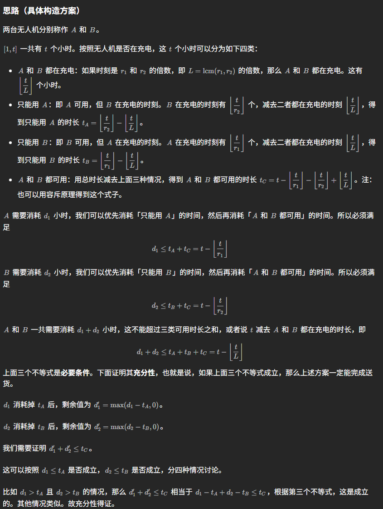
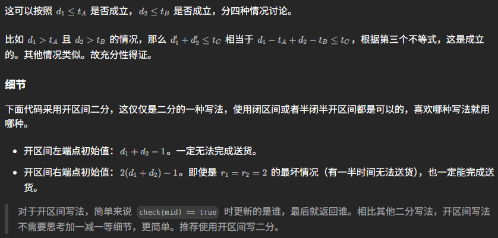

# 3733.完成所有的送货任务的最少时间（第三道题）
考察知识点：二分查找

题目链接:https://leetcode.cn/problems/minimum-time-to-complete-all-deliveries/description/

给你两个大小为 2 的整数数组：`d = [d1, d2]` 和 `r = [r1, r2]`。

两架送货无人机负责完成特定数量的送货任务。无人机 `i `必须完成 `di` 次送货。每次送货花费正好一小时，并且在任何给定小时内只有一架无人机可以送货。此外，两架无人机都需要在特定时间间隔进行充电，在此期间它们不能送货。无人机 `i` 必须每 `ri` 小时充电一次（即在 ri 的倍数小时进行充电）。

返回完成所有送货所需的 最小 总时间（以小时为单位）的整数。

 

示例 1:
```
输入: d = [3,1], r = [2,3]

输出: 5

解释:

第一架无人机在第 1、3、5 小时送货（在第 2、4 小时充电）。
第二架无人机在第 2 小时送货（在第 3 小时充电）。
```
示例 2:
```
输入: d = [1,3], r = [2,2]

输出: 7

解释:

第一架无人机在第 3 小时送货（在第 2、4、6 小时充电）。
第二架无人机在第 1、5、7 小时送货（在第 2、4、6 小时充电）。
```
示例 3:
```
输入: d = [2,1], r = [3,4]

输出: 3

解释:

第一架无人机在第 1、2 小时送货（在第 3 小时充电）。
第二架无人机在第 3 小时送货。
 ```

提示:
```
d = [d1, d2]
1 <= di <= 10的9次方
r = [r1, r2]
2 <= ri <= 3 * 10的4次方
```







```java
class Solution {
    public long minimumTime(int[] d, int[] r) {
        int d1 = d[0], d2 = d[1];
        int r1 = r[0], r2 = r[1];
        int l = lcm(r1, r2);

        long left = d1 + d2 - 1;
        long right = (d1 + d2) * 2L - 1;
        while (left + 1 < right) {
            long mid = left + (right - left) / 2;
            if (check(mid, d1, d2, r1, r2, l)) {
                right = mid;
            } else {
                left = mid;
            }
        }
        return right;
    }

    private boolean check(long t, int d1, int d2, int r1, int r2, int l) {
        return d1 <= t - t / r1 && d2 <= t - t / r2 && d1 + d2 <= t - t / l;
    }


    private int gcd(int a,int b){
        while(a!=0){
            int tmp = a;
            a = a%b;
            b = tmp;
        }
        return b;
    }

    private int lcm(int a,int b){
        return a/gcd(a,b)*b;
    }
}

```


## 相关题目

2513.最小化两个数组中的最大值


给你两个数组 `arr1` 和 `arr2` ，它们一开始都是空的。你需要往它们中添加正整数，使它们满足以下条件：

`arr1 `包含 `uniqueCnt1` 个 互不相同 的正整数，每个整数都 不能 被 `divisor1` 整除 。
`arr2` 包含 `uniqueCnt2` 个 互不相同 的正整数，每个整数都 不能 被 `divisor2 `整除 。
`arr1` 和 `arr2` 中的元素 互不相同 。
给你 `divisor1` ，`divisor2` ，`uniqueCnt1` 和 `uniqueCnt2 `，请你返回两个数组中 最大元素 的 最小值 。

 

示例 1：
```
输入：divisor1 = 2, divisor2 = 7, uniqueCnt1 = 1, uniqueCnt2 = 3
输出：4
解释：
我们可以把前 4 个自然数划分到 arr1 和 arr2 中。
arr1 = [1] 和 arr2 = [2,3,4] 。
可以看出两个数组都满足条件。
最大值是 4 ，所以返回 4 。
```
示例 2：
```
输入：divisor1 = 3, divisor2 = 5, uniqueCnt1 = 2, uniqueCnt2 = 1
输出：3
解释：
arr1 = [1,2] 和 arr2 = [3] 满足所有条件。
最大值是 3 ，所以返回 3 。

```
示例 3：
```
输入：divisor1 = 2, divisor2 = 4, uniqueCnt1 = 8, uniqueCnt2 = 2
输出：15
解释：
最终数组为 arr1 = [1,3,5,7,9,11,13,15] 和 arr2 = [2,6] 。
上述方案是满足所有条件的最优解。
 ```

提示：
```
2 <= divisor1, divisor2 <= 105
1 <= uniqueCnt1, uniqueCnt2 < 109
2 <= uniqueCnt1 + uniqueCnt2 <= 109
```


```Java
class Solution {
    public int minimizeSet(int divisor1, int divisor2, int uniqueCnt1, int uniqueCnt2) {
        long l = lcm(divisor1,divisor2);
        long low = 1,high = (uniqueCnt1+uniqueCnt2)*2l;
        while(low+1<high){
            long mid = low + (high-low)/2;
            if(check(mid,divisor1,divisor2,uniqueCnt1,uniqueCnt2,l)){
                high = mid;
            }else{
                low = mid;
            }
        }
        return (int)high;


    }

    private boolean check(long mid,int divisor1,int divisor2,int uniqueCnt1,int uniqueCnt2,long l){
        long cnt1 = mid - mid/divisor1;
        long cnt2 = mid - mid/divisor2;
        if(cnt1>=uniqueCnt1&&cnt2>=uniqueCnt2&&mid-mid/l>=uniqueCnt1+uniqueCnt2){
            return true;
        }else{
            return false;
        }
    }


    private long lcm(int a,int b){
        return (long)a/gcd(a,b)*b;
    }

    private int gcd(int a,int b){
        while(a!=0){
            int temp = a;
            a = b%a;
            b = temp;
        }
        return b;
    }
}

```