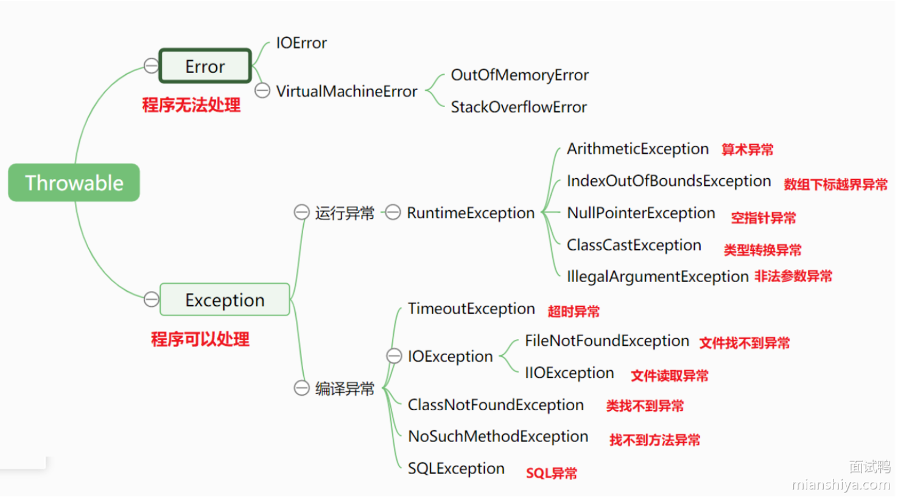
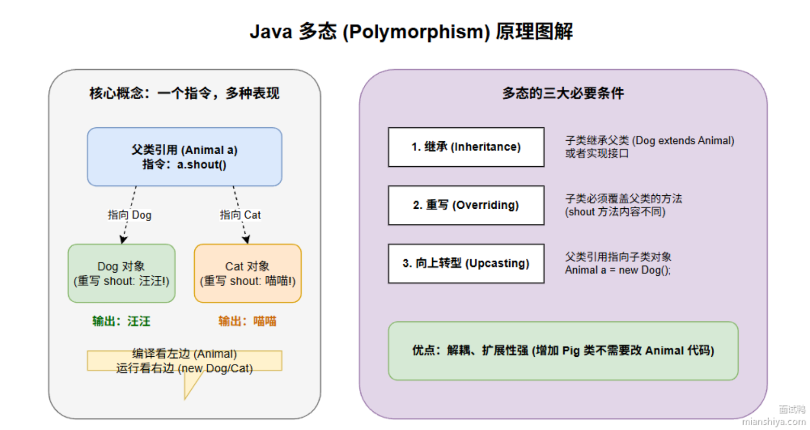
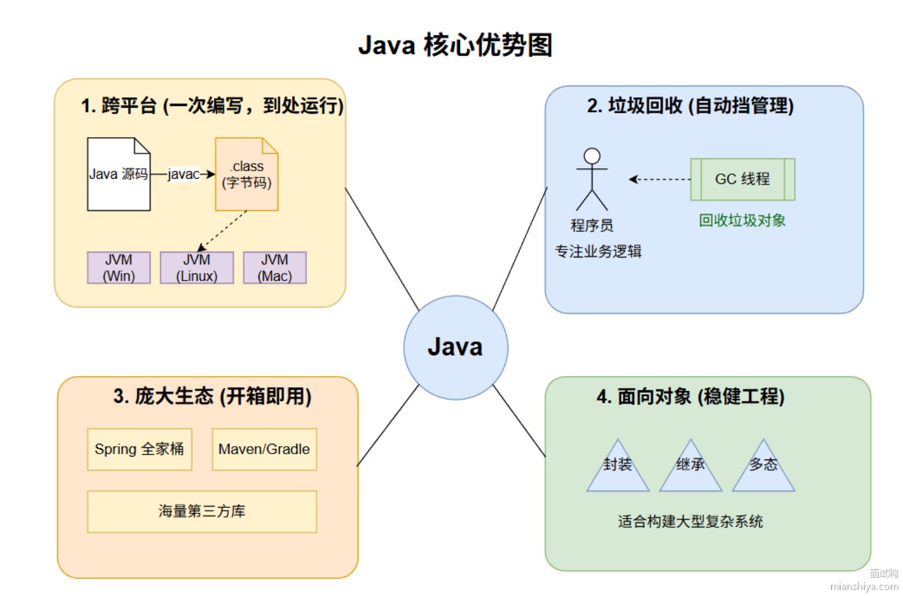
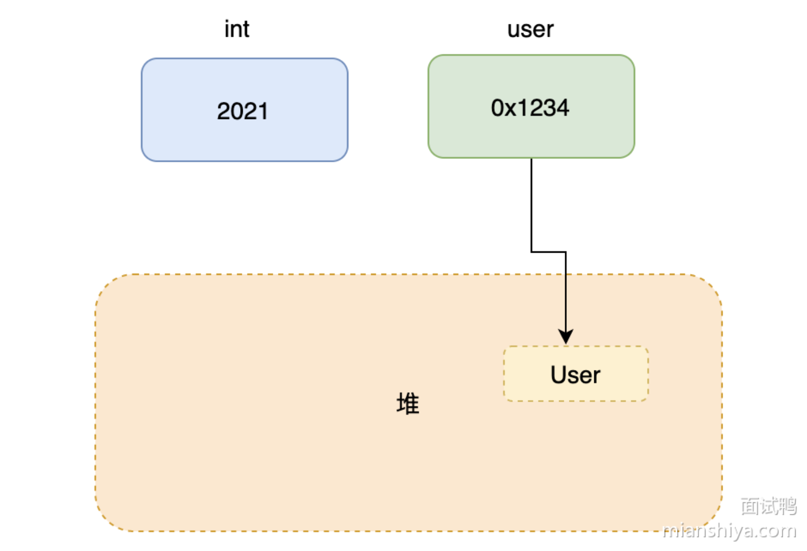
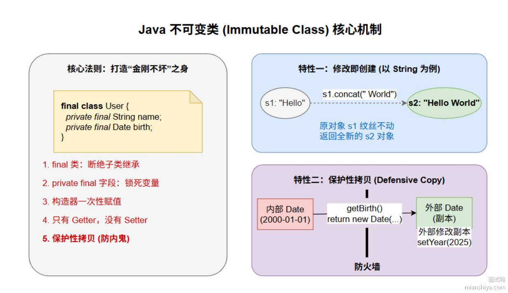

# 一、Java中Exception和Error有什么区别？

Error：代表JVM本身或者系统环境的严重错误，程序通常无法恢复，出现后进程需要终止或重启。
编译器异常就是受检时异常，必须要显示捕获。

IOError是严重的IO系统错误，比如磁盘硬件故障、操作系统IO子系统故障。 

# 二、什么是Java的多态特性？
多态：同一个方法调用，表现出不同的行为。即一个指令多种表现。

分为编译时多态和运行时多态。
- 编译时多态：静态多态，通过方法重载实现。Java编译器通过传入的参数决定调用哪个方法。
- 运行时多态：动态多态，在运行时确定方法的调用。通过方法重写实现。父类引用指向子类对象。

多态是一种抽象行为，可以面对抽象编程而不是具体实现类，写出来的代码扩展性会更强。

编译看左边，运行看右边。

多态的作用：
- 解耦:调用方只依赖抽象，不依赖具体实现。
- 可扩展:新增一个子类，完全不需要修改原有代码。

# 三、你认为Java的优势是什么？

Java的优势：
1. 一次编译，处处运行。得益于JVM。
2. Java自带垃圾回收机制，能够自动管理内存，程序员只专注于效率就行。
3. Java的生态圈好，做什么功能都能找到现成的，成熟的开源库。
4. Java是纯粹面向对象语言，封装、继承、多态这些特性使代码结构非常清晰。

# 四、Java中的参数传递是按值还是按引用？
在Java中，不管基本数据类型还是引用数据类型，参数传递只有值传递。
基本数据类型传递的是值的副本，对方法参数修改不会影响原始变量。引用数据类型传递的是引用的副本，即对象引用的内存地址。方法内可以修改对象的属性，不能使其指向另外一个对象。

# 五、什么是Java中的不可变类？
不可变类即对象创建完成后不可被修改的类。

Java中最典型的不可变类有String、所有基本类型的包装类（Integer、Boolean等）。

实现一个严格的不可变类，需要：
- 声明类为final，不可被继承，防止子类继承后添加可变行为。
- 所有字段都为private final，保证只在构造阶段赋值，之后无法被外部直接访问或者修改。
- 通过构造函数初始化所有字段，不提供setter方法。
- 如果类包含可变对象的引用，确保这些引用在对象外部无法被修改。

不可变类有什么作用：
- 不可变，多线程随便访问，不需要加锁，性能很高，天生性能安全。
- 状态不可变，适合做缓存的key。
代价：
- 费内存，每次修改（String拼接）都要创建新的对象，改动频繁，压力会比较大。

扩展：
String就是不可变类。` s+="a";`是返回的新建的String对象。老的s指向的对象不变化，只是s的引用指向了新对象。所以不能用+来频繁拼接字符串。

如何实现一个不可变类？

# 六、为什么Java不支持多重继承？
多继承会产生“菱形继承”的问题，即D调用A的方法，但B和C都有不同的实现，此时会出现歧义。

那为什么接口多继承可以？
在Java8之前，接口无法定义具体方法实现，因此即使有多个接口也必须子类自己实现。
Java8之后出现了默认方法，所以Java中强制规定，如果多个接口内有默认方法，子类必须重写这个方法。不然编译时会报错。

# 七、Java面向对象编程和面向过程的区别在哪儿？
面向对象编程(OOP)把类或对象作为基本单元来组织代码。
面向过程编程，把过程作为基本单元来组织代码。

1）思维方式：
- 面向过程: 通过函数或过程来一步步实现业务逻辑，关注执行步骤和顺序。 
- 面向对象：通过定义对象的属性和行为来解决问题，关注对象的交互。 

2）数据与行为的关系:
- 面向对象: 数据和操作数据的方法封装在对象中，数据操作由对象方法管理。
- 面向过程: 数据和函数是分离的，函数对数据进行操作。

3）可扩展性和复用性：
- 面向对象：通过继承、接口、多态等机制支持代码的高复用性和扩展性。  
- 面向过程：复用性较低，扩展需要修改已有代码。

4）适用场景：
- 面向对象：适合复杂的系统和模块化设计，便于维护和开发。
- 面向过程：适用于简单的、顺序性强的小型程序，开发效率高。

