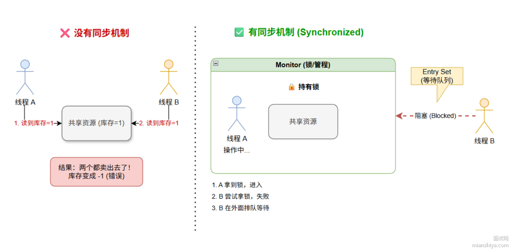

# 一、什么是Java中的线程同步？
是一种机制，确保在多线程环境下，同一时刻，只有一个线程可以执行共享资源的临界区代码。
不这样做？多个线程同时访问共享资源，会导致数据不一致、静态条件、死锁等问题产生。可以避免超卖或脏数据。
怎么做？通过加锁的方式实现，来实现临界区代码在同一时刻只能被一个线程执行。


synchronized加在实例方法，锁的是实例的对象。
synchronized加在静态方法上，锁的是类对象。

```java
public class counter{
    private int count = 0;
    public synchronized void increment(){
        count++;
    }
    public static synchronized int staticincrement(){
        count++;
    }
}

public class counter{
    private final Object lock = new Object();
    private int count = 0;
    
    public void increment(){
        synchronized (lock){
            count++;
        }
    }
}
```