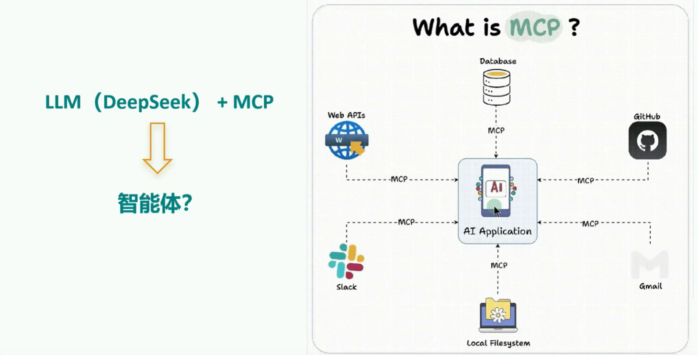
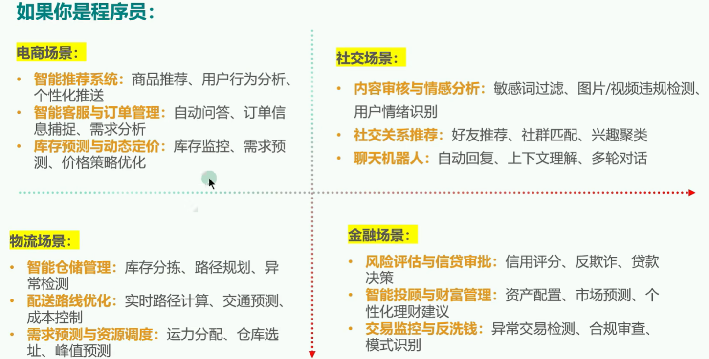
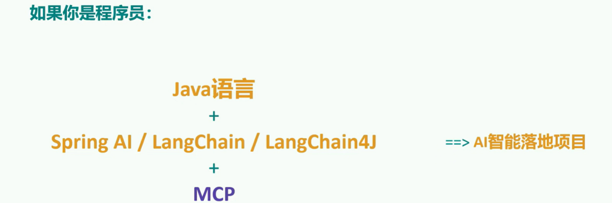
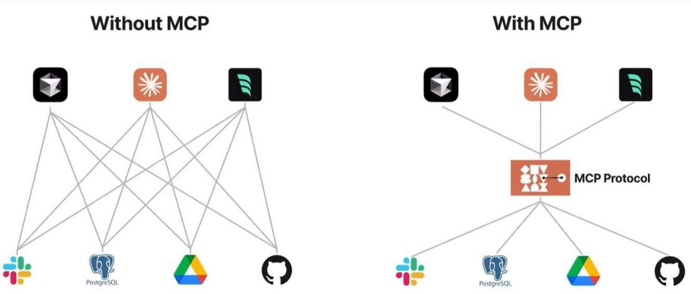
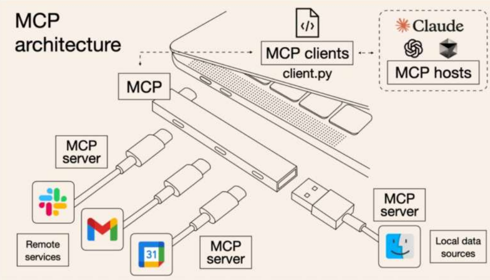
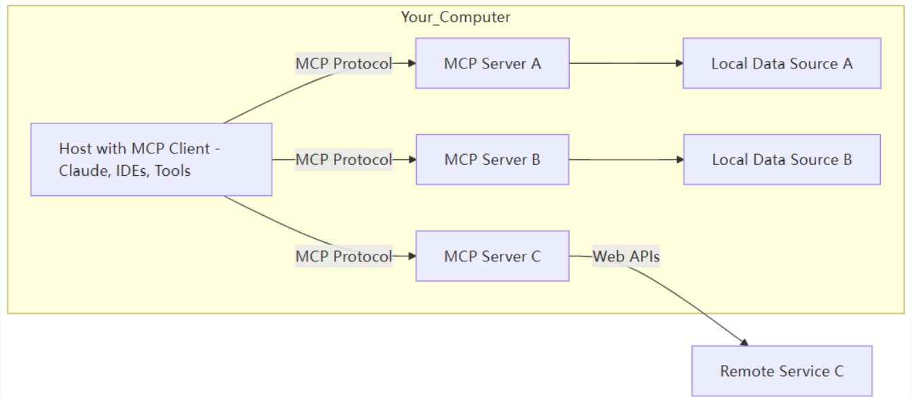
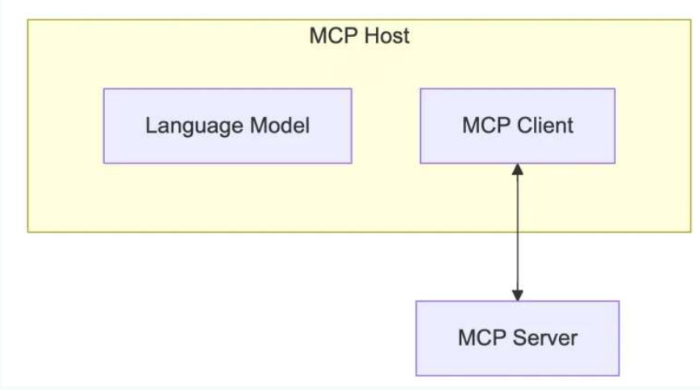
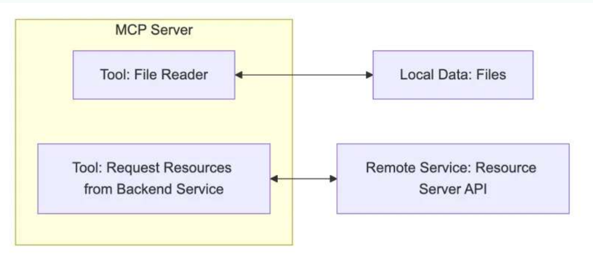
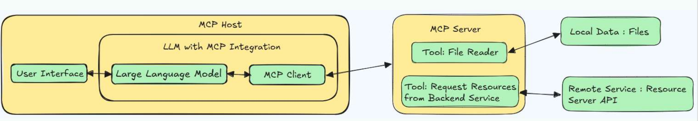

# MCP模型
# 一、概述
两个互联领域的重大挑战：

第一、Agent与Tools(工具)的交互：
Agent需要调用外部工具和API、访问数据库、执行代码。（MCP解决）


第二、Agent与其他Agent（其他智能体或用户）的交互：Agent需要理解其他Agent的意图，协同完成任务、与用户进行自然的对话。（A2A解决）




不加入MCP，则大模型只能进行对话。



落地



千帆过境的大模型之争，被MCP统一。

## 1.MCP能干什么？
### 对于程序员来说

举例1：开发部署

开发者通过自然语言指令“部署新版本到测试环境”，触发 MCP 链式调用 `GitLab API`（代码合并）、`Jenkins API`（构建镜像）、`Slack API`（通知团队）。

举例2：SQL查询

开发者通过自然语言输入，比如“查询某集团部门上个季度销售额”，就能查询出数据库的数据，并结合大模型进行回答，不再需要编写 `SQL`，`MCP` 自动转换为精准 `SQL` 语句并执行。

举例3：manus智能体

Manus的每一次任务处理都至少需要调用网页搜索、网页访问、网页信息获取、本地文件创建、代码解释器等几十个外部工具。
这里就暴露了两个问题。
- 问题1：可供大模型调用的工具不足。
- 问题2：调用工作量很大。

**借助 MCP，只要支持了该协议，就能轻松将各种数据源和工具连接到 LLM。**


### 对于大众用户来说

举例1：旅游规划

当我要去旅行时，旅行规划助手通过MCP同时调用天气API（获取目的地气象）、交通API（查询航班动态）、地图API（规划路线），AI自动生成带实时数据的行程方案。

举例2：联网搜索

我们在与LLM交互时，经常需要联网搜索最新信息以减少幻觉。然而，这里也存在问题：

1. 并非所有聊天机器人都支持联网功能
2. 即使支持联网，也可能不包含你习惯使用的搜索引擎。

- 在没有MCP的情况下，用户只能等待开发者添加特定搜索引擎的支持。
- 有了MCP后，只需简单配置，就能将所需服务接入当前使用的聊天机器人。

举例3：业绩查询

用户询问“查询上季度营业额”，MCP自动组合调用CRM系统API（获取客户数据）+ 财务系统API（调取报表）+邮件 API（发送总结报告）。

## 2.MCP是什么？
### 2.1 MCP的理解
MCP（Model Context Protocol，模型上下文协议），2024年11月底，由Anthropic推出的一种开放标准。旨在为大语言模型（LLM）提供统一的、
标准化方式与外部数据源和工具之间进行通信。



- 传统AI集成的问题：这种为每个数据源构建独立连接的方式，可以被视为一个M*N问题。
- 问题：架构碎片化，难以扩展，限制了AI获取必要上下文信息的能力MCP
- 解决方案：提供统一且可靠的方式来访问所需数据，克服了以往集成方法的局限性。



MCP作为一种标准化协议，极大地简化了大语言模型与外部世界的交互方式，使开发者能够以统一的方式为 AI 应用添加各种能力。

官方文档：https://modelcontextprotocol.io/introduction

|特征|MCP|TCP/IP、HTTPS|
|-|-|-|
|作用|标准化AI模型与上下文来源/工具之间的数据交互方式|标准化设备之间的网络通信方式|
|目标|让不同模型应用可以用统一方式访问资源/工具|让不同设备、系统可以互通数据|
|好处|消除碎片化集成、形成生态闭环|解决设备互联、实现互联网基础|
||||

阿里全面拥抱MCP：https://bailian.console.aliyun.com/?tab=mcp#/mcp-market

### 2.2 哪些平台支持MCP查询
github查看：
- MCP官方资源：https://github.com/modelcontextprotocol/servers
- MCP热门资源：https://github.com/punkpeye/awesome-mcp-servers

其它平台：
- Glama：https://glama.ai/mcp/servers
- Smithery：https://smithery.ai 
- cursor：https://cursor.directory
- MCP.so：https://mcp.so/zh
- 阿里云百炼：https://bailian.console.aliyun.com/?tab=mcp#/mcp-market

这里有两点：
- 第1，随着越来越多的Server接入MCP协议，未来AI能够直接调用的工具将呈现指数级增长，这能从根源上打开Agent能力的天花板。未来 AI 生态系统将变得更加开放和强大。

- 第2，目前社区的 MCP Server 还是比较混乱，有很多缺少教程和文档，很多的代码功能也有问题，大家只能凭经验和参考官方文档了。
## 3.程序员如何使用MCP？
### 3.1 MCP应用场景
|应用领域|典型场景|MCP价值|代表实现|
|-|-|-|-|
|智能编程助手|代码生成、BUG修复、API集成|安全访问本地代码库、CI/CD系统|Cursor、VS Code插件|
|数据分析工具|自然语言查询数据库、可视化生成|安全查询内部数据库、连接BI工具|XiYanSQL-MCP、数据库MCP服务器|
|企业知识管理|知识库查询、文档生成、邮件撰写|安全访问内部文档、保护隐私数据|文件系统MCP、Email-MCP|
|创意设计工具|3D建模、图形生成、UI设计|与专业软件无缝集成|Blender MCP、浏览器自动化|
|工作流自动化|多系统协调、事件驱动流程|跨系统安全协作|Cloudflare MCP、AWS自动化套件|
|||||

### 3.2 使用前的准备工作
#### MCP的通信机制：
根据 MCP 的规范，当前支持两种通信机制（传输方式）：
- stdio(标准输入输出)：主要用在本地服务上，操作你本地的软件或者本地的文件。比如Blender这种就只能用Stdio因为他没有在线服务。MCP默认通信方式。
- SSE(Server-Sent Events)：主要用在远程通信服务上，这个服务本身就有在线的API，比如访问你的谷歌邮件，天气情况等。

#### MCP的通信机制：stdio方式
- 优点
    - 这种方式适用于客户端和服务器在同一台机器上运行的场景，简单。
    - stdio模式无需外部网络依赖，通信速度快，适合快速响应的本地应用。
    - 可靠性高，且易于调试

- 缺点
    - Stdio 的配置比较复杂，我们需要做些准备工作，你需要提前安装需要的命令行工具。
    - stdio模式为单进程通信，无法并行处理多个客户端请求，同时由于进程资源开销较大，不适合在本地运行大量服务。（限制了其在更复杂分布式场景中的使用）

#### MCP的通信机制：SSE方式
- 场景
    - SSE方式适用于客户端和服务器位于不同物理位置的场景。
    - 适用于实时数据更新、消息推送、轻量级监控和实时日志流等场景。
    - 对于分布式或远程部署的场景，基于 HTTP和 SSE 的传输方式则更为合适。

- 优点
    - 配置方式非常简单，基本上就一个链接就行，直接复制他的链接填上就行

#### stdio的本地环境安装
stdio的本地环境有两种：
- 一种是Python 编写的服务，
- 一种用TypeScript 编写的服务。

分别对应着uvx 和 npx 两种指令。

第1种：若已配置Python环境，可使用以下命令安装：`pip install uv`
第2种：在Windows下可以通过PowerShell运行命令来安装uv。`powershell -ExecutionPolicy ByPass -c "irm https://astral.sh/uv/install.ps1 | iex”`

验证：重启终端并运行以下命令检查是否正常：
```
uv --version
uvx --help
```

stdio的本地环境安装：
npxNode.js下载的官网：https://nodejs.org/zh-cn
### 3.3 cursor中使用MCP
cursor中国区官网：https://www.cursor.com/cn

### 3.4 Cline中使用MCP
## 4.MCP的工作原理？
### 4.1 MCP的C/S架构
五个核心概念：
MCP 遵循客户端-服务器架构（client-server），其中包含以下几个核心概念：
- MCP 主机(MCP Hosts)
- MCP 客户端( MCP Clients )
- MCP 服务器( MCP Servers ) 
- 本地资源( Local Resources )
- 远程资源( Remote Resources ) 



#### MCP主机
作为运行 `MCP` 的主应用程序，例如 `Claude Desktop`、`Cursor`、`Cline` 或 `AI` 工具。为用户提供与LLM交互的接口，同时集成 `MCP Client` 以连接 `MCP Server`。




#### MCP CLient
`MCP client` 充当 `LLM` 和 `MCP server` 之间的桥梁，嵌入在主机程序中，主要负责：
- 接收来自LLM的请求；
- 将请求转发到相应的` MCP server`
- 将 `MCP server` 的结果返回给 LLM
##### 常见的客户端

分为两类：
- AI编程IDE：`Cursor`、`Cline`、`Continue`、`Sourcegraph`、`Windsurf` 等。
- 聊天客户端：`Cherry Studio`、`Claude`、`Librechat`、`Chatwise`等。

更多的Client参考这里：
- MCP Clients：https://www.pulsemcp.com/clientsAwesome 
- MCP Clients：https://github.com/punkpeye/awesome-mcp-clients/

#### MCP Server
每个 MCP 服务器都提供了一组特定的工具，负责从本地数据或远程服务中检索信息。是 MCP 架构中的关键组件。



与传统的远程 API 服务器不同，MCP 服务器既可以作为本地应用程序在用户设备上运行，也可部署至远程服务器。

比如你让助手：
- “帮我查航班信息” → 它调用航班查询 API
- “算一下 37% 折扣后多少钱” → 它运行计算器函数

作用：让 LLM 不仅能“说”，还能“做”（执行代码、查询数据等）。

##### MCP Server本质
本质是运行在电脑上的一个nodejs或python程序。可以理解为客户端用命令行调用了电脑上的nodejs或python程序。

- 使用 TypeScript 编写的 MCP server 可以通过 npx 命令来运行
- 使用 Python 编写的 MCP server 可以通过 uvx 命令来运行。



### 4.2 MCP的工作流程
## 5. 手动开发MCP项目

## 大众用户如何使用MCP

## MCP Servers推荐

## A2A协议：Agent之间的协作