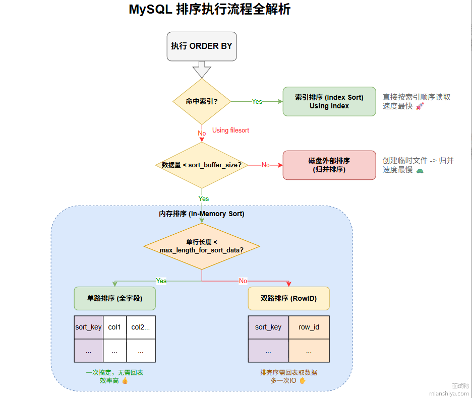
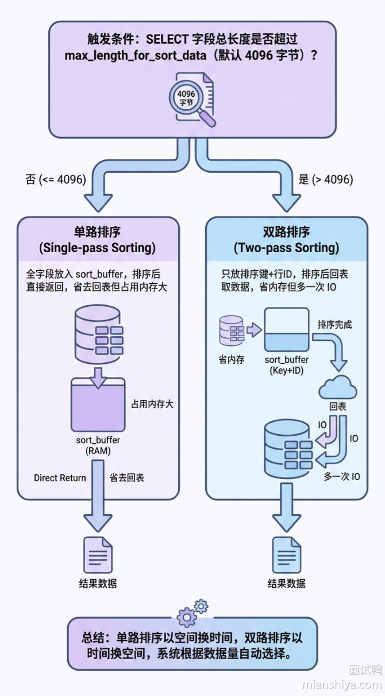
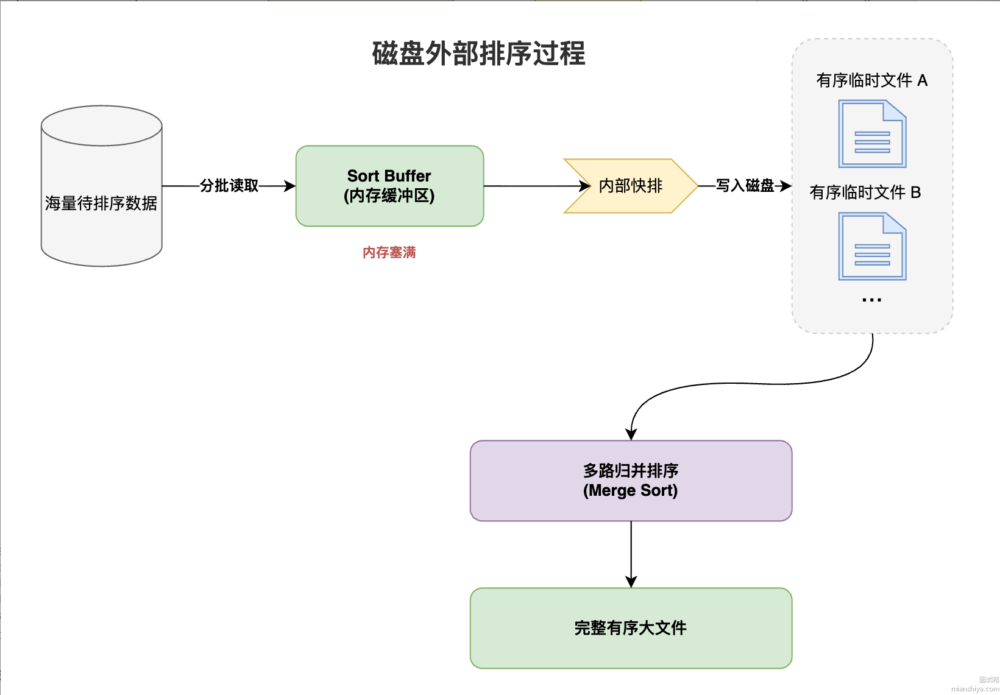
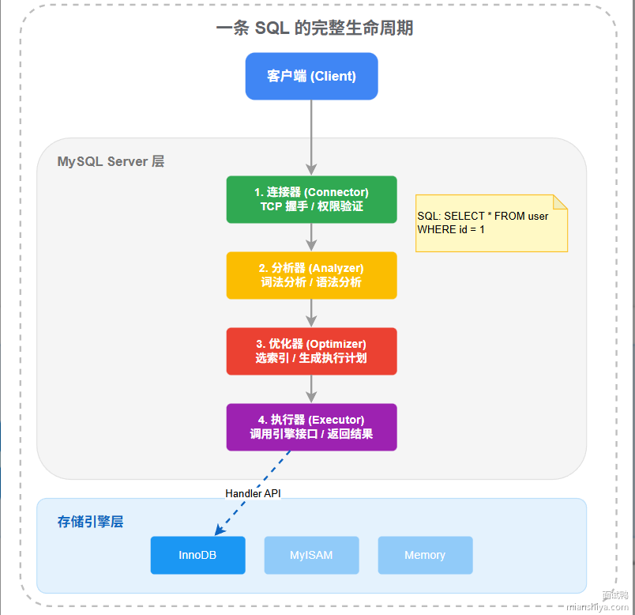
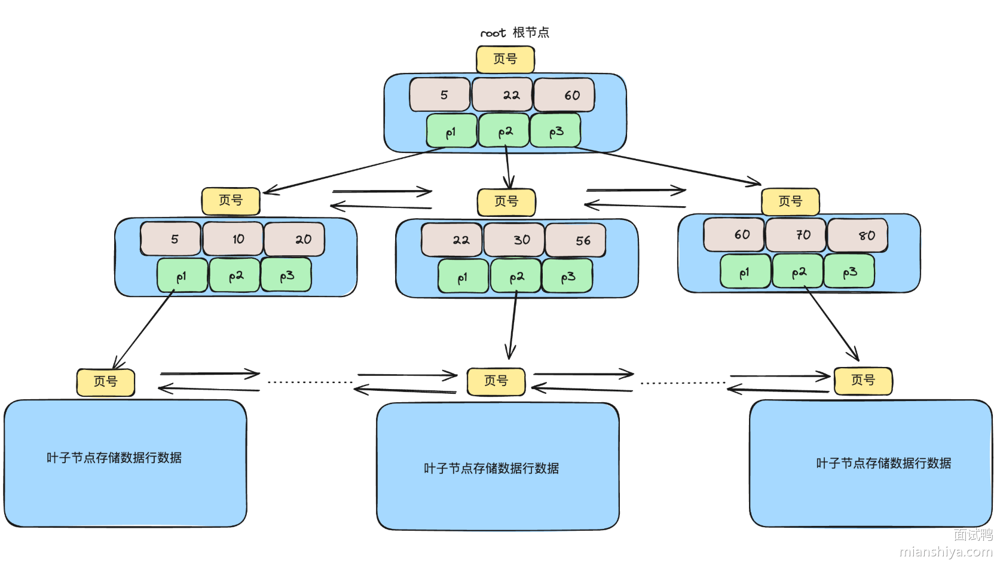
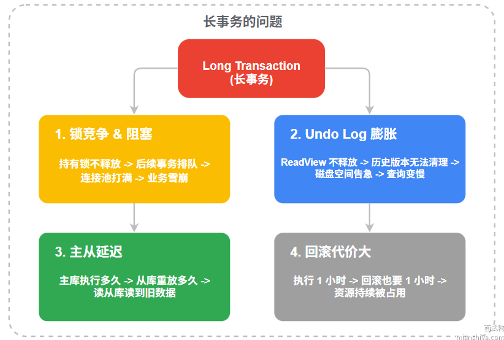
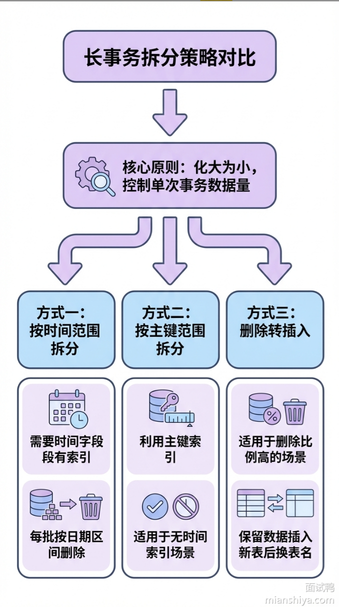

## 1.MySQL中的数据排序是怎么实现的?
有两种实现方式：索引天然有序和自己动手做filesort。

如果`order by`的字段正好有索引，而且排序方向一致，MySQL顺着B+树叶子节点扫描，不需要额外排序，效率高。

要是没命中索引，或者索引顺序不对的话，就要走`filesort`了。这个时候MySQL会用 `sort_buffer`这个内存缓冲区来排序。小数据量就在内存里搞定。大数据量就需要磁盘来进行外部排序。

内存排序还分为单路排序和多路排序两种模式：
- 单路排序：把所有select字段都放进`sort_buffer`排，排完直接返回。
- 多路排序：只放排序字段和行ID，排完再回表取其他字段。



**如何判断是利用了索引还是自己做了filesort？**

用`Explain`命令看执行计划，如果`Extra`列没有`using filesort`，说明直接利用了索引排序。
```sql
    -- 假设有索引 idx_user_age (user_id, age)
    -- 下面这条 SQL 可以直接利用索引排序
    SELECT user_id, age FROM users WHERE user_id = 10086 ORDER BY age;

    -- 但如果排序方向和索引不一致，就得 filesort
    SELECT user_id, age FROM users WHERE user_id = 10086 ORDER BY age DESC;
    -- MySQL 8.0 之前，索引只支持升序，DESC 会触发 filesort
    -- MySQL 8.0+ 支持降序索引，可以建 idx(user_id, age DESC)

```

**filesort工作机制?**
`Extra`列出现`using filesort`，说明MySQL自己手动排序了。数据量小内存排序也很快，大的时候出现性能瓶颈。
`sort_buffer`的内存大小为256KB。数据量小就内存排，大则涉及磁盘临时文件。



如果SELECT字段长度总长超过`max_length_for_sort_data`,为了省空间，`sort_buffer`只放排序字段和row_id。

```sql
-- 假设a,b,c三列字段长度超过了阈值，则sort_buffer里面只会放id和b这两列来排序。排序完成后再通过徽标查询拿到a,b,c
SELECT a, b, c FROM t1 WHERE a = '面试鸭' ORDER BY b;
```

SQL早期只有这种方式，需要回表。

单路排序完后，就是完整结果集，直接返回客户端。不用再回表，少了一次IO，效率高。但是单路排序一行占用空间大，可能会导致外部排序。



但外部排序涉及到的磁盘IO很多，性能比较差。因此建议：
1.适当调大缓冲区的大小，但每个连接对应一个缓冲区。
2.用SSD硬盘加速文件读写。
3.用LIMIT控制结果集大小。
4.优先建索引避免filesort。


## 2.详细描述一条SQL语句在MySQL中的执行过程?
MySQL架构分两层：Server层和存储引擎层。Server层负责连接管理，SQL解析，查询优化等。 存储引擎层负责数据的实际存取。
1. 客户端先跟MySQL建立连接，**连接器**负责验证账号密码和权限。
2. 老版本会先查询缓存，但新版本8.0砍掉了这功能，因为涉及表的更新缓存就会失效，命中率低。
3. **分析器**会对SQL做词法分析和语法分析。首先将SQL语句拆分为一个个token；再按语法规则检查SQL写的对不对，最后生成一颗抽象语法树。
4. **优化器**拿到语法树后，决定用哪个索引，多表JOIN时先查哪个表。
5. **执行器**按照执行计划，调用存储引擎的接口读取数据，条件过滤，把结果返回给客户端。




** 查询和更新的区别 **
上面讲的是查询语句的流程。如果是`insert`、`update`、`delete`这种更新流程，区别在执行阶段。
更新语句需要写日志来确保数据安全和崩溃恢复。`InnoDB`会先写`redo log`,记录本次物理变化。再写`undo log`，记录修改后的数据用于回滚；Server层还需要写`bin log`,用于主从复制和数据回复。
为了确保`redo log`和`bin log`的一致性，MySQL使用了二阶段提交。

## 3.为什么MySQL使用B+树作为索引？

主要原因：磁盘IO次数少。数据库的数据存储在磁盘上，磁盘内存读写速度比内存慢10万倍，所以索引设立目标就是尽量减少磁盘IO次数。

B+树能做到这个主要是靠：
1. 树矮。B+树是多叉树，3层的B+树能存两千多万条数据，最多3次磁盘IO。红黑树是二叉树，但存同样的数据要20多层，IO次数爆炸。
2. 非叶子节点存储key和指针，不存数据。内存里能缓存更多索引。
3. 叶子节点用双向链表串起来。范围查询时，定位到起点顺着扫，顺序IO。



**为什么不使用哈希表？**

哈希表等值查询`O(1)`,但有两个问题：
1. 不支持范围查询，只能全表扫描。
2. 不支持排序。

**为什么不用红黑树和AVL树？**

因为他们都是二叉树，树高。


## 4.MySQL如何实现事务？
MySQL实现事务依靠：Redo Log、Undo Log、锁、MVCC。

Redo Log保证持久性，事务提交时，修改先写到redo log再写到磁盘数据页。就算写数据宕机，也能恢复。

Undo Log保证原子性。每次修改数据前，先把原值存在Undo log。事务回滚时，按undo log反向操作把数据恢复回去。要么全做完，要么全撤销。

锁机制保证隔离性，两个事务修改同一行，一个必须等另外一个释放锁。

MVCC保证隔离性的读写并发。读操作不加锁，通过undo log里的版本链找到自己应该看到的数据版本，写的时候也不影响别人读。

一致性是原子性、隔离性、持久性共同作用的结果。


**Redo Log工作原理**
InnoDB修改数据时，不会直接写磁盘上的数据页，那样随机IO太多，性能扛不住。它使用WAL策略，先将修改操作顺序写到Redo log，再找机会把数据页刷到磁盘中。

Redo Log有两个指针，一个表示写到哪儿了，一个表示已经刷盘的位置。

```
+---+---+---+---+
| 0 | 1 | 2 | 3 |   redo log 文件组
+---+---+---+---+
    ^       ^
    |       |
checkpoint  write_pos

```

事务提交时，`redo log` 必须落盘，这个行为由 `innodb_flush_log_at_trx_commit` 控制：

- 设成 1：每次提交都刷盘，最安全但性能最差

- 设成 0：每秒刷一次，宕机可能丢 1 秒数据

- 设成 2：写到操作系统缓存，MySQL 挂了数据还在，机器挂了才丢

**Undo log工作原理**

每条数据行里会有两个隐藏字段：

- trx_id：记录最后一次修改这行数据的事务 ID

- roll_pointer：指向 undo log 中这行数据的“上一个版本”

假设一开始 name = '张三'，后来：事务 100 把它改成 李四，事务 200 又把它改成 王五
```
当前数据页：name='王五', trx_id=200, roll_pointer →
    undo log：name='李四', trx_id=100, roll_pointer →
        undo log：name='张三', trx_id=0, roll_pointer=null
```

MVCC 读取数据时，会根据当前事务的 ReadView，沿着这条版本链往回找，直到找到第一个“当前事务可见”的版本返回。

- 可重复读（RR）：ReadView 在事务开始时生成一次，事务期间一直复用，所以多次查询看到的数据一致。

- 读已提交（RC）：每次查询都会生成新的 ReadView，所以可能每次读到的版本不同。

**锁的实现细节**

InnoDB的行锁是加在索引上的，不是加在数据行上的。如果SQL没走索引，就会锁全表。
```sql
-- 假设 id 是主键，name 无索引
begin;
update user set age = 20 where id = 1;     -- 只锁 id=1 这一行
update user set age = 20 where name = '张三'; -- 锁全表！
commit;
```
InnoDB 有三种行锁：

- Record Lock：锁单条记录

- Gap Lock：锁一个区间，不包含记录本身

- Next-Key Lock：Record Lock + Gap Lock，锁记录和它前面的间隙

可重复读隔离级别下默认使用Next-Key Lock,就是为了防止幻读。

**事务提交的两阶段提交**

InnoDB和Server层各有自己的日志，`redo log` 和 `bin log`。为了保证这两个日志的一致性，用了两阶段提交：

1）prepare阶段：`redo log`写盘，状态标记为`prepare`
2）commit阶段：`bin log`写盘，然后`redo log`状态改为`commit`

如果prepare之后，binlog写盘之前宕机，重启时发现redo log时prepare状态但没对应的`bin log`，事务回滚
如果`bin log`写完但commit前宕机，重启恢复发现`redo log`是prepare状态但有对应的`bin log`，事物提交。

这套机制保证了主从复制的一致性，从库靠`bin log`同步数据，主库靠`redo log`恢复数据。

## 5.MySQL中长事务（事务逻辑过长）可能会导致哪些问题？

长事务的问题核心就是资源占用时间过长，影响系统的稳定性和性能。

1）锁竞争严重。事务持有锁的时间越长，其他事务等待的时间就越久。业务线程被阻塞后，连接池被占满，上游服务超时，搞不好就雪崩了。

2）死锁风险增加。事务执行时间越长，持有的锁越多，和其他事务产生循环等待的概率就越大。InnoDB 虽然有死锁检测机制，但检测本身也消耗资源，而且检测到了只能回滚其中一个事务，业务还是要受影响。

3）undo log 膨胀。InnoDB 的 MVCC 机制需要保留事务开始时的数据版本，长事务不提交，这个版本链就一直不能清理。

4）主从延迟。主库执行一个大事务要 10 分钟，binlog 传到从库后，从库也要重放 10 分钟。这期间主从数据不一致，读从库的业务拿到的都是脏数据。

5）回滚代价大。事务执行了 20 分钟，突然报错要回滚，之前的活全白干了。更惨的是回滚本身也要时间，可能又要等 20 分钟。

总结：就是锁竞争严重，会导致其他业务被阻塞，出现雪崩，也容易产生死锁。undo log日志会变大，回滚代价也大。主从延迟时间长。



**长事物的SQL如何处理**

你要删一张 5 亿数据的表里面 2021 年的数据，假设这张表叫 yes。脑子里 1 秒钟就能蹦出这条 SQL：
```sql
delete from yes where create_date > '2020-12-31' and create_date < '2022-01-01';
```
直接跑不行，数据量太大就是典型的长事务。

解决思路就是拆，按批次来。如果 create_date 有索引，按日期拆就完事了：
```sql
delete from yes where create_date > '2020-12-31' and create_date < '2021-02-01';
delete from yes where create_date >= '2021-02-01' and create_date < '2021-03-01';
-- 以此类推...
```
如果 create_date 没索引呢？上面这种写法就是全表扫描，性能爆炸。这时候给它创造索引条件，用主键来分批。先查出主键范围：
```sql
select min(id), max(id) from yes where create_date > '2020-12-31' and create_date < '2022-01-01';
-- 假设结果是 233333333 到 666666666
```
然后按主键分段删除，每批处理 10 万条：
```sql
delete from yes where id >= 233333333 and id < 233433333
  and create_date > '2020-12-31' and create_date < '2022-01-01';

delete from yes where id >= 233433333 and id < 233533333
  and create_date > '2020-12-31' and create_date < '2022-01-01';
-- 以此类推...
```
这样每条 SQL 都能走主键索引，执行快，锁持有时间短。哪条语句报错了也只回滚一小批，排查起来方便。而且拆分后还能多线程并行跑，效率更高。虽然可能有锁竞争导致个别语句超时，重跑一下就好了。

**删除思路的转化**

大表删除有时候要换个思路，把删除变成插入。

假设一张 5 亿数据的表，你要删掉 4.8 亿，只留 2000 万。与其删 4.8 亿条，不如把要留的 2000 万插到新表里。

具体操作：

1. 创建结构一样的新表 yes_temp
2. 把需要保留的数据 insert into yes_temp select ... from yes
3. 把 yes 改名成 yes_backup
4. 把 yes_temp 改名成 yes

狸猫换太子，1 分钟搞定，比删 4.8 亿条快了不知道多少倍。

这种操作有专门的工具，比如 pt-online-schema-change、gh-ost，它们会自动处理增量数据同步的问题，生产环境建议用工具来做。




**如何发现长事物**

MySQL 提供了 `information_schema.innodb_trx` 表来查询当前正在运行的事务：
```sql
select trx_id, trx_state, trx_started,
       timestampdiff(second, trx_started, now()) as duration,
       trx_query
from information_schema.innodb_trx
where timestampdiff(second, trx_started, now()) > 60
order by duration desc;
```
跑超过 60 秒的事务都会被筛出来。生产环境建议配置监控告警，事务超过一定时间就报警。

另外 `performance_schema` 里的 `events_transactions_history_long` 也能看到历史事务信息，排查问题时很有用。


提问：长事务导致 undo log 膨胀，具体是什么原理？

回答：InnoDB 用 MVCC 实现事务隔离，每次更新数据时会把旧版本存到 undo log 里，形成版本链。purge 线程会定期清理不再需要的旧版本，但清理的前提是没有活跃事务需要这些旧版本。长事务的 ReadView 一直不释放，它开始时刻之后产生的所有版本都不能清理，这些 undo log 就一直堆积。事务跑得越久，堆得越多。

提问：怎么避免业务代码里产生长事务？

回答：几个关键点。第一，事务里不要有 RPC 调用或者外部 IO，这些操作耗时不可控。第二，能异步的就异步，比如发消息、写日志这些可以放到事务外面。第三，大批量数据操作要分批提交，不要一个事务处理几十万数据。第四，Spring 的 @Transactional 注解要注意作用范围，别把整个方法都包进去。

提问：如果线上已经出现长事务把数据库打挂了，怎么处理？

回答：先止血再排查。第一步用 select * from information_schema.innodb_trx 找到长事务的线程 ID，然后 kill 掉。如果事务太大 kill 不掉，回滚也要时间，可能要等。第二步检查连接池状态，必要时重启应用释放连接。第三步看监控和慢查询日志，定位是哪个业务搞出来的长事务，从代码层面修复。

## 6.MySQL中MVCC是什么？


## 7.数据库的三大范式？

三大范式是数据库表设计的规范，目的是减少数据冗余、保证数据一致性。

一句话总结就是：字段不可再分，消除部分依赖，消除传递依赖。

第一范式 1NF：每个字段必须是原子的，不能再拆分。比如「地址」字段存「北京市朝阳区xxx路」就不符合，应该拆成省、市、区、详细地址四个字段。

第二范式 2NF：在 1NF 基础上，非主键字段必须完全依赖主键，不能只依赖主键的一部分。这主要针对联合主键的场景，比如订单明细表用「订单ID + 商品ID」做联合主键，如果把「订单时间」也放进来就违反了 2NF，因为订单时间只依赖订单ID。

第三范式 3NF：在 2NF 基础上，非主键字段之间不能有依赖关系。比如员工表里存了部门ID和部门名称，部门名称依赖部门ID而不是员工ID，这就是传递依赖，应该把部门名称拆到部门表里。

**为什么要反范式？**

理论上满足三大范式的表设计最「干净」，但实际业务中几乎都在反范式。

以电商订单为例，严格遵守范式的话，订单表里只有 `user_id`，查询时要 `JOIN` 用户表拿用户名。但订单量一上来，`JOIN` 的性能开销非常大，所以实际做法是直接在订单表里冗余一份 `user_name`。

这样做的代价是：用户改名了，历史订单里的名字不一定同步更新。但对订单业务来说，下单时的用户名本来就应该是快照，不需要同步。

**反范式的适用场景**
1. 读多写少的业务，冗余字段减少 JOIN，提升查询性能
2. 需要数据快照的场景，比如订单里的商品名称、价格，下单时就定死在那了
3. 分库分表后跨库 JOIN 代价太大，必须冗余
4. 报表统计场景，宽表设计本身就是反范式的


**冗余字段的维护策略**

冗余带来的问题是数据一致性，常见的维护方式有：

1. 同步更新：修改主表时同时更新所有冗余的地方，用事务保证一致性。适合冗余少、更新不频繁的场景
2. 异步同步：通过消息队列或 binlog 订阅，延迟更新冗余字段。适合对实时性要求不高的场景
3. 不更新：把冗余数据当做历史快照，压根不更新。订单里的商品信息就是这种策略

**BCNF 和第四范式**

面试偶尔会问到更高级的范式。BCNF 要求每个决定因素都必须是候选键，比 3NF 更严格。第四范式 4NF 要求消除多值依赖。

不过实际开发中连 3NF 都很少严格遵守，BCNF 和 4NF 基本停留在理论层面，了解一下就行。

**提问：什么情况下你会选择反范式设计？**

详细解答可以看：MySQL 在设计表（建表）时需要注意什么？

回答：主要看业务场景。读多写少、查询性能要求高的场景会考虑反范式，比如订单查询页要展示用户名、商品名，每次都 JOIN 太慢，直接冗余一份。还有分库分表之后跨库 JOIN 不稳定，也得冗余。不过冗余字段一定要想清楚怎么维护，是同步更新、异步同步还是干脆不更新当快照。

**提问：你们项目里有没有遇到过数据冗余导致不一致的问题？**

回答：遇到过。之前商品表改了名称，订单里的商品名没同步，客服查订单的时候对不上。后来改成两种策略：一是订单里的商品信息定义为下单时的快照，就不同步了；二是需要最新数据的场景走异步消息队列更新，Canal 订阅 binlog 触发。关键是队列要对哪些字段是快照、哪些要同步达成共识。

**提问：1NF 说字段要原子不可分，那 JSON 字段算不算违反 1NF？**

回答：严格来说，JSON 里面还能嵌套一堆字段。但 MySQL 5.7 之后原生支持 JSON 类型，还能对 JSON 内部字段建虚拟列和索引，从实用角度看已经能当成「可查询的原子单元」了。范式是指导原则不是死规定，关键看业务需不需要对 JSON 内部字段做独立查询和约束。

## 8.在MySQL中，你使用过那些函数？
字符串函数：
- `CONCAT` 拼接字符串，比如把姓和名拼成全名
- `SUBSTRING `截取子串，提取手机号后四位这种场景
- `LENGTH` 返回字节长度，CHAR_LENGTH 返回字符长度
- `REPLACE `替换内容，批量脱敏的时候好用
- `TRIM` 去除首尾空格，清洗脏数据必备

日期函数

- `NOW() `取当前时间，CURDATE() 只取日期
- `DATE_FORMAT `格式化输出，比如转成 '2026-01-01'
- `DATEDIFF` 计算日期差几天，统计留存率常用
- `DATE_ADD/DATE_SUB `日期加减，算会员到期时间

聚合函数
- `COUNT` 统计行数，注意 COUNT(*) 和 COUNT(字段) 的区别
- `SUM/AVG` 求和求平均，财务报表必备
- `MAX/MIN` 取极值，查最新订单、最高金额

条件函数

- `IF(条件, 真值, 假值)` 简单二选一
- `IFNULL(字段, 默认值)` 处理 NULL，避免计算出问题
- `CASE WHEN` 多条件分支，写复杂业务逻辑

数学函数

- `ROUND` 四舍五入，金额计算必用

- `CEIL/FLOOR` 向上向下取整

- `ABS` 取绝对值，MOD 取余数