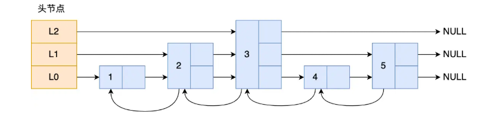
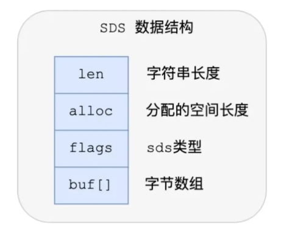

# 认识Redis
## 什么是Redis?
Redis 是一个开源的内存数据结构存储系统，支持多种数据结构（如字符串、哈希、列表、集合等），常用于缓存、分布式锁。它通过将数据存储在内存中实现高速读写，并支持持久化到磁盘，确保数据安全。Redis 还提供主从复制、事务和 Lua 脚本等功能，适用于高并发场景。


## 使用Redis有哪些好处？

- 高性能：数据存储在内存中，读写速度极快，适合高并发场景。
- 丰富的数据结构：支持字符串、哈希、列表、集合、有序集合等多种数据结构，满足多样化需求。
- 持久化：支持 RDB 和 AOF 两种持久化方式，确保数据安全。
- 高可用性：通过主从复制和哨兵模式实现故障转移，保障服务连续性。
- 分布式：支持集群模式，可水平扩展，处理大规模数据。
- 多功能：提供事务、发布订阅、Lua 脚本等功能，增强灵活性。
- 广泛应用：适用于缓存、会话存储、消息队列、实时排行榜等场景。

这些优势使 Redis 成为高性能数据存储和缓存的理想选择，回答时候选几个点来说就行，高性能和持久化一定要提到。


## 为什么MySQL做存储，Redis做缓存?
使用 Redis 作为 MySQL 的缓存有以下几个主要原因：

- 提升性能：Redis 将数据存储在内存中，读写速度远快于基于磁盘的 MySQL，显著减少数据库查询延迟。
- 减轻数据库负载：通过缓存频繁访问的数据，减少对 MySQL 的直接查询，降低数据库压力，提高系统整体性。
- 高并发支持：Redis 能处理大量并发请求，适合高流量场景，避免 MySQL 成为瓶颈。
- 灵活数据结构：Redis 支持多种数据结构（如字符串、哈希、列表等），便于缓存复杂查询结果或中间数据。
- 缓存失效策略：Redis 支持设置缓存过期时间，确保数据及时更新，避免脏数据。
- 高可用性：Redis 提供主从复制和持久化功能，确保缓存数据的高可用性和可靠性。

MySQL 是数据库系统，对于数据的操作需要访问磁盘，而将数据放在 Redis 中，需要访问就可以直接从内存获取，避免磁盘 I/O，提高操作的速度，使用 Redis + MySQL 结合的方式可以有效提高系统 QPS。

综上，Redis 作为 MySQL 缓存能显著提升系统性能、降低数据库负载，并支持高并发场景。


## Redis常用业务场景
主要常用的业务场景有：

- 对热点数据的缓存：因为 Redis 支持多种数据类型，数据存储在内存中，访问速度快，所以 Redis 很适合用来存储热点数据；

- 限时类业务的实现：可以使用 expire 命令设置 key 的生存时间，到时间后自动删除 key。例如使用在验证码验证、优惠活动等业务场景；

- 计数器的实现：因为 incrby 命令可以实现原子性的递增，所以可以运用于高并发的秒杀活动、分布式序列号的生成。例如限制一个手机号发多少条短信、一个接口一分钟限制多少请求、一个接口一天限制调用多少次等业务场景。

- 排行榜的实现：借助 Sorted Set 进行热点数据的排序。例如：下单量最多的用户排行榜，最热门的帖子（回复最多）等业务场景；

- 分布式锁实现：可以利用 Redis 的 setnx 命令进行。

- 队列机制实现：Redis 提供了 list push 和 list pop 这样的命令，所以能够很方便的执行队列操作。

Redis 常用业务场景包括缓存、计数器、分布式锁、排行榜等，其中缓存和分布式锁是最核心和广泛的应用场景。


# 数据对象
## 讲一下Redis底层的数据类型？
Redis 提供了丰富的数据类型，常见的有五种数据类型：**String（字符串），Hash（哈希），List（列表），Set（集合）、Zset（有序集合）**。

Redis 提供了丰富的数据类型，常见的有五种数据类型：String（字符串）、Hash（哈希）、List（列表）、Set（集合）、Zset（有序集合）。


1. String 字符串
    - 结构存储的值：可以是字符串、整数或浮点数
    - 结构的读写能力：对整个字符串或字符串的一部分进行操作；对整数或浮点数进行自增或自减操作；

2. List 列表
    - 结构存储的值：一个链表，链表上的每个节点都包含一个字符串
    - 结构的读写能力：对链表的两端进行 push 和 pop 操作；读取单个或多个元素；根据值查找或删除元素；

3. Set 集合
    - 结构存储的值：包含字符串的无序集合
    - 结构的读写能力：字符串的集合，包含基础的方法有是否存在、添加、获取、删除；还包含计算交集、并集、差集等

4. Hash 散列
    - 结构存储的值：包含键值对的无序散列表
    - 结构的读写能力：包含方法有添加、获取、删除单个元素

5. Zset 有序集合
    - 结构存储的值：和散列一样，用于存储键值对
    - 结构的读写能力：字符串成员与浮点数分数之间的有序映射；元素的排列顺序由分数的大小决定；包含方法有添加、获取、删除单个元素以及根据分值范围或成员来获取元素

随着 Redis 版本的更新，后面又支持了四种数据类型：
BitMap（2.2 版新增）、HyperLogLog（2.8 版新增）、GEO（3.2 版新增）、Stream（5.0 版新增）。

Redis 的数据类型的应用场景：
- String 类型的应用场景：缓存对象、常规计数、分布式锁、共享 session 信息等。
- List 类型的应用场景：消息队列（但是有两个问题：1. 生产者需要自行实现全局唯一 ID；2. 不能以消费者组形式消费数据）等。
- Hash 类型：缓存对象、购物车等。
- Set 类型：聚合计算（并集、交集、差集）场景，比如点赞、共同关注、抽奖活动等。
- Zset 类型：排序场景，比如排行榜、电话和姓名排序等。
- BitMap（2.2 版新增）：二值状态统计的场景，比如签到、判断用户登陆状态、连续签到用户总数等；
- HyperLogLog（2.8 版新增）：海量数据基数统计的场景，比如百万级网页 UV 计数等；
- GEO（3.2 版新增）：存储地理位置信息的场景，比如滴滴叫车；
- Stream（5.0 版新增）：消息队列，相比于基于 List 类型实现的消息队列，有这两个特有的特性：自动生成全局唯一消息 ID，支持以消费者组形式消费数据。

总结：

1. String（字符串）
    - 简介：二进制安全
    - 特性：可以包含任何数据，比如 JPG 图片或者序列化的对象，一个键最大能存储 512M
    - 场景：简短的字符串场景

2. Hash（哈希）
    - 简介：键值对集合，即编程语言中的 Map 类型
    - 特性：适合存储对象，并且可以像数据库中 update 一个属性一样只修改某一项属性
    - 场景：存储、读取、修改用户属性

3. List（列表）
    - 简介：链表（双向链表）
    - 特性：增删快，提供了操作某一段元素的 API
    - 场景：①最新消息排行等功能（比如朋友圈的时间线）；②消息队列

4. Set（集合）
    - 简介：哈希表实现，元素不重复
    - 特性：①添加、删除、查找的复杂度都是 O(1)；②为集合提供了求交集、并集、差集等操作
    - 场景：①共同好友；②利用唯一性，统计访问网站的所有独立 IP；③好友推荐时，根据 tag 求交集，大于某个阈值就可以推荐

5. Sorted Set（有序集合）
    - 简介：将 Set 中的元素增加一个权重参数 score，元素按 score 有序排列
    - 特性：数据插入集合时，已经进行天然排序
    - 场景：①排行榜；②带权重的消息队列


## Redis有哪些底层的数据结构?
数据对象 String、List、Set、Hash、ZSet 的实现都依托于底层数据结构，这些结构包括 SDS、链表、压缩列表、哈希表、跳表 等，比如 ZSet 就是利用跳表高效实现了有序集合的能力。

## set一个已有的数据会发生什么?
Set 一个已有数据会覆盖原有的值，同时会覆盖或者擦除该 key 的过期时间

## 浮点型在 String 是用什么表示？
要将一个浮点数放入字符串对象里面，需要先将这个浮点数转换成字符串值，然后再保存转换所得的字符串值。
浮点数在字符串对象里面是用字符串值表示的，用 Raw 还是 Embstr 编码，取决于转换后字符串的长度

## String 可以有多大？
一个 Redis 字符串最大为 512MB，官网有明确注明，我看源码那里也是直接写死的
最大存储长度可以通过配置项 proto-max-bulk-len 控制

## Redis字符串是怎么实现的？
Redis 字符串底层是 String 对象，String 对象有三种编码方式：INT 型、EMBSTR 型、RAW 型。如果是存一个整数，可以用 long 表示的整数就以 INT 编码存储；如果存字符串，当字符串长度小于等于一个阈值，使用 EMBSTR 编码；字符串大于阈值，则用 RAW 编码。在我用的 5.0.5 版本中阈值是 44。
## ZSet用过吗
用过 zset 实现排行榜的功能。

以博文点赞排名为例，小林发表了五篇博文，分别获得赞为 200、40、100、50、150。

```redis
# 命令格式: ZADD KEY SCORE MEMBER KEY：某个有序集合 SCORE：分数 MEMBER：成员
# arcticle:1 文章获得了200个赞
> ZADD user:xiaolin:ranking 200 arcticle:1
(integer) 1
# arcticle:2 文章获得了40个赞
> ZADD user:xiaolin:ranking 40 arcticle:2
(integer) 1
# arcticle:3 文章获得了100个赞
> ZADD user:xiaolin:ranking 100 arcticle:3
(integer) 1
# arcticle:4 文章获得了50个赞
> ZADD user:xiaolin:ranking 50 arcticle:4
(integer) 1
# arcticle:5 文章获得了150个赞
> ZADD user:xiaolin:ranking 150 arcticle:5
(integer) 1
```

文章 arcticle:4 新增一个赞，可以使用 ZINCRBY 命令（为有序集合key中元素member的分值加上increment）：

```redis
> ZINCRBY user:xiaolin:ranking 1 arcticle:4
"51"
```

查看某篇文章的赞数，可以使用 ZSCORE 命令（返回有序集合key中元素个数）：
```redis
> ZSCORE user:xiaolin:ranking arcticle:4
"50"
```

获取小林文章赞数最多的 3 篇文章，可以使用 ZREVRANGE 命令（倒序获取有序集合 key 从start下标到stop下标的元素）：
```Redis
# WITHSCORES 表示把 score 也显示出来
> ZREVRANGE user:xiaolin:ranking 0 2 WITHSCORES
1) "arcticle:1"
2) "200"
3) "arcticle:5"
4) "150"
5) "arcticle:3"
6) "100"
```

获取小林 100 赞到 200 赞的文章，可以使用 ZRANGEBYSCORE 命令（返回有序集合中指定分数区间内的成员，分数由低到高排序）：

```Redis
> ZRANGEBYSCORE user:xiaolin:ranking 100 200 WITHSCORES
1) "arcticle:3"
2) "100"
3) "arcticle:5"
4) "150"
5) "arcticle:1"
6) "200"
```
## Zset 底层是怎么实现的？
Zset 类型的底层数据结构是由**压缩列表或跳表**实现的：

如果有序集合的元素个数小于 128 个，并且每个元素的值小于 64 字节时，Redis 会使用压缩列表作为 Zset 类型的底层数据结构；
如果有序集合的元素不满足上面的条件，Redis 会使用跳表作为 Zset 类型的底层数据结构；
在 Redis 7.0 中，压缩列表数据结构已经废弃了，交由 listpack 数据结构来实现了。

## 跳表是怎么实现的？
链表在查找元素的时候，因为需要逐一查找，所以查询效率非常低，时间复杂度是O(N)，于是就出现了跳表。跳表是在链表基础上改进过来的，实现了一种「多层」的有序链表，这样的好处是能快读定位数据。

那跳表长什么样呢？我这里举个例子，下图展示了一个层级为 3 的跳表。



图中头节点有 L0~L2 三个头指针，分别指向了不同层级的节点，然后每个层级的节点都通过指针连接起来：

- L0 层级共有 5 个节点，分别是节点 1、2、3、4、5；
- L1 层级共有 3 个节点，分别是节点 2、3、5；
- L2 层级只有 1 个节点，也就是节点 3 。

如果我们要在链表中查找节点 4 这个元素，只能从头开始遍历链表，需要查找 4 次，而使用了跳表后，只需要查找 2 次就能定位到节点 4，因为可以在头节点直接从 L2 层级跳到节点 3，然后再往前遍历找到节点 4。

可以看到，这个查找过程就是在多个层级上跳来跳去，最后定位到元素。当数据量很大时，跳表的查找复杂度就是 O(logN)。

那跳表节点是怎么实现多层级的呢？这就需要看「跳表节点」的数据结构了，如下：

```C++
typedef struct zskiplistNode {
    //Zset 对象的元素值
    sds ele;
    //元素权重值
    double score;
    //后向指针
    struct zskiplistNode *backward;
  
    //节点的level数组，保存每层上的前向指针和跨度
    struct zskiplistLevel {
        struct zskiplistNode *forward;
        unsigned long span;
    } level[];
} zskiplistNode;
```


`Zset` 对象要同时保存「元素」和「元素的权重」，对应到跳表节点结构里就是 sds 类型的 ele 变量和 double 类型的 score 变量。每个跳表节点都有一个后向指针（struct zskiplistNode *backward），指向前一个节点，目的是为了方便从跳表的尾节点开始访问节点，这样倒序查找时很方便。

跳表是一个带有层级关系的链表，而且每一层级可以包含多个节点，每一个节点通过指针连接起来，实现这一特性就是靠跳表节点结构体中的zskiplistLevel 结构体类型的 level 数组。

level 数组中的每一个元素代表跳表的一层，也就是由 zskiplistLevel 结构体表示，比如 leve[0] 就表示第一层，leve[1] 就表示第二层。zskiplistLevel 结构体里定义了「指向下一个跳表节点的指针」和「跨度」，跨度时用来记录两个节点之间的距离。

比如，下面这张图，展示了各个节点的跨度。


第一眼看到跨度的时候，以为是遍历操作有关，实际上并没有任何关系，遍历操作只需要用前向指针（struct zskiplistNode *forward）就可以完成了。

Redis **跳表在创建节点的时候，随机生成每个节点的层数**，并没有严格维持相邻两层的节点数量比例为 2 : 1 的情况。

具体的做法是，**跳表在创建节点时候，会生成范围为[0-1]的一个随机数，如果这个随机数小于 0.25（相当于概率 25%），那么层数就增加 1 层，然后继续生成下一个随机数，直到随机数的结果大于 0.25 结束，最终确定该节点的层数**。

这样的做法，相当于每增加一层的概率不超过 25%，层数越高，概率越低，层高最大限制是 64。

虽然我前面讲解跳表的时候，图中的跳表的「头节点」都是 3 层高，但是其实**如果层高最大限制是 64，那么在创建跳表「头节点」的时候，就会直接创建 64 层高的头节点**。

## 跳表是怎么设置层高的？
跳表在创建节点时候，会生成范围为[0-1]的一个随机数，如果这个随机数小于 0.25（相当于概率 25%），那么层数就增加 1 层，然后继续生成下一个随机数，直到随机数的结果大于 0.25 结束，最终确定该节点的层数。

## Redis为什么使用跳表而不是用B+树?
Redis 是内存数据库，**跳表在实现简单性、写入性能、内存访问模式等方面的综合优势**，使其成为更合适的选择。

|维度|	跳表优势|	B+ 树劣势|
|  -- |--   | --  |
|内存访问	|符合CPU缓存局部性，指针跳转更高效	|节点结构复杂，缓存不友好|
|实现复杂度|	代码简洁，无复杂平衡操作|	节点分裂/合并逻辑复杂，代码量大|
|写入性能|	插入/删除仅需调整局部指针	|插入可能触发递归节点分裂，成本高|
|内存占用|	结构紧凑，无内部碎片|	节点预分配可能浪费内存|

Redis 选择使用跳表（Skip List）而不是 B+ 树来实现有序集合（Sorted Set）等数据结构，是经过多方面权衡后的结果。以下是详细的原因分析：

1、内存结构与访问模式的差异

B+ 树的特性

- 磁盘友好：B+ 树的设计目标是优化磁盘I/O，通过减少树的高度来降低磁盘寻道次数（例如，一个3层的B+树可以管理数百万数据）。
- 节点填充率高：每个节点存储多个键值（Page/Block），适合批量读写。
- 范围查询高效：叶子节点形成有序链表，范围查询（如 ZRANGE）性能极佳。

跳表的特性

- 内存友好：跳表基于链表，通过多级索引加速查询，内存访问模式更符合CPU缓存局部性（指针跳跃更少）。
- 简单灵活：插入/删除时仅需调整局部指针，无需复杂的节点分裂与合并。
- 概率平衡：通过随机层高实现近似平衡，避免了严格的平衡约束（如红黑树的旋转）。

Redis 是内存数据库，数据完全存储在内存中，不需要优化磁盘I/O，因此 B+ 树的磁盘友好特性对 Redis 意义不大。而跳表的内存访问模式更优，更适合高频的内存操作。

2、实现复杂度的对比

B+ 树的实现复杂度：

- 节点分裂与合并：插入/删除时可能触发节点分裂或合并，需要复杂的再平衡逻辑。
- 锁竞争：在并发环境下，B+ 树的锁粒度较粗（如页锁），容易成为性能瓶颈。
- 代码复杂度：B+ 树的实现需要处理大量边界条件（如最小填充因子、兄弟节点借用等）。

跳表的实现复杂度：

- 无再平衡操作：插入时只需随机生成层高，删除时直接移除节点并调整指针。
- 细粒度锁或无锁：跳表可以通过分段锁或无锁结构（如 CAS）实现高效并发。
- 代码简洁：Redis 的跳表核心代码仅需约 200 行（B+ 树实现通常需要数千行）。

对于 Redis 这种追求高性能和代码简洁性的项目，跳表的低实现复杂度更具吸引力，Redis作者Antirez曾表示，跳表的实现复杂度远低于平衡树，且性能相近，是更优选择。

3、性能对比

查询性能

- 单点查询：跳表和 B+ 树的时间复杂度均为 O(log N)，但跳表的实际常数更小（内存中指针跳转比磁盘块访问快得多）。
- 范围查询：B+ 树的叶子链表在范围查询时占优，但跳表通过双向链表也能高效支持 ZRANGE 操作。

写入性能

- B+ 树：插入可能触发节点分裂，涉及父节点递归更新，成本较高。
- 跳表：插入仅需修改相邻节点的指针，写入性能更优（Redis 的 ZADD 操作时间复杂度为 O(log N)）。
实测数据：在内存中，跳表的插入速度比 B+ 树快 2-3 倍，查询速度相当。

4、内存占用

- B+ 树：每个节点需要存储多个键值和子节点指针，存在内部碎片（节点未填满时）。
- 跳表：每个节点只需存储键值、层高和多个前向指针，内存占用更紧凑。

---
跳表内存访问模式更优，不需要mysql的磁盘友好。调表实现复杂度低 ，跟Redis更契合，redis范围查询不如mysql，但单点查询比mysql快。跳表的写入性能是B+树的2-3倍。内存占用更紧凑，B+树存在内部碎片。


## 压缩列表是怎么实现的？

压缩列表是 Redis 为了节约内存而开发的，它是由连续内存块组成的顺序型数据结构，有点类似于数组。


压缩列表在表头有三个字段：

- *zlbytes*，记录整个压缩列表占用对内存字节数；（总字节数）
- *zltail*，记录压缩列表「尾部」节点距离起始地址由多少字节，也就是列表尾的偏移量；（最后一个元素的起始位置相对于起始地址偏移）
- *zllen*，记录压缩列表包含的节点数量；
- *zlend*，标记压缩列表的结束点，固定值 0xFF（十进制255）。（结束点位置）

在压缩列表中，如果我们要查找定位第一个元素和最后一个元素，可以通过表头三个字段（zllen）的长度直接定位，复杂度是 O(1)。而查找其他元素时，就没有这么高效了，只能逐个查找，此时的复杂度就是 O(N) 了，因此压缩列表不适合保存过多的元素。

另外，压缩列表节点（entry）的构成如下：


压缩列表节点包含三部分内容：

- prevlen，记录了「前一个节点」的长度，目的是为了实现从后向前遍历；
- encoding，记录了当前节点实际数据的「类型和长度」，类型主要有两种：字符串和整数。
- data，记录了当前节点的实际数据，类型和长度都由 encoding 决定；

当我们往压缩列表中插入数据时，压缩列表就会根据数据类型是字符串还是整数，以及数据的大小，会使用不同空间大小的 prevlen 和 encoding 这两个元素里保存的信息，**这种根据数据大小和类型进行不同的空间大小分配的设计思想，正是 Redis 为了节省内存而采用的**。

压缩列表的缺点是会发生连锁更新的问题，因此**连锁更新一旦发生，就会导致压缩列表占用的内存空间要多次重新分配，这就会直接影响到压缩列表的访问性能**。

所以说，虽然压缩列表紧凑型的内存布局能节省内存开销，但是如果保存的元素数量增加了，或是元素变大了，会导致内存重新分配，最糟糕的是会有「连锁更新」的问题。

因此，**压缩列表只会用于保存的节点数量不多的场景，只要节点数量足够小，即使发生连锁更新，也是能接受的**。

虽说如此，Redis 针对压缩列表在设计上的不足，在后来的版本中，新增设计了两种数据结构：quicklist（Redis 3.2 引入） 和 listpack（Redis 5.0 引入）。这两种数据结构的设计目标，就是尽可能地保持压缩列表节省内存的优势，同时解决压缩列表的「连锁更新」的问题。

## 介绍一下 Redis 中的 listpack
quicklist 虽然通过控制 quicklistNode 结构里的压缩列表的大小或者元素个数，来减少连锁更新带来的性能影响，但是并没有完全解决连锁更新的问题。

因为 quicklistNode 还是用了压缩列表来保存元素，压缩列表连锁更新的问题，来源于它的结构设计，所以要想彻底解决这个问题，需要设计一个新的数据结构。

于是，Redis 在 5.0 新设计一个数据结构叫 listpack，目的是替代压缩列表，它最大特点是 listpack 中每个节点不再包含前一个节点的长度了，压缩列表每个节点正因为需要保存前一个节点的长度字段，就会有连锁更新的隐患。

listpack 采用了压缩列表的很多优秀的设计，比如还是用一块连续的内存空间来紧凑地保存数据，并且为了节省内存的开销，listpack 节点会采用不同的编码方式保存不同大小的数据。

我们先看看 listpack 结构：


listpack 头包含两个属性，分别记录了 listpack 总字节数和元素数量，然后 listpack 末尾也有个结尾标识。图中的 listpack entry 就是 listpack 的节点了。

每个 listpack 节点结构如下：


主要包含三个方面内容：

- encoding，定义该元素的编码类型，会对不同长度的整数和字符串进行编码；
- data，实际存放的数据；
- len，encoding+data的总长度；

可以看到，listpack 没有压缩列表中记录前一个节点长度的字段了，listpack 只记录当前节点的长度，当我们向 listpack 加入一个新元素的时候，不会影响其他节点的长度字段的变化，从而避免了压缩列表的连锁更新问题。

## 哈希表是怎么扩容的？
进行 rehash 的时候，需要用上 2 个哈希表了。


在正常服务请求阶段，插入的数据，都会写入到「哈希表 1」，此时的「哈希表 2 」 并没有被分配空间。

随着数据逐步增多，触发了 rehash 操作，这个过程分为三步：

- 给「哈希表 2」 分配空间，一般会比「哈希表 1」 大 2 倍；
- 将「哈希表 1 」的数据迁移到「哈希表 2」 中；
- 迁移完成后，「哈希表 1 」的空间会被释放，并把「哈希表 2」 设置为「哈希表 1」，然后在「哈希表 2」 新创建一个空白的哈希表，为下次 rehash 做准备。

为了方便你理解，我把 rehash 这三个过程画在了下面这张图：


这个过程看起来简单，但是其实第二步很有问题，如果「哈希表 1 」的数据量非常大，那么在迁移至「哈希表 2 」的时候，因为会涉及大量的数据拷贝，此时可能会对 Redis 造成阻塞，无法服务其他请求。

为了避免 rehash 在数据迁移过程中，因拷贝数据的耗时，影响 Redis 性能的情况，所以 Redis 采用了渐进式 rehash，也就是将数据的迁移的工作不再是一次性迁移完成，而是分多次迁移。

渐进式 rehash 步骤如下：

- 给「哈希表 2」 分配空间；
- 在 rehash 进行期间，每次哈希表元素进行新增、删除、查找或者更新操作时，Redis 除了会执行对应的操作之外，还会顺序将「哈希表 1 」中索引位置上的所有 key-value 迁移到「哈希表 2」 上；
- 随着处理客户端发起的哈希表操作请求数量越多，最终在某个时间点会把「哈希表 1 」的所有 key-value 迁移到「哈希表 2」，从而完成 rehash 操作。

这样就巧妙地把一次性大量数据迁移工作的开销，分摊到了多次处理请求的过程中，避免了一次性 rehash 的耗时操作。

在进行渐进式 rehash 的过程中，会有两个哈希表，所以在渐进式 rehash 进行期间，哈希表元素的删除、查找、更新等操作都会在这两个哈希表进行。比如，查找一个 key 的值的话，先会在「哈希表 1」 里面进行查找，如果没找到，就会继续到哈希表 2 里面进行找到。

另外，在渐进式 rehash 进行期间，新增一个 key-value 时，会被保存到「哈希表 2 」里面，而「哈希表 1」 则不再进行任何添加操作，这样保证了「哈希表 1 」的 key-value 数量只会减少，随着 rehash 操作的完成，最终「哈希表 1 」就会变成空表。

## 哈希表扩容的时候，有读请求怎么查？
查找一个 key 的值的话，先会在「哈希表 1」 里面进行查找，如果没找到，就会继续到哈希表 2 里面进行找到。

## String 是使用什么存储的?为什么不用 c 语言中的字符串?
Redis 的 String 字符串是用 SDS 数据结构存储的。

下图就是 Redis 5.0 的 SDS 的数据结构：



结构中的每个成员变量分别介绍下：

- len，记录了字符串长度。这样获取字符串长度的时候，只需要返回这个成员变量值就行，时间复杂度只需要 O（1）。
- alloc，分配给字符数组的空间长度。这样在修改字符串的时候，可以通过 alloc - len 计算出剩余的空间大小，可以用来判断空间是否满足修改需求，如果不满足的话，就会自动将 SDS 的空间扩展至执行修改所需的大小，然后才执行实际的修改操作，所以使用 SDS 既不需要手动修改 SDS 的空间大小，也不会出现前面所说的缓冲区溢出的问题。
- flags，用来表示不同类型的 SDS。一共设计了 5 种类型，分别是 sdshdr5、sdshdr8、sdshdr16、sdshdr32 和 sdshdr64，后面在说明区别之处。
- buf[]，字符数组，用来保存实际数据。不仅可以保存字符串，也可以保存二进制数据。

总的来说，Redis 的 SDS 结构在原本字符数组之上，增加了三个元数据：len、alloc、flags，用来解决 C 语言字符串的缺陷。

O（1）复杂度获取字符串长度

C 语言的字符串长度获取 strlen 函数，需要通过遍历的方式来统计字符串长度，时间复杂度是 O（N）。

而 Redis 的 SDS 结构因为加入了 len 成员变量，那么获取字符串长度的时候，直接返回这个成员变量的值就行，所以复杂度只有 O（1）。

二进制安全

因为 SDS 不需要用 “\0” 字符来标识字符串结尾了，而是有个专门的 len 成员变量来记录长度，所以可存储包含 “\0” 的数据。但是 SDS 为了兼容部分 C 语言标准库的函数， SDS 字符串结尾还是会加上 “\0” 字符。

因此， SDS 的 API 都是以处理二进制的方式来处理 SDS 存放在 buf[] 里的数据，程序不会对其中的数据做任何限制，数据写入的时候时什么样的，它被读取时就是什么样的。

通过使用二进制安全的 SDS，而不是 C 字符串，使得 Redis 不仅可以保存文本数据，也可以保存任意格式的二进制数据。

不会发生缓冲区溢出

C 语言的字符串标准库提供的字符串操作函数，大多数（比如 strcat 追加字符串函数）都是不安全的，因为这些函数把缓冲区大小是否满足操作需求的工作交由开发者来保证，程序内部并不会判断缓冲区大小是否足够用，当发生了缓冲区溢出就有可能造成程序异常结束。

所以，Redis 的 SDS 结构里引入了 alloc 和 len 成员变量，这样 SDS API 通过 alloc - len 计算，可以算出剩余可用的空间大小，这样在对字符串做修改操作的时候，就可以由程序内部判断缓冲区大小是否足够用。

而且，当判断出缓冲区大小不够用时，Redis 会自动将扩大 SDS 的空间大小，以满足修改所需的大小。

# 二、线程模型
## Redis为什么快？
官方使用基准测试的结果是，单线程的 Redis 吞吐量可以达到 10W/每秒，如下图所示：


之所以 Redis 采用单线程（网络 I/O 和执行命令）那么快，有如下几个原因：

- Redis 的大部分操作都在内存中完成，并且采用了高效的数据结构，因此 Redis 瓶颈可能是机器的内存或者网络带宽，而并非 CPU，既然 CPU 不是瓶颈，那么自然就采用单线程的解决方案了；
- Redis 采用单线程模型可以避免了多线程之间的竞争，省去了多线程切换带来的时间和性能上的开销，而且也不会导致死锁问题。
- Redis 采用了 I/O 多路复用机制处理大量的客户端 Socket 请求，IO 多路复用机制是指一个线程处理多个 IO 流，就是我们经常听到的 select/epoll 机制。简单来说，在 Redis 只运行单线程的情况下，该机制允许内核中，同时存在多个监听 Socket 和已连接 Socket。内核会一直监听这些 Socket 上的连接请求或数据请求。一旦有请求到达，就会交给 Redis 线程处理，这就实现了一个 Redis 线程处理多个 IO 流的效果。

总结：1.操作在内存中完成，数据结构高效。Redis瓶颈主要是内存或者网络带宽。2.Redis单线程避免多线程切换带来时间和性能上的消耗。3.IO多路复用机制处理大量客户端Socket请求。

## Redis哪些地方使用了多线程?
Redis 单线程指的是「接收客户端请求->解析请求 ->进行数据读写等操作->发送数据给客户端」这个过程是由一个线程（主线程）来完成的，这也是我们常说 Redis 是单线程的原因。

但是，Redis 程序并不是单线程的，Redis 在启动的时候，是会启动后台线程（BIO）的：

- Redis 在 2.6 版本，会启动 2 个后台线程，分别处理关闭文件、AOF 刷盘这两个任务；
- Redis 在 4.0 版本之后，新增了一个新的后台线程，用来异步释放 Redis 内存，也就是 lazyfree 线程。例如执行 unlink key / flushdb async / flushall async 等命令，会把这些删除操作交给后台线程来执行，好处是不会导致 Redis 主线程卡顿。因此，当我们要删除一个大 key 的时候，不要使用 del 命令删除，因为 del 是在主线程处理的，这样会导致 Redis 主线程卡顿，因此我们应该使用 unlink 命令来异步删除大key。

之所以 Redis 为「关闭文件、AOF 刷盘、释放内存」这些任务创建单独的线程来处理，是因为这些任务的操作都是很耗时的，如果把这些任务都放在主线程来处理，那么 Redis 主线程就很容易发生阻塞，这样就无法处理后续的请求了。

后台线程相当于一个消费者，生产者把耗时任务丢到任务队列中，消费者（BIO）不停轮询这个队列，拿出任务就去执行对应的方法即可。


虽然 Redis 的主要工作（网络 I/O 和执行命令）一直是单线程模型，但是在 Redis 6.0 版本之后，也采用了多个 I/O 线程来处理网络请求，这是因为随着网络硬件的性能提升，Redis 的性能瓶颈有时会出现在网络 I/O 的处理上。

所以为了提高网络 I/O 的并行度，Redis 6.0 对于网络 I/O 采用多线程来处理。但是对于命令的执行，Redis 仍然使用单线程来处理，所以大家不要误解Redis 有多线程同时执行命令。

Redis 官方表示，Redis 6.0 版本引入的多线程 I/O 特性对性能提升至少是一倍以上。

Redis 6.0 版本支持的 I/O 多线程特性，默认情况下 I/O 多线程只针对发送响应数据（write client socket），并不会以多线程的方式处理读请求（read client socket）。要想开启多线程处理客户端读请求，就需要把 Redis.conf 配置文件中的 io-threads-do-reads 配置项设为 yes。

```
//读请求也使用io多线程
io-threads-do-reads yes
```
同时， Redis.conf 配置文件中提供了 IO 多线程个数的配置项。
```
// io-threads N，表示启用 N-1 个 I/O 多线程（主线程也算一个 I/O 线程）
io-threads 4
```
关于线程数的设置，官方的建议是如果为 4 核的 CPU，建议线程数设置为 2 或 3，如果为 8 核 CPU 建议线程数设置为 6，线程数一定要小于机器核数，线程数并不是越大越好。

因此， Redis 6.0 版本之后，Redis 在启动的时候，默认情况下会额外创建 6 个线程（这里的线程数不包括主线程）：

- Redis-server ： Redis的主线程，主要负责执行命令；
- bio_close_file、bio_aof_fsync、bio_lazy_free：三个后台线程，分别异步处理关闭文件任务、AOF刷盘任务、释放内存任务；
- io_thd_1、io_thd_2、io_thd_3：三个 I/O 线程，io-threads 默认是 4 ，所以会启动 3（4-1）个 I/O 多线程，用来分担 Redis 网络 I/O 的压力。

## Redis怎么实现的io多路复用？
为什么 Redis 中要使用 I/O 多路复用这种技术呢？

因为 Redis 是跑在「单线程」中的，所有的操作都是按照顺序线性执行的，但是由于读写操作等待用户输入 或 输出都是阻塞的，所以 I/O 操作在一般情况下往往不能直接返回，这会导致某一文件的 I/O 阻塞导，致整个进程无法对其它客户提供服务。而 I/O 多路复用就是为了解决这个问题而出现的。为了让单线程(进程)的服务端应用同时处理多个客户端的事件，Redis 采用了 IO 多路复用机制。

这里“多路”指的是多个网络连接客户端，“复用”指的是复用同一个线程(单进程)。I/O 多路复用其实是使用一个线程来检查多个 Socket 的就绪状态，在单个线程中通过记录跟踪每一个 socket（I/O流）的状态来管理处理多个 I/O 流。如下图是 Redis 的 I/O 多路复用模型：


如上图对 Redis 的 I/O 多路复用模型进行一下描述说明：

- 一个 socket 客户端与服务端连接时，会生成对应一个套接字描述符(套接字描述符是文件描述符的一种)，每一个 socket 网络连接其实都对应一个文件描述符。
- 多个客户端与服务端连接时，Redis 使用 I/O 多路复用程序 将客户端 socket 对应的 FD 注册到监听列表(一个队列)中。当客服端执行 read、write 等操作命令时，I/O 多路复用程序会将命令封装成一个事件，并绑定到对应的 FD 上。
- 文件事件处理器使用 I/O 多路复用模块同时监控多个文件描述符（fd）的读写情况，当 accept、read、write 和 close 文件事件产生时，文件事件处理器就会回调 FD 绑定的事件处理器进行处理相关命令操作。

例如：以 Redis 的 I/O 多路复用程序 epoll 函数为例。多个客户端连接服务端时，Redis 会将客户端 socket 对应的 fd 注册进 epoll，然后 epoll 同时监听多个文件描述符(FD)是否有数据到来，如果有数据来了就通知事件处理器赶紧处理，这样就不会存在服务端一直等待某个客户端给数据的情形。

整个文件事件处理器是在单线程上运行的，但是通过 I/O 多路复用模块的引入，实现了同时对多个 FD 读写的监控，当其中一个 client 端达到写或读的状态，文件事件处理器就马上执行，从而就不会出现 I/O 堵塞的问题，提高了网络通信的性能。

Redis 的 I/O 多路复用模式使用的是 Reactor 设置模式的方式来实现。

## Redis的网络模型是怎样的？
Redis 6.0 版本之前，是用的是单Reactor单线程的模式


单 Reactor 单进程的方案因为全部工作都在同一个进程内完成，所以实现起来比较简单，不需要考虑进程间通信，也不用担心多进程竞争。

但是，这种方案存在 2 个缺点：

- 第一个缺点，因为只有一个进程，无法充分利用 多核 CPU 的性能；
- 第二个缺点，Handler 对象在业务处理时，整个进程是无法处理其他连接的事件的，如果业务处理耗时比较长，那么就造成响应的延迟；

所以，单 Reactor 单进程的方案不适用计算机密集型的场景，只适用于业务处理非常快速的场景。

Redis 是由 C 语言实现的，在 Redis 6.0 版本之前采用的正是「单 Reactor 单进程」的方案，因为 Redis 业务处理主要是在内存中完成，操作的速度是很快的，性能瓶颈不在 CPU 上，所以 Redis 对于命令的处理是单进程的方案。

到 Redis 6.0 之后，就将网络IO的处理改成多线程的方式了，目的是为了这是因为随着网络硬件的性能提升，Redis 的性能瓶颈有时会出现在网络 I/O 的处理上。

所以为了提高网络 I/O 的并行度，Redis 6.0 对于网络 I/O 采用多线程来处理。但是对于命令的执行，Redis 仍然使用单线程来处理，所以大家不要误解 Redis 有多线程同时执行命令。

# 事务
## 如何实现redis 原子性？


# Redis集群
## Redis集群架构模式有哪几种？
Redis 提供了三种集群模式：主从架构、哨兵集群、切片集群。

### 主从复制

主从复制是 Redis 高可用服务的最基础的保证，实现方案就是将从前的一台 Redis 服务器，同步数据到多台从 Redis 服务器上，即一主多从的模式，且主从服务器之间采用的是「读写分离」的方式。

主服务器可以进行读写操作，当发生写操作时自动将写操作同步给从服务器，而从服务器一般是只读，并接受主服务器同步过来写操作命令，然后执行这条命令。

也就是说，所有的数据修改只在主服务器上进行，然后将最新的数据同步给从服务器，这样就使得主从服务器的数据是一致的。

注意，主从服务器之间的命令复制是异步进行的。

具体来说，在主从服务器命令传播阶段，主服务器收到新的写命令后，会发送给从服务器。但是，主服务器并不会等到从服务器实际执行完命令后，再把结果返回给客户端，而是主服务器自己在本地执行完命令后，就会向客户端返回结果了。如果从服务器还没有执行主服务器同步过来的命令，主从服务器间的数据就不一致了。

所以，无法实现强一致性保证（主从数据时时刻刻保持一致），数据不一致是难以避免的。

### 哨兵集群
在使用 Redis 主从服务的时候，会有一个问题，就是当 Redis 的主从服务器出现故障宕机时，需要手动进行恢复。

为了解决这个问题，Redis 增加了「哨兵模式（Redis Sentinel）」，因为哨兵模式做到了可以监控主从服务器，并且提供主从节点故障转移的功能。

### 切片集群

当 Redis 缓存数据量大到一台服务器无法缓存时，就需要使用 Redis 切片集群（Redis Cluster）方案，它将数据分布在不同的服务器上，以此来降低系统对单主节点的依赖，从而提高 Redis 服务的读写性能。

Redis Cluster 方案采用哈希槽（Hash Slot），来处理数据和节点之间的映射关系。在 Redis Cluster 方案中，一个切片集群共有 16384 个哈希槽，这些哈希槽类似于数据分区，每个键值对都会根据它的 key，被映射到一个哈希槽中，具体过程分为两步：

根据键值对的 key，按照 CRC16 算法计算一个 16 bit 的值。

再用 16bit 值对 16384 取模，得到 0~16383 范围内的模数，每个模数代表一个相应编号的哈希槽。

接下来的问题就是，这些哈希槽怎么映射到具体的 Redis 节点上的呢？有两种方案：

平均分配：在使用 cluster create 命令创建 Redis 集群时，Redis 会自动把所有哈希槽平均分布到集群节点上。比如集群中有 9 个节点，则每个节点上槽的个数为 16384/9 个。

手动分配：可以使用 cluster meet 命令手动建立节点间的连接，组成集群，再使用 cluster addslots 命令指定每个节点上的哈希槽个数。

为了方便你的理解，我通过一张图来解释数据、哈希槽，以及节点三者的映射分布关系。
（配图：CRC16(key1)%4=1、CRC16(key2)%4=2 → Slot0~Slot3 → Redis 实例1 / Redis 实例2）

上图中的切片集群一共有 2 个节点，假设有 4 个哈希槽（Slot0~Slot3）时，我们就可以通过命令手动分配哈希槽，比如节点 1 保存哈希槽 0 和 1，节点 2 保存哈希槽 2 和 3。

代码块：
```redis
redis-cli -h 192.168.1.10 -p 6379 cluster addslots 0,1
redis-cli -h 192.168.1.11 -p 6379 cluster addslots 2,3
```

然后在集群运行的过程中，key1 和 key2 计算完 CRC16 值后，对哈希槽总个数 4 进行取模，再根据各自的模数结果，就可以被映射到哈希槽 1（对应节点1）和哈希槽 2（对应节点2）。

需要注意的是，在手动分配哈希槽时，需要把 16384 个槽都分配完，否则 Redis 集群无法正常工作。


## Redis主从复制过程是怎样的？

### 全量同步

刚开始搭建主从模式时，从机需要从主机上获取所有数据，这时就需要 Slave 将 Master 上所有的数据进行同步复制。复制的步骤为：

从服务器发送 SYNC 命令，链接主服务器；

主服务器收到 SYNC 命令后，进行存盘的操作，并继续收集后续的写命令，存储缓冲区；

存盘结束后，将对应的数据文件发送到 Slave 中，完成一次全量同步；

主服务器数据发送完毕后，将进行增量的缓冲区数据同步；

Slave 加载数据文件和缓冲区数据，开始接受命令请求，提供操作。

### 增量同步

从节点完成了全量同步后，就可以正式的开启增量备份。当 Master 节点有写操作时，都会自动同步到 Slave 节点上。Master 节点每执行一个命令，都会同步向 Slave 服务器发送相同的命令，当从服务器接收到命令，会同步执行。

总结:

当从节点初次连接到主节点，或者掉线重连后进度落后较多时会进行一次全量数据同步。此时，主节点会生成 RDB 快照并传给从节点，在此期间，主节点接收到的增量命令会先写入 replication_buffer 缓冲区，等到从节点加载完 RDB 快照的数据后，再将缓冲区的命令传播给从节点，以此完成初次同步。

当从节点掉线重连后，如果进度落后的不多，将会进行增量同步。主节点内部维护了一个环形的固定大小的 repl_backlog_buffer 缓冲区，用于记录最近传播的命令。其中，主节点和从节点会分别维护一个 offset，用于表示自己的复制进度。从节点掉线重连后，将会检查主节点和从节点 offset 差值是否小于缓冲区大小，如果确实小于，说明从节点同步进度落后不多，则主节点将缓冲区的两 offset 之间的增量命令发送给从节点，完成增量同步。

当主从节点完成初次同步后，将会建立长连接进行命令传播。简单的来说，就是每当主节点执行一条命令，它就会写入 replication_buffer 缓冲区，随后再将缓冲区的命令通过节点间的长连接发送给对应的从节点。

