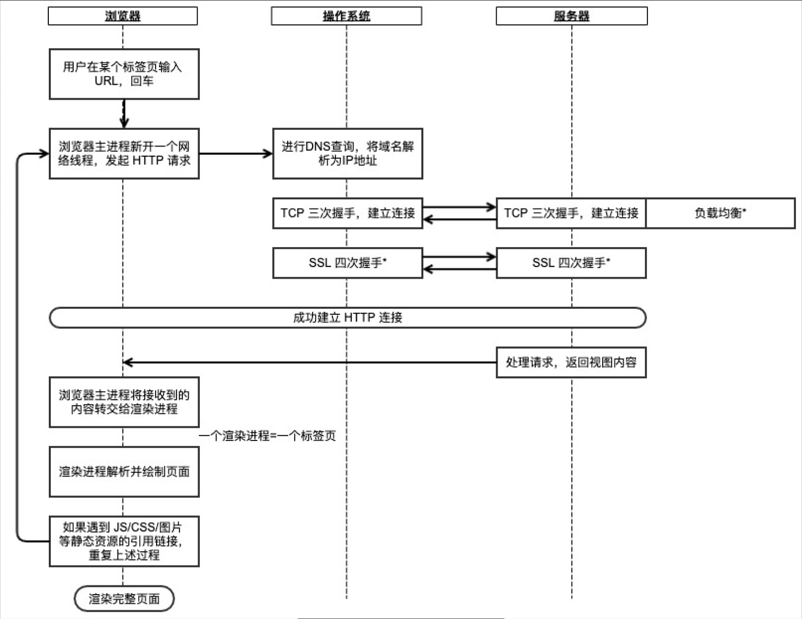

## 1.介绍一下OSI七层模型，各层协议有哪些？
OSI 七层模型是网络通信分层框架，把网络通信拆成七层，每层只管自己的事，通过接口跟上下层打交道。

从下往上依次是：

1. 物理层：最底层，管的是比特流怎么在物理介质上传输。网线、光纤、无线电波这些都是物理层的东西。

2. 数据链路层：把比特流组成帧，用 MAC 地址在局域网内寻址，还负责差错检测。以太网、（点对点协议）PPP 协议在这层。

3. 网络层：管的是跨网络的数据传输，用 IP 地址寻址，负责路由选择。IP 协议、ICMP 协议、ARP协议在这层。

4. 传输层：提供端到端的通信，管的是进程级别的通信。TCP 提供可靠传输，UDP 提供快速但不保证可靠的传输。

5. 会话层：管理通信会话的建立、维护和终止。NetBIOS、RPC 这些在这层。

6. 表示层：管数据格式转换、加密解密、压缩解压。JPEG、MPEG、SSL/TLS 的加密功能在这层。

7. 应用层：最上层，直接跟用户打交道。HTTP、HTTP、FTP、SMTP、DNS 这些都是应用层协议。

网络分层的好处：对各层实现了解耦，层与层之间不会有关联性，就比如应用层HTTP从1.1升到2.0时，也不会对传输层、网络层有影响。

不过OSI也只是理论模型，现实因特网中是使用了TCP/IP网络模型，对OSI模型进行了简化，将应用层/表示层/会话层统一成了应用层，数据链路层和物理层统一成了网络接口层。

## 2.TCP/IP网络模型有哪几层？

TCP/IP 网络模型主要有四层，从上到下分别是，应用层、传输层、网络层、网络接口层。

- 应用层：负责为应用软件提供网络服务，例如HTTP（管网页）、FTP（管文件传输）、HTTPS、DNS（管域名）、SMTP（管邮件）等协议。
- 传输层：负责为应用程序层提供数据传输服务，管的是进程之间的通信。传输层协议主要有TCP和UDP，TCP是可靠传输协议，UDP是不可靠的传输协议。
- 网络层：负责主机寻址，打包和路由功能。网络层的核心协议是IP、ARP、ICMP等协议。IP协议负责寻址和路由，ARP协议负责获取MAC地址，ICMP负责提供诊断功能并报告错误。
- 网络接口层：负责为网络层提供「链路级别」传输的服务，负责在以太网、Wifi这样的物理网络上发送原始数据包，工作在网卡这个层次，使用 MAC 地址来标示网络上的设备。以太网、Wi-Fi、PPP这些协议都在这层。

## 3.IP协议和TCP协议属于哪一层？
IP协议属于网络层，TCP协议属于传输层。

## 4.网络为什么要分层？
分层是为了降低耦合，各层相互独立之后，上层可以不关心下层的实现，只关心下层提供的接口服务，有利于排查网络问题，能更精细定位问题在哪一层。

而且分层之后层一层之间不会产生关联性，不会因为某个层的改动，影响了其他层，比如我们应用层的 HTTP 协议，从 HTTP1.1 升级到 HTTP2.0 的时候，并不会对传输层、网络层等有影响，或者网络层的 IPv4 协议升级为 IPv6 协议的时候，也不会影响应用层、传输层。

## 5.输入网址后，期间发生了什么？
在浏览器输入网址后（浏览器端）：

1. 浏览器会先解析 URL，解析出域名、资源路径、端口等信息，然后构造 HTTP 请求报文。

2. 接着进行域名解析，将域名解析为 IP 地址，会先查浏览器缓存缓存是否有域名信息，如果有就返回 IP 地址，没有就会查看本地系统 host 文件有没有域名信息，如果有就返回 IP 地址，如果没有就去查本地 DNS 服务器，如果本地 DNS 服务器缓存中有域名信息，就返回 IP 地址，否则本地 DNS 服务器会去根域名服务器->顶级域名服务器->权威域名服务器询问，最后拿着返回的 IP 交给浏览器。(浏览器缓存->系统缓存->路由器缓存->DNS服务器)

3. 由于 HTTP 是基于 TCP 传的，所以在发送 HTTP 请求前，需要进行三次握手，在客户端发送第一次握手的时候，TCP 头部会填上 SYN 标记位，同时上目标端口和源端口的信息。源端口是浏览器随机生成的，目标端口要看是 HTTP 还是 HTTPS，如果是 HTTP 默认端口是 80，如果是 HTTPS 默认是 443。如果是HTTPS，还需要进行TLS四次握手，协商加密密钥。

4. 然后到网络层，会加上 IP 头，同时填上目标 IP 地址和源 IP 地址。

5. 然后到数据链路层，会通过 ARP 协议，获取路由器的 MAC 地址，然后会加上 MAC 头，填上目标 MAC 地址和源 MAC 地址。

6. 然后到物理层之后，直接把数据包，转发给路由器，路由器再通过下一跳，最终找到目标服务器，然后目标服务器收到客户的 SYN 报文之后，会响应第二次握手。

7. 当双方都完成三次握手后，如果是 HTTP 协议，客户端就会将 HTTP 请求就会发送给目标服务器；如果是 HTTPS 协议，客户端还要和服务端进行 TLS 四次握手之后，客户端才会将 HTTP 报文发送给目标服务器。

8. 目标服务器收到 HTTP 请求消息后，就返回 HTTP 响应消息，浏览器会对响应消息进行解析渲染，呈现给用户。

处理与响应（服务器端）：
1. 服务器接收与解包。数据包历经千辛万苦到达服务器。服务器网卡收到后，操作系统开始一层层脱壳（解封装）：去掉 MAC 头 -> 去掉 IP 头 -> 去掉 TCP 头，最后把纯净的 HTTP 数据交给监听 80 或 443 端口的 Web 服务器进程（如 Nginx）。

2. 处理与响应。服务器处理请求（读数据库、运行逻辑），生成 HTTP 响应报文。这个响应报文会经历同样的封装过程，原路返回给浏览器。

3. 浏览器渲染。浏览器收到 HTML 代码，开始解析 DOM 树，下载 CSS 和 JS，最后把漂亮的网页渲染出来展示给用户。




## 6.DNS是如何解析的，属于哪一层协议？
DNS 属于应用层的协议，客户端在进行 DNS 解析之前，会先查看浏览器和操作系统是否有缓存该域名对应的IP地址，没有就会查看本地系统 host 文件有没有域名信息，如果有就返回 IP 地址，如果没有就会向本地DNS服务器发出查询请求。

如果本地DNS服务器有缓存也直接返回 IP 地址，如果本地DNS服务器没有缓存，就接着本地DNS向根DNS发送查询请求。

根DNS服务器收到请求后会返回顶级域名服务器的 IP 地址，然后本地DNS服务器再向顶级域名服务器发出查询请求，顶级DNS服务器收到请求后会返回权威域名服务器的 IP 地址，然后本地DNS服务器再向权威域名服务器发出查询请求，权威域名服务器收到请求后，就会返回域名对应的 IP 地址了。

最后本地DNS 服务器返回查询结果给客户端，同时本地域名服务器把返回的结果保存到缓存，以备下一次使用。

客户端通过这个 IP 地址就可以访问目标Web服务器了。到这里，DNS查询的整个过程就结束了。

## 7.DNS域名解析使用了什么协议？
在DNS中，域名解析请求和响应都是基于UDP进行传输的。

UDP是一种无连接的传输层协议，它提供了一种简单的传输机制，适用于实时性要求较高的应用场景。DNS使用UDP协议进行域名解析是因为域名解析通常是短小而频繁的请求，UDP的无连接特性可以减少建立和断开连接的开销，并提高解析的效率。不过DNS也并非完全不用TCP，当响应数据超过512字节时会使用TCP。

UDP对与TCP的缺点是没办法保证数据的可靠传输，针对这个缺陷，可以在应用层实现一个超时重传机制，如果域名解析请求在一定时间内没收到响应，那么就重发域名解析请求。

## 8.输入域名是如何知道端口的？
```
http://xiaolincoding.com/，默认端口是80
https://xiaolincoding.com/，默认端口是 443
http://xiaolincoding.com:8080/，指定的端口是 8080
```
HTTP 默认端口是 80，HTTPS 默认端口是 443，如果用户指定了端口，比如域名:8080，这时候就会使用 8080 作为目标端口。

## 9.客户端向服务器的IP地址发送数据，服务端如何确定应该把数据传给谁？

首先服务端的应用会监听端口，协议栈会通过端口来区分不同应用的数据。

服务端收到的 `HTTP` 请求就是一段文本，格式是固定的：`请求行 + 请求头 + 空行 + 请求体`。服务端按这个格式逐行解析就行。
```http
POST /api/login HTTP/1.1            //请求行
Host: www.mianshiya.com             //请求头
Content-Type: application/json
Content-Length: 42
                                    //空行
{"username":"admin","password":"123456"}        //请求体
```
**请求行的三个要素**
- 请求方法决定了这次请求要干什么：GET 取资源、POST 提交数据、PUT 更新资源、DELETE 删除资源。不过这只是语义约定，服务端爱怎么实现怎么实现。
- URL 是请求的路径，可能带查询参数。比如 /search?keyword=java&page=1，服务端要把 keyword 和 page 解析出来。
- HTTP 版本影响后续的解析方式。HTTP/1.1 是文本协议，一行一行读就行。HTTP/2 是二进制帧格式，完全不同的解析逻辑。

常见的请求头
- Host 是 HTTP/1.1 必须带的头，告诉服务器请求的是哪个虚拟主机。一台服务器可能部署了好几个网站，靠 Host 区分。

- Content-Type 告诉服务端请求体的格式。常见的有：

    1. application/x-www-form-urlencoded：表单默认格式，数据是 key=value&key2=value2
    2. multipart/form-data：上传文件用的，每个字段用分隔符隔开
    3. application/json：前后端分离的主流格式，请求体是 JSON 字符串

- Content-Length 告诉服务端请求体有多少字节，服务端据此读取指定长度的数据。如果没有这个头，服务端就不知道该读多少。

- Transfer-Encoding: chunked 是分块传输，请求体分成多个块，每个块前面标明长度，最后一个块长度为 0 表示结束。适合数据量不确定的场景。


解析过程分这么几步：

1. 先读第一行，就是请求行，按空格切分得到请求方法 POST、URI /api/login、协议版本 HTTP/1.1
2. 接着逐行读请求头，每行都是 key: value 格式，遇到空行就停止。Host 告诉服务器请求的是哪个域名，Content-Type 告诉请求体是什么格式，Content-Length 告诉请求体有多少字节
3. 空行之后就是请求体了。服务端根据 Content-Length 读指定长度的数据，再根据 Content-Type 决定怎么解析。application/json 就用 JSON 解析器，application/x-www-form-urlencoded 就按 & 切分键值对
4. 解析完成后，根据 URL 路由到对应的处理逻辑，执行业务代码
5. 处理完生成响应，响应格式也是固定的：状态行 + 响应头 + 空行 + 响应体

```http
HTTP/1.1 200 OK                     //状态行
Content-Type: application/json      //响应头
Content-Length: 27
                                    //空行
{"code":0,"msg":"success"}          //响应体
```


**提问：如果 Content-Length 和实际请求体长度不一致会怎么样？**

**回答**两种情况。Content-Length 比实际小，服务端只读取声明的长度，后面的数据被截断或者留在缓冲区污染下一个请求。Content-Length 比实际大，服务端会一直等，直到超时或者连接断开。这还可能被利用来做 HTTP 走私攻击，前端代理和后端服务器对同一个请求解析不一致，攻击者可以夹带恶意请求。


**提问：HTTP/1.1 的 Keep-Alive 是怎么工作的？**

**回答**HTTP/1.0 默认每个请求都要新建 TCP 连接，请求完就断。HTTP/1.1 默认开启 Keep-Alive，一个连接上可以发多个请求，省掉重复握手的开销。但 HTTP/1.1 是串行的，前一个请求的响应没收完，后一个请求发不出去，这叫队头阻塞。服务端通过 Connection: keep-alive 和 Keep-Alive: timeout=60 告诉客户端这个连接能保持多久。

**提问：怎么判断请求体读完了？**

**回答**两种方式：一是看 Content-Length，读够指定字节数就完了；二是 Transfer-Encoding: chunked，分块传输，每个块前面有长度，读到长度为 0 的块就结束。如果两个头都没有，对于请求来说一般认为没有请求体，对于响应来说只能靠服务端关闭连接来标识结束，这在 HTTP/1.0 里常见。

## 10.现在很多网站都要求使用 https，假设我们输入一个 http 网址，网站是如何实现由 http 跳转到 https 的？
在nginx服务器端进行配置。
```nginx
server {
    listen 80;
    server_name example.com;
    return 301 https://$host$request_uri;
}
```
- 服务器收到 http 请求后，给客户端一个 http 响应，状态码为 301（永久重定向）
- 浏览器收到重定向响应后，会自动向服务器发起一个新的 HTTPS 请求（默认端口 443） 

## 11.如果浏览器没有显示页面有哪些原因？
最直接的方法就是抓包，排查的思路大概有：

1）先确定是服务端的问题，还是客户端的问题

先在客户端确认浏览器是否可以访问其他网站，如果不可以，说明客户端网络自身的问题，然后检查客户端网络配置（。

如果可以正常其他网页，说明客户端网络是可以正常上网的。

2）如果客户端网络没问题，就抓包确认 DNS 是否解析出了 IP 地址

如果没有解析出来，说明域名写错了。

如果解析出了 IP 地址，抓包确认有没有和服务端建立三次握手：

如果没有成功建立三次握手，需要在服务端通过 ps 确认 server 进程是否启动了，以及通过 netstate 命令确认是否监听了端口。

如果能成功建立三次握手，并且发出了 HTTP 请求，但是就是没有显示页面，可以查看服务端返回的响应码：

如果是 404 错误码，检查输入的 url 是否正确；

如果是 500，说明服务器此时有问题，这时候就需要去服务器排查日志。

如果是 200，可以在浏览器按 F12 输出前端控制台，看看前端代码有问题导致浏览器没有渲染出页面。

3）如果客户端网络是正常的，但访问速度很慢导致很久才显示出来

可以通过 ping 去确认网络延迟是否正常。

如果耗时很严重，可以排查服务器的流量是不是很大，导致超过了带宽上限，产生了丢包的问题。

如果网络是正常的，可能要排查接口为什么处理这么久，这里可能是 SQL 导致的。

总之就是一层一层有没有插网线、网络配置是否正确、DNS 有没有解析出 IP 地址、TCP 有没有三次握手、HTTP 返回的响应码是什么。

## 12. 服务器 ping 不通但是 http 能请求成功，会出现这种情况吗？

会的，因为 ping 和 http 使用的协议是不一样的，ping 是基于网络层的 icmp 协议，而 http 是基于传输层的 tcp 协议的，有可能服务器的防火墙禁止 icmp 协议，但是 tcp 协议没有禁止，就会出现服务器 ping 不通，但是 http 能请求成功的现象。

## 13. HTTP 协议的特点是什么？
HTTP 具有简单、灵活可扩展、无状态等特点，是一种广泛应用于 Web 通信的协议。
- **基于文本**:HTTP 的消息是以文本形式传输，易于阅读和调试。
- **可扩展性**:HTTP 协议本身不限制数据的内容和格式，可以通过扩展头部、方法等来支持新的功能。
- **数据格式灵活**:可传输文本（HTML、JSON）、图片、视频等多种类型数据，通过 Content-Type 头部字段标识，适用于多种应用场景。
- **请求应答模式**:HTTP 协议使用的是请求 - 应答通信模式，请求方先发起连接和请求，是主动的，而应答方只有在收到请求后才能答复，是被动的，如果没有请求时不会有任何动作。
- **无状态**:HTTP 每个请求之间相互独立，服务器不会保留之前请求的状态信息，需要通过其他手段（如 Cookies、Session）来维护状态

## 14. HTTP报文格式？怎么分割的？


HTTP 报文格式分为请求行、请求头、请求体三个部分：
- 请求行是请求或响应的基本信息，比如请求方法、URL、HTTP 版本信息；
- 请求头使用 key-value 形式更详细地说明报文，比如 Host 字段、Connection 字段、Content-Length 字段；
- 请求体是实际传输的数据，比如文本数据、图片数据。

请求行和请求头是通过 \r\n 分割的；请求头和请求体之间是通过空白行分割的，也就是两个连续的 \r\n。

## 15.HTTP默认的端口号是？
80

## 16.HTTP有什么方法？
我了解到 HTTP 方法的有 GET、POST、PUT、HEAD、DELETE 这些方法，其中：
- GET 方法是用来请求从服务器获取资源的；
- HEAD 方法和 GET 方法类似，也是请求从服务器获取资源，但与 GET 请求不同的是，服务器不会返回请求的实体数据，只会传回响应头，也就是获取的是资源的“元信息”。
- POST 方法是用来向服务器端提交数据，数据就放在报文的 body 里
- PUT 方法和 POST 类似，也可以向服务器提交数据，区别在于 POST 是“新增数据”，PUT 是“更新数据”。
- DELETE 方法是用来删除资源

在项目开发中，用的比较多是 GET 和 POST 请求。

## 17. 分析一下哪些 HTTP 方法是安全或者幂等的？
GET 和 HEAD 方法是安全且幂等的，因为它们是读操作，只要开发者遵循规范要求的去处理请求，无论 GET 和 HEAD 操作多少次，服务器上的数据都是安全的。

而 POST/PUT/DELETE 这些方法都会增加/改服务器上的资源，所以是不安全的。

DELETE 和 PUT 方法是幂等的，因为 DELETE 是删除资源，多次删除效果都是资源不存在，所以也是幂等的；PUT 是更新数据，多次更新数据，结果都一样，所以是幂等的。

但是 POST 不是幂等的，因为多次 POST 请求，会创建多个资源，所以不是幂等的。

## 18.Get和Post请求的区别?Get请求一定是安全且幂等的吗?
不一定，要看实际的 GET 请求，如果开发者遵循了规范去处理请求，也就是 GET 请求的实现是获取资源，那么就是安全且幂等的，但是如果开发者处理 GET 请求的方式是新增数据，这时候 GET 请求就不是安全且幂等的。

## 19.HTTP有什么状态码?

1. 100类状态码属于提示信息，是协议处理中的一种中间状态，实际用到的比较少。

    - “101 Switching Protocols”：请求者已要求服务器切换协议，服务器已确认并准备切换。它的意思是客户端使用 Upgrade 头字段，要求在 HTTP 协议的基础上改成其他的协议继续通信，比如 WebSocket。而如果服务器也同意变更协议，就会发送状态码 101，但这之后的数据传输就不会再使用 HTTP 了。

2. 200类状态码表示服务器成功处理了客户端的请求。

    - “200 OK” 是最常见的成功状态码，表示一切正常，服务器如客户端所期望的那样返回了处理结果，如果是非 HEAD 请求，通常在响应头后都会有 body 数据。

    - “204 No Content” 是另一个很常见的成功状态码，它的含义与 “200 OK” 基本相同，但响应头后没有 body 数据。所以对于 Web 服务器来说，正确地区分 200 和 204 是很必要的。

    - “206 Partial Content” 是 HTTP 分块下载或断点续传的基础，在客户端发送 “范围请求”，要求获取资源的部分数据时出现，它与 200 一样，也是服务器成功处理了请求，但 body 里的数据不是资源的全部，而是其中的一部分。

3. 300类状态码表示客户端请求的资源发生了变动，需要客户端用新的 URL 重新发送请求获取资源，也就是重定向。

    - “301 Moved Permanently”：代表永久性的重定向，值得注意的是，这种重定向跳转，从严格意义来讲不是服务器跳转，而是客户端跳转的。这个“跳”的动作是服务器是通过回传状态码301来下达给客户端的，让客户端完成跳转。

    - “302 Found”：代表临时跳转。例如：URL地址A可以向URL地址B上跳转，但这并不是永久性的，在经过一段时间后，URL地址A还可能向URL地址C上跳转。

    - “304 Not Modified”：服务器通过返回状态码304可以告诉客户端请求资源成功，但是这个资源不是由服务器提供返回给客户端的，而是客户端本地浏览器缓存中就有的这个资源，因为可以从缓存中获取这个资源，从而节省传输的开销。

4. 400类状态码表示客户端发送的报文有误，服务器无法处理。

    - “400 Bad Request”：表示请求报文有错误，但具体是数据格式错误、缺少请求头还是 URI 超长它没有明确说，只是一个笼统的错误，客户端看到 400 只会是“一头雾水”不知所措。

    - “403 Forbidden”：代表请求的服务器资源权限不够，也就是没有权限去访问服务器的资源，或者请求的IP地址被封掉了。

    - “404 Not Found”：代表服务器上没有该资源，或者说服务器找不到客户端请求的资源，是最常见的请求错误码。

5. 500类状态码表示客户端请求报文正确，但是服务器处理时内部发生了错误，属于服务器端的错误码。

    - “500 Internal Server Error”：代表服务器程序错误，也就是说请求的网页程序本身报错了。在服务器端的网页程序出错。由于现在的浏览器都会对状态码500做一定的处理，所以在一般情况下会返回一个定制的错误页面。

    - “501 Not Implemented”：服务器不具备完成请求的功能。例如，服务器无法识别请求方法时可能会返回此代码。

    - “502 Bad Gateway”：通常是服务器作为网关或代理时返回的错误码，表示服务器自身工作正常，访问后端服务器发生了错误。

    - “503 Service Unavailable”：表示服务器当前很忙，暂时无法响应客户端。我们上网时有时候遇到的“网络服务正忙，请稍后重试”的提示信息就是状态码 503。

    - “504 Gateway Timeout”：服务器作为网关或代理，但是没有及时从上游服务器收到请求。


## 20.什么情况下会出现502错误码?
如果客户端访问服务器是通过 nginx 来反向代理到应用服务器，那么如果应用服务器出现了故障，导致 nginx 无法从应用服务器获取到响应，这时候 nginx 就会返回 502 错误码给客户端。

## 21.有个服务出现了 504，你觉得这个服务是出了什么问题？
504 是网关超时错误，通常是 nginx 将请求代理到后端应用时，后端应用没有在规定的时间返回数据，需要开发检查下应用那块有什么耗时的操作，比如是否出现了 sql 慢查询，接口是否发生 死循环、死锁 等问题，然后后端服务系统负载高不高。

## 22.重定向是哪一类状态码？临时重定向和永久重定向有什么区别？
重定向是数字 3 开头的状态码。
- 301 状态码是代表永久重定向，客户端收到 301 状态码后，会记忆重定向后的 URL 地址，这样下一次访问的时候，不需要访问旧 URL，直接跳转到新 URL 访问。
- 302 状态码代表临时重定向，客户端收到 302 状态码后，不会记忆重定向后的 URL 地址，下一次访问的时候，还需要访问旧 URL，再跳转访问新的 URL。

## 23.HTTP是长连接还是短连接？
HTTP 1.0 虽然支持长连接，但是默认的连接行为是短链接，从 HTTP1.1 版本之后，都是默认长连接了。要打开,
```http
Connection: Keep-Alive
```
要关闭，
```http
Connection: Keep-Alive
```

## 24.HTTP长连接和短连接的区别?


短连接：每次通信请求都需要建立新的TCP连接，请求完成后立即关闭连接，下次请求还需要重新建立 TCP 连接。这样每次请求都需要建立连接和释放连接，会增加通信开销和延迟。

长连接：在通信过程中保持连接的持续性，多次请求可以共享同一个 TCP 连接。在长连接中，客户端和服务器建立连接后可以进行多次请求和响应，减少了连接建立和释放的开销，提高了通信效率。

## 25.HTTP/1.0和HTTP/1.1的区别?
HTTP/1.0 和 HTTP/1.1 两者的主要区别体现在：

- 长连接：在 HTTP/1.0 中，默认使用的是短连接，也就是每次请求都要重新建立一次连接。HTTP 是基于 TCP/IP 协议的，每一次建立或者断开连接，都需要三次握手四次挥手的开销，如果每次请求都要这样的，开销会比较大，因此最好能维持一个长连接，可以用长连接来发多个请求。HTTP 1.1 起，默认使用长连接 Connection: keep-alive。

- 请求管道化：HTTP 1.1 支持请求管道化，即在一个持久连接上可以同时发送多个请求，而 HTTP 1.0 不支持请求管道化，HTTP/1.0 请求和响应必须是串行的，当一个请求和它响应完成之后，才能发送下一个请求，而 HTTP/1.1 由于支持管道传输方式，因此可以并发发送 HTTP 请求，能够提高 HTTP 请求的效率。

- Host 头字段：HTTP/1.0 没有 host 字段，HTTP/1.1 新增了 host 字段，通过 Host 头部字段，一个物理服务器可以承载多个域名或站点。

- 错误响应码：在 HTTP 1.1 中，新增了 24 个错误状态响应码，如 409（Conflict）：表示请求的资源与资源的当前状态发生冲突；410（Gone）：表示服务器上的某个资源被永久性的删除。

- 缓存处理：HTTP 1.0 中，主要使用 header 里的 If-Modified-Since、Expires 来做缓存判断的标注；HTTP 1.1 则引入了更多的缓存控制策略，如 Entity tag、If-Unmodified-Since、If-Match、If-None-Match 等；

- 带宽优化及网络连接的使用：HTTP 1.0 中，存在一些浪费带宽的现象，例如客户端只是需要某个对象的一部分，而服务器却将整个对象传送过来，并且不支持断点续传功能；HTTP 1.1 中，引入了 range 头域，允许只请求资源的某个部分，返回码是 206（Partial Content），这样方便开发者自由的选择，以便于充分利用带宽和连接。

