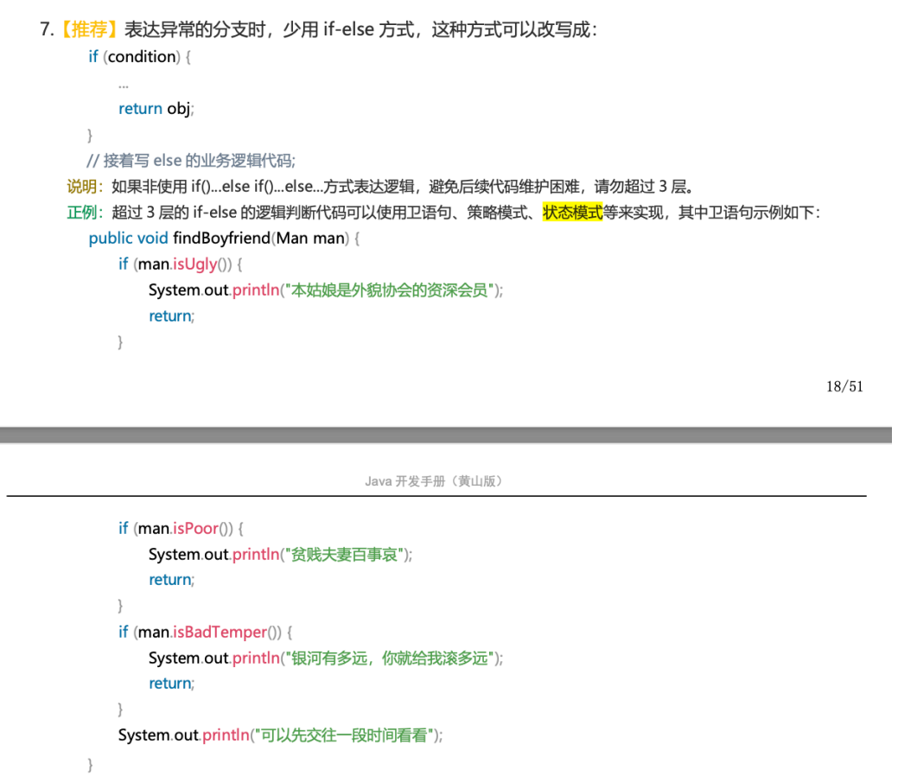

# 一、面向对象软件开发核心设计原则

SOLID原则

## 1. 单一职责原则（Single Responsibility Principle, SRP）

- **核心思想**：一个类或模块应该只有**一个引起它变化的原因**。

- 通俗理解：一个类只专注做一件相关的事。若一个类承担多个职责，当其中一个职责变更时，可能会影响其他职责的实现，从而增加代码复杂度和耦合度。

  例如：一个 “用户管理类” 如果同时负责用户信息存储和用户权限验证，当权限验证逻辑变更时，可能会影响用户信息存储的稳定性，这就违反了单一职责原则。

## 2. 开闭原则（Open-Closed Principle, OCP）

- **核心思想**：软件实体（类、模块、函数等）应该**对扩展开放，对修改关闭**。

- 通俗理解：新增功能时，应通过添加新代码（如子类、实现类）来实现，而非修改已有、运行良好的代码。这是面向对象设计中最核心的原则之一，是系统可维护性和可复用性的基础。

  例如：一个 “图形绘制系统”，若要新增 “三角形绘制” 功能，应通过新增 “三角形类” 来扩展，而不是修改已有 “圆形类”“矩形类” 的代码。

## 3. 里氏替换原则（Liskov Substitution Principle, LSP）

- **核心思想**：所有引用基类的地方，都能**透明地使用其子类对象**。

- 通俗理解：子类可以完全替换父类，且程序行为不会出现错误或异常。这意味着子类在继承父类时，不应改变父类预期的行为，它是实现 “开闭原则” 的重要保障。

  例如：父类 “鸟” 有 “飞翔” 方法，若子类 “鸵鸟” 继承父类后重写 “飞翔” 方法为 “无法飞翔”，则违反了里氏替换原则，因为它改变了父类的预期行为。

## 4. 接口隔离原则（Interface Segregation Principle, ISP）

- **核心思想**：客户端不应该被强迫依赖它不需要的接口；一个类对另一个类的依赖应建立在**最小的接口**之上。

- 通俗理解：接口设计要 “专一”，避免大而全的 “胖接口”，应根据功能拆分成多个细粒度接口。这样可以避免一个类为了实现接口中的某一个功能，被迫实现其他不需要的功能。

  例如：一个 “设备接口” 如果同时包含 “打印”“扫描”“传真” 方法，对于只需要 “打印” 功能的类来说，就被迫依赖了不需要的 “扫描”“传真” 接口，违反了接口隔离原则。

## 5. 依赖倒置原则（Dependency Inversion Principle, DIP）

- **核心思想**：高层模块不应该依赖低层模块，两者都应该依赖于**抽象**；抽象不应该依赖于细节，细节应该依赖于抽象。

- 通俗理解：要 “面向接口 / 抽象编程”，而非面向具体实现编程。代码的依赖关系应通过抽象（如接口、抽象类）建立，而非具体的实现类。这能大幅降低模块间的耦合度，方便系统升级和扩展。

  例如：高层模块 “订单服务” 若直接依赖低层模块 “MySQL 数据库实现类”，则耦合度很高；若改为依赖 “数据库操作接口”，低层模块通过实现该接口来适配，就能实现依赖倒置，降低耦合。

---

1. 单一职责原则：一个类之应该专注一件事情。
2. 开闭原则：应该对扩展开放，对修改关闭。
3. 里氏替换原则：子类可以替换父类，不会改变父类预期的行为。
4. 接口隔离原则：接口要细粒度，避免大而全的接口。
5. 依赖倒置原则：代码的依赖关系应通过抽象建立，降低耦合度。

---

其他原则：

## 1. 合成聚合复用原则（Composite/Aggregate Reuse Principle, CARP）

- **核心思想**：尽量通过  对象组合（合成 / 聚合）的方式实现代码复用，而非依赖继承。

- 通俗理解：“has-a”（拥有）的关系比 “is-a”（是）的继承关系更灵活。继承是强耦合的 “白盒复用”（子类会暴露父类的实现细节），而组合是弱耦合的 “黑盒复用”（只需关注组件的功能，无需了解内部实现），后者更易维护和扩展。

  示例：若要实现 “汽车” 功能，通过组合“发动机”“轮胎”“座椅” 等组件来构建，比让 “汽车” 类继承 “交通工具” 类更灵活 —— 当 “发动机” 的实现变更时，只需修改 “发动机” 组件，不会影响 “汽车” 类的其他逻辑。

## 2. 迪米特法则（Law of Demeter, LoD）/ 最少知识原则（Least Knowledge Principle, LKP）

- **核心思想**：一个软件实体应尽可能**少地与其他实体发生交互**。

- 通俗理解：一个对象应 “只和直接朋友交谈”，对其他对象的了解越少越好。这能大幅降低类之间的耦合度，让每个模块更独立。

  示例：用户下单时，“订单服务” 只需直接调用 “支付服务” 即可，无需关心 “支付服务” 内部如何调用 “银行接口”“风控系统”—— 如果 “订单服务” 直接与 “银行接口” 交互，就违反了迪米特法则，导致耦合度飙升。


# 二、什么是设计模式

- **定义**：设计模式是一套在特定场景下，针对软件设计中常见问题的**可复用解决方案**。它不是直接可运行的代码，更像 “蓝图或模板”，描述了如何组织类和对象来解决特定设计难题。
- 本质属性
  - 是**经验的总结**：由无数软件工程师长期实践、反复验证后总结的 “最佳实践”；
  - 是**沟通的语言**：为开发者提供通用词汇（如 “工厂模式”“单例模式”），让团队能快速理解设计意图，提升沟通效率；
  - 解决的核心问题：提升代码的**可重用性、可读性、健壮性和可维护性**，让代码结构更清晰、耦合度更低，避免重复造轮子和踩常见的设计 “坑”。
- **价值定位**：是软件工程化的重要基石，能将代码设计从 “个人技艺” 提升到 “工程规范” 的层面。


# 三、设计模式的分类

### 1. 创建型模式（Creational Patterns）

- **关注点**：对象的创建过程。这类模式将对象的创建和使用解耦，使程序在创建对象时更具灵活性，隐藏了对象创建的复杂逻辑，无需直接使用 `new` 关键字。
- **核心思想**：提供一种机制，让客户端代码不必关心所需的具体类实例，也不必关心实例的创建和组织方式。
- 常见模式：
  - 单例模式（Singleton）
  - 工厂方法模式（Factory Method）
  - 抽象工厂模式（Abstract Factory）
  - 建造者模式（Builder）
  - 原型模式（Prototype）

### 2. 结构型模式（Structural Patterns）

- **关注点**：类和对象的组合。这类模式研究如何将类和对象组合成更大、更复杂的结构，同时保持结构的灵活性和效率。
- **核心思想**：通过继承、组合等方式，在不改变原有类的情况下，为其增加新功能或适配不同接口。
- 常见模式：
  - 适配器模式（Adapter）
  - 桥接模式（Bridge）
  - 组合模式（Composite）
  - 装饰器模式（Decorator）
  - 外观模式（Facade）
  - 享元模式（Flyweight）
  - 代理模式（Proxy）

### 3. 行为型模式（Behavioral Patterns）

- **关注点**：对象之间的通信和职责分配。这类模式专门处理对象之间的交互和协作，以及算法和责任的分配。
- **核心思想**：通过定义对象间的通信模式来降低耦合度，使系统中的对象可以独立地变化。
- 常见模式：
  - 责任链模式（Chain of Responsibility）
  - 命令模式（Command）
  - 迭代器模式（Iterator）
  - 中介者模式（Mediator）
  - 备忘录模式（Memento）
  - 观察者模式（Observer）
  - 状态模式（State）
  - 策略模式（Strategy）
  - 模板方法模式（Template Method）
  - 访问者模式（Visitor）
  - 解释器模式（Interpreter）


# 四、工厂模式

#### 请谈一谈你对工厂模式的理解

工厂模式是创建型设计模式中最常用的一族，它主要解决的是对象的创建问题，将对象的创建和使用过程进行解耦。根据其复杂度和应用场景的不同，通常分为三种：

1. 简单工厂模式
2. 工厂方法模式
3. 抽象工厂模式

#### 说一说简单工厂模式

简单工厂模式指由一个单一的工厂对象来创建实例，客户端不需要关注创建逻辑，只需提供传入工厂的参数。

UML 类图如下：


- 角色组成：
  - 工厂（Factory）：负责实现创建所有实例的内部逻辑。
  - 抽象产品（AbstractProduct）：所有被创建对象的父类或接口。
  - 具体产品（ConcreteProduct）：工厂类创建的目标实例。
- **解决的问题**：将客户端代码与具体产品的实现类解耦。客户端只需 “消费” 产品，而无需关心产品是如何被创建的。
- 优缺点：
  - 优点：结构简单，将创建逻辑集中管理，实现了职责分离。
  - 缺点：违反了开闭原则。当需要增加新产品时，必须修改工厂类内部的判断逻辑（例如 if-else 或 switch 语句），这使得工厂类越来越臃肿，难以维护。
- 实例：
  - Java 的 `Calendar.getInstance()` 方法，内部会根据时区、地区等参数创建具体的日历对象。
  - Spring 的 `BeanFactory` 在概念上就是一个强大的简单工厂，你通过一个 bean 的名字（ID）就能获取到对应的实例，而无需关心这个 bean 是如何被创建和配置的。

简单工厂代码实现：


#### 静态工厂和简单工厂的区别

**静态工厂（Static Factory）**：是一种基于类的**静态方法**创建对象的方式，源于《Effective Java》中推荐的创建对象技巧。严格来说它不算标准设计模式，但常被归类为创建型模式。

文中还提到，前面的简单工厂模式代码可以用静态工厂的方式改写，并会对静态工厂和简单工厂进行对比（具体对比内容需结合后续内容，但从现有信息可明确二者的核心区别是实现方式和设计定位的差异）。


NIO 中大量用到了工厂模式，比如 `Files` 类的 `newInputStream` 方法用于创建 `InputStream` 对象（静态工厂）、`Paths` 类的 `get` 方法创建 `Path` 对象（静态工厂）、`ZipFileSystem` 类（`sun.nio` 包下的类，属于 `java.nio` 相关的一些内部实现）的 `getPath` 的方法创建 `Path` 对象（简单工厂）。


#### 工厂方法模式

为了解决简单工厂模式违反开闭原则的问题，工厂方法模式将创建具体对象的任务下放给子类。它定义了一个用于创建对象的抽象方法，但由子类来决定要实例化哪一个类。

UML 类图如下：


- 角色组成：
  - 抽象工厂（AbstractFactory）：声明了创建产品的抽象方法。
  - 具体工厂（ConcreteFactory）：实现抽象方法，负责创建具体的产品。
  - 抽象产品（AbstractProduct）：与简单工厂模式相同。
  - 具体产品（ConcreteProduct）：与简单工厂模式相同。
- **解决的问题**：在不修改现有工厂类的情况下，轻松扩展新的产品。如果想增加一个新产品，只需增加一个新的具体产品类和一个对应的具体工厂类即可，完全符合开闭原则。
- 优缺点：
  - 优点：完美遵循开闭原则，扩展性好。创建逻辑被分散到各个具体工厂中，符合单一职责原则。
  - 缺点：每增加一个产品，就需要增加一个具体工厂类，这会导致系统中的类数量成倍增加，增加了系统的复杂性。
- **实例**：Java 集合框架中 `Collection` 接口的 `iterator()` 方法。`ArrayList` 和 `LinkedList` 都实现了这个接口，但它们各自的 `iterator()` 方法返回的是不同的迭代器实现类（`ArrayListIterator` 和 `LinkedListIterator`），这就是典型的工厂方法模式。

#### 

#### 抽象工厂模式

当需要创建的不是单一产品，而是一个**产品族**（一系列相互关联或相互依赖的对象）时，就该使用抽象工厂模式。它提供一个接口，用于创建一系列相关或相互依赖的对象，而无需指定它们具体的类。可以理解为它是 “工厂的工厂”。

"产品族" 和 "产品等级结构" 概念介绍：

- 产品等级结构：同一类产品的不同实现（如按钮可以有 Windows 按钮、Mac 按钮，这构成一个产品等级结构）
- 产品族：同一品牌或风格下的不同产品（如 Windows 风格下的按钮、文本框、复选框，构成一个产品族）


角色组成：

- 抽象工厂 (AbstractFactory)：定义了创建一系列不同产品（一个产品族）的接口。
- 具体工厂 (ConcreteFactory)：实现接口，创建特定主题或风格的产品族。
- 抽象产品 (AbstractProduct)：为产品族中的每一种产品定义接口。
- 具体产品 (ConcreteProduct)：实现抽象产品接口，是具体工厂创建的目标。

解决的问题：

解决创建一整个产品家族的问题，保证客户端在切换不同产品族时，能获得一整套相互兼容和匹配的对象。

优缺点：

- 优点：非常适合用于创建一系列相互匹配的产品。切换整个产品族非常方便，只需更换具体的工厂即可。
- 缺点：扩展新的产品等级结构困难。例如，如果产品族需要增加一个 “鼠标”，那么 `AbstractFactory` 接口就需要增加一个 `createMouse()` 方法，所有已经实现的具体工厂类也都要跟着修改，这违反了开闭原则。

实例：

- 最典型的例子是更换软件皮肤。一个 `SkinFactory` 接口可以定义 `createButton()`、`createTextBox()` 等方法。然后可以有 `WindowsSkinFactory` 和 `MacSkinFactory` 两个具体工厂，分别用来创建一套 Windows 风格或 Mac 风格的 UI 组件。
- JDBC 也是一个很好的例子。`Connection`、`Statement`、`ResultSet` 就可以看作一个产品族。不同的数据库驱动（如 MySQL Driver、Oracle Driver）就扮演了具体工厂的角色，负责创建对应数据库的连接和操作对象。


# 五、单例模式

#### 什么是单例模式？有什么优点？

单例模式属于创建型模式，一个单例类在任何情况下都只存在一个实例，构造方法必须是私有的、由自己创建一个静态变量存储实例，对外提供一个静态公有方法获取实例。

优缺点：

- 优点：
  - 节省资源：由于内存中只有一个实例，减少了频繁创建和销毁对象带来的性能开销。
  - 全局控制：方便对唯一实例进行统一管理，避免对共享资源的多重占用。
- 缺点：
  - 扩展性差：因为没有抽象层，难以扩展。
  - 职责过重：一个类既要负责自身的业务逻辑，又要负责保证单例，有点违背单一职责原则。
  - 测试困难：全局状态在单元测试中可能引入依赖和副作用。

#### 单例模式的常见写法有哪些？

单例模式的实现方式有很多种，它们主要在**线程安全**和**懒加载**（Lazy Loading）这两个维度上有所不同。

##### 1. 饿汉式 (Eager Initialization) - 线程安全

饿汉式单例模式，顾名思义，类一加载就创建对象，这种方式比较常用，但容易产生垃圾对象，浪费内存空间。

饿汉式单例是如何保证线程安全的呢？它是基于类加载机制避免了多线程的同步问题，但是如果类被不同的类加载器加载就会创建不同的实例。

代码实现，以及使用反射破坏单例：
```java
  public class Singleton {
    // 1. 私有化构造
    private Singleton() {}

    // 2. 类加载时就创建实例（饿汉式）
    private static final Singleton INSTANCE = new Singleton();

    // 3. 提供公共访问方法
    public static Singleton getInstance() {
        return INSTANCE;
    }
}

```
使用反射破坏单例，代码如下：
```java
import java.lang.reflect.Constructor;

public class Test {
    public static void main(String[] args) throws Exception {
        // 使用反射破坏单例：获取无参构造并强制访问
        Constructor<Singleton> declaredConstructor = Singleton.class.getDeclaredConstructor(null);
        //设置强制访问
        declaredConstructor.setAccessible(true);

        // 创建实例
        Singleton singleton = declaredConstructor.newInstance();

        System.out.println("反射创建的实例：" + singleton);
        System.out.println("正常创建的实例：" + Singleton.getInstance());
        System.out.println("正常创建的实例：" + Singleton.getInstance());


    }
}
```

得到结果如下：
```java
反射创建的实例 com.example.spring.demo.single.Singleton@6267c3bb
正常创建的实例 com.example.spring.demo.single.Singleton@533ddba
正常创建的实例 com.example.spring.demo.single.Singleton@533ddba
```

因为反射能拿到私有构造器，能重修调用构造器返回新实例。

优缺点：

- **优点**：实现简单，天生线程安全，执行效率高。
- **缺点**：不是懒加载。如果这个实例从未使用过，会造成内存浪费。


##### 2. 懒汉式 (Lazy Initialization) - 线程不安全

为了解决饿汉式的资源浪费问题，懒汉式在第一次被使用时才创建实例。但下面这种基础写法是**线程不安全**的。

```java
public class Singleton {

    // 1. 私有化构造方法
    private Singleton() {}

    // 2. 定义一个静态变量指向自己类型（懒汉式）
    private static Singleton instance;

    // 3. 对外提供获取实例的方法
    public static Singleton getInstance() {
        // 判断为 null 的时候再创建对象
        if (instance == null) {
            instance = new Singleton();
        }
        return instance;
    }
}

```

能够使用多线程破坏单例模式，测试代码如下：
```java
public class Test {

    public static void main(String[] args) {
        for (int i = 0; i < 3; i++) {
            new Thread(() -> {
                System.out.println("多线程创建的单例：" + Singleton.getInstance());
            }).start();
        }
    }
}
```
输出结果如下：
```java
多线程创建的单例： com.example.spring.demo.single.Singleton@18396bd5
多线程创建的单例： com.example.spring.demo.single.Singleton@7f23db98
多线程创建的单例： com.example.spring.demo.single.Singleton@5000d44
```


优缺点：

- **优点**：实现了懒加载。
- **缺点**：线程不安全。在多线程环境下，可能创建出多个实例。

##### 3. 懒汉式 - 同步方法

懒汉式单例如何保证线程安全呢？通过 `synchronized` 关键字加锁保证线程安全，`synchronized` 可以添加在方法上面，也可以添加在代码块上面，这里演示添加在方法上面，存在的问题是每一次调用 `getInstance` 获取实例时都需要加锁和释放锁，这样是非常影响性能的。
```java
public class Singleton  {

    // 1、私有化构造方法
    private Singleton() {}

    // 2、定义一个静态变量指向自己类型（懒汉式）
    private static Singleton instance;

    // 3、对外提供一个公共的方法获取实例（方法加 synchronized，线程安全但开销较大）
    public static synchronized Singleton getInstance() {
        if (instance == null) {
            instance = new Singleton();
        }
        return instance;
    }
}
```


##### 4. 懒汉式 - 双重检查锁

双重检查锁 (Double-Checked Locking, DCL) 是对同步方法懒汉式的优化，它通过两次 null 检查和 `synchronized` 代码块，在保证线程安全的同时，大大提升了性能。

```java
public class Singleton {
    private Singleton() {}

    // 使用 volatile 保证可见性并禁止指令重排
    private static volatile Singleton instance;

    public static Singleton getInstance() {
        // 第一次检查：避免不必要的同步
        if (instance == null) {
            // 第二次检查：同步内只允许一个线程创建实例
            synchronized (Singleton.class) {
                if (instance == null) {
                    // new 不是原子操作，因此需要 volatile
                    instance = new Singleton();
                }
            }
        }
        return instance;
    }
}
```


双重检查的必要性：

- **外层检查**：当单例实例已经被创建时，所有线程可以直接返回实例，不需要进入同步代码块，**避免了不必要的锁竞争和同步开销**，这是提升性能的关键。
- **内层检查**：当多个线程同时通过 “外层检查”（此时实例还未创建）时，同步块会保证只有一个线程能进入 “创建实例” 的逻辑；后续线程进入同步块后，会被 “内层检查” 拦截（此时实例已被创建），从而**确保整个程序中只创建一个单例实例**，解决了多线程并发竞争的问题。


##### volatile 关键字的作用：

instance 采用 volatile 关键字修饰也是很有必要的，instance = new Singleton(); 
这段代码其实是分为三步执行：

1.为 instance 分配内存空间

2.初始化 instance

3.将 instance 指向分配的内存地址

但是由于 JVM 具有指令重排的特性，执行顺序有可能变成 1 → 3 → 2。指令重排在单线程环境下不会出现问题，但是在多线程环境下会导致一个线程获得还没有初始化的实例。
例如，线程 T1 执行了 1 和 3，此时 T2 调用 getInstance() 后发现 instance 不为空，因此返回 instance，但此时 instance 还未被初始化。

优缺点：

优点： 懒加载、线程安全、性能较高。

缺点： 实现相对复杂，需要正确理解 volatile 的作用。

为什么使用volatile：

1.可见性（visibility）instance 被写入后，对它的写会立刻对其它线程可见；其它线程读到的就是最新值，从而第一次 if (instance == null) 才可靠。

2.禁止指令重排（safe publication）
instance = new Singleton() 实际上会经历：
① 分配内存 → ② 调用构造函数初始化 → ③ 将引用指向这块内存。
没有 volatile 时可能被 重排为 ①→③→②，导致别的线程看到 instance != null 但对象尚未初始化（半初始化）。
把 instance 声明为 volatile 后，JMM 在读/写处插入内存屏障，保证 ② 先于 ③ 对其他线程可见，从而安全发布。

即第二个线程读到了第一个线程的引用，但引用里面的实例还未进行初始化。

####  5.静态内部类-推荐
虽然 DCL 已经很优秀了，但在现代 Java 开发中，我们有更优雅、更推荐的实现方式。

这是我个人比较推荐的写法，它巧妙地利用了 JVM 的类加载机制 来实现懒加载和线程安全。


```java
public class Singleton {
    private Singleton() {}

    private static class SingletonHolder {
        private static final Singleton INSTANCE = new Singleton();
    }

    public static Singleton getInstance() {
        return SingletonHolder.INSTANCE;
    }
}
```

静态内部类单例是如何实现懒加载的呢？
首先，我们先了解下类的加载/初始化时机。

对于初始化阶段，虚拟机严格规定：仅在以下 6 种情况下，必须对类进行初始化（只有“主动使用”类才会触发初始化）：

1. 遇到 `new`、`getstatic`、`putstatic` 或 `invokestatic` 这 4 条字节码指令时：

    - `new`：创建一个类的实例对象。

    - `getstatic`、`putstatic`：读取或设置一个类型的静态字段（被 final 修饰且编译期已把结果放入常量池的静态字段除外）。

    - `invokestatic`：调用类的静态方法。

2. 使用反射触发：通过 `java.lang.reflect` 包的方法对类进行反射调用（如 Class.forName("...")、newInstance() 等）。若类尚未初始化，需要触发其初始化。

3. 初始化一个类时，若其父类尚未初始化，则会先触发父类的初始化。

4. 虚拟机启动时：用户需要指定一个要执行的主类（包含 main 方法的那个类），虚拟机会先初始化该主类。

5. `MethodHandle` 与 `VarHandle`：它们可看作轻量级的反射调用机制；而要想使用这两种调用，必须先使用 `findStaticVarHandle`（等查找操作）从而初始化要调用的类。

这 6 种情况称为类的主动引用。注意，这里《虚拟机规范》中使用的限定词是“有且仅有”，那么，除此之外的所有引用类都不会对类进行初始化，称为被动引用。静态内部类就属于被动引用的情况。

当 `getInstance()` 方法被调用时，`InnerClass` 才在 `Singleton` 的运行时常量池里，把符号引用替换为直接引用，这时静态对象 `INSTANCE` 也真正被创建，然后再被 `getInstance()` 方法返回出去，这体现了懒加载。

那么 `INSTANCE` 在创建过程中又是如何保证线程安全的呢？在《深入理解 JAVA 虚拟机》中，有这样一句话：

虚拟机会保证一个类的 `<clinit>()` 方法在多线程环境中被正确地加锁、同步，如果多个线程同时去初始化一个类，那么只会有一个线程去执行该类的 `<clinit>()` 方法，其他线程都需要阻塞等待，直到活动线程执行 `<clinit>()` 方法完毕。如果在一个类的 `<clinit>()` 方法中有耗时很长的操作，就可能造成多个线程阻塞（需要注意的是，其他线程虽然会被阻塞，但执行 `<clinit>()` 方法后，其他线程唤醒之后不会再次进入 `<clinit>()` 方法。同一个类加载器下，一个类型只会初始化一次）。在实际应用中，这种阻塞往往是很隐蔽的。

从上面的分析可以看出，`INSTANCE` 在创建过程中是线程安全的，所以静态内部类形式的单例既能保证线程安全，也能保证单例的唯一性，同时还延迟了实例化。

# 六、适配器模式
#### 适配器模式了解吗？
适配器模式（Adapter Pattern）是一种结构型设计模式。核心作用：把一个类的接口转换成客户端期望的另一个接口，让原本由于接口不兼容而不能一起工作的类能协同工作。

可以把它类比成我们日常用的电源适配器/转换头：笔记本电源是两脚插头（Adaptee），墙上插座是三孔（Target），需要一个Adapter 把两者对接起来。

模式包含三个核心角色：

- Target（目标接口）：客户端（Client）期望直接交互的接口；例子里就是三孔插座。

- Adaptee（被适配者）：已存在但接口与 Target 不兼容的类；例子里是两脚插头。

- Adapter（适配器）：实现 Target 接口，同时内部包一个 Adaptee 实例，把对 Target 的调用转换为对 Adaptee 的调用；例子里就是转换头。


优缺点：

- 优点：
  1. 增强复用性：可复用已有、功能强大的 Adaptee 类，无需改其源码。

  2. 灵活/可扩展：可方便地替换或新增适配器以适配不同 Adaptee，符合开闭原则。

  3. 解耦：让客户端只依赖 Target，与具体实现 Adaptee 解耦。

- 缺点：
  1. 增加了系统的复杂性： 每适配一个类都需要增加一个适配器类，如果过度使用，会导致系统中的类数量增多，代码可读性有所下降。

  2. （针对类适配器）限制较多： 由于语言的单继承限制，类适配器一次最多只能适配一个 Adaptee 类，并且要求 Target 必须是接口或抽象类。


#### 适配器模式实现方式有哪些？如何选择？
适配器模式主要有两种实现方式：**类适配器**和**对象适配器**。

类适配器：

- 原理： 通过类继承来实现。Adapter 类同时继承 Adaptee 类并实现 Target 接口。
- 特点： 由于 Java 是单继承，这意味着 Adapter 只能适配一个 Adaptee 类，耦合度相对较高。


对象适配器：

  - 原理： 通过对象组合/关联来实现。Adapter 类实现 Target 接口，并在内部持有一个 Adaptee 类的实例。

  - 特点： 这种方式更灵活，因为 Adapter 可以适配 Adaptee 的任何子类。它遵循“合成/聚合复用原则”，是更推荐、更常用的做法。


简单对比一下：

| 对比维度 | 类适配器	| 对象适配器 |
| --- | --- | --- |
| 实现原理 |继承	|组合/关联|
|耦合度|	高（编译时绑定）|	低（运行时绑定）|
|灵活性	|低，只能适配一个 Adaptee 类	|高，可以适配 Adaptee 及其所有子类|
|推荐度|	一般|	推荐|

哪些地方用到了适配器模式？

  - java.util.Arrays.asList()：典型适配器。把一个数组（Adaptee）适配成 List 接口（Target），从而可以用操作 List 的方式来操作数组。

  - java.io 的字节流与字符流转换：InputStreamReader 是适配器——把字节输入流 InputStream（Adaptee）适配成字符输入流 Reader（Target），解决文本处理时“字节→字符”的转换；OutputStreamWriter 同理。

  - 日志框架 SLF4J：SLF4J（Simple Logging Facade for Java）是日志门面，它的桥接包（如 slf4j-log4j12）就是适配器，让应用（Client）统一面向 SLF4J API（Target）编程，而底层可无缝切换到 Log4j / Logback 等具体实现（Adaptee）。

# 七、代理模式
##### 什么是代理模式？
代理模式（Proxy Pattern）是一种结构型设计模式。它的核心思想是为其他对象提供一种代理，以控制对这个对象的访问。

你可以把它想象成生活中的“明星经纪人”。粉丝（客户端 Client）不能直接联系到明星（真实对象 RealSubject），而是需要通过经纪人（代理 Proxy）。这个经纪人可以帮明星处理很多事情，比如过滤不重要的请求、安排日程、谈合同等，而明星本人则可以专注于自己的核心工作——表演。

在这个过程中，经纪人和明星都实现了相同的“能力接口”（比如“接受采访”“商业演出”），所以对外界来说，与经纪人沟通和与明星直接沟通，在接口上是一致的。


代理模式主要包含三个核心角色：

- Subject（抽象主题）：定义了真实对象和代理对象共同的接口。


- RealSubject（真实主题）：被代理的实际对象，它执行业务的核心逻辑。

- Proxy（代理）：持有对真实对象的引用，并实现了抽象主题接口。它可以在调用真实对象前后执行额外的操作。这就是“经纪人”。


##### 为什么要使用代理模式？
代理模式的价值在于：它可以在不改变真实对象代码的前提下，为其增加额外功能。这些功能通常是通用的、与核心业务无关的，例如：


1. 远程代理（Remote Proxy）：为一个位于不同地址空间的对象提供本地的代表。它可以隐藏网络通信的细节，使得客户端调用远程对象就像调用本地对象一样。
例如：Dubbo、gRPC 等 RPC 框架的客户端存根（Stub）就是典型的远程代理。


2. 虚拟代理（Virtual Proxy）：根据需要创建开销很大的对象。如果真实对象创建和初始化非常耗时，虚拟代理可以延迟创建，直到客户端真正需要时才实例化。
例如：加载一幅高清大图，可以先显示一个占位图（代理），在后台再加载真实图片（真实对象）。


3. 保护代理/安全代理（Protection Proxy）：控制对真实对象的访问权限。代理可以根据调用者的权限，决定是否将请求转发给真实对象。
例如：Spring Security 中实现的方法级权限控制。


4. 智能引用（Smart Reference）：在访问对象时执行一些附加操作，如缓存、日志记录、事务管理等。
例如：在 Spring AOP 中体现得淋漓尽致。

##### 代理模式在Java中如何实现？


# 八、观察者模式
#### 说一说观察者模式？

观察者模式是一种非常经典和实用的行为型设计模式。它的核心思想在于定义了一种一对多的依赖关系：当一个对象（我们称之为“被观察者”或“主题”）的状态发生改变时，所有依赖于它的对象（即“观察者”）都会自动收到通知并进行相应的更新。

这种模式的本质是解耦，它将被观察者和观察者分离开来，使得它们可以独立地变化和复用，而不需要知道对方的具体实现细节。


观察者模式通常包含四个核心角色：

- 主题/被观察者（Subject）：接口或抽象类，负责维护一个观察者列表，并提供添加、删除、通知观察者的方法；最关键的是定义了 notify()。

- 具体主题/具体被观察者（ConcreteSubject）：Subject 的具体实现，包含业务逻辑；当自身状态发生变化时，调用继承自 Subject 的 notify() 方法，通知所有已注册的观察者。

- 观察者（Observer）：同样是接口或抽象类，定义 update() 方法；当接收到来自主题的通知时，该方法被调用。

- 具体观察者（ConcreteObserver）：Observer 的具体实现；在 update() 中根据通知完成具体业务逻辑，如更新自身状态、执行某个操作等。

优缺点：

- 优点：

1. 高度解耦：主题与观察者之间是松耦合；主题只知道有一组观察者，但不需要知道它们是谁、做什么，系统更灵活、可扩展性好。

2. 符合开闭原则：系统对“扩展”开放、对“修改”关闭；新增一种响应行为只需创建一个新的具体观察者并注册即可，无需修改主题代码。

3. 支持广播通信：主题可以向所有注册的观察者广播通知，在很多场景下非常高效。

- 缺点：

1. 潜在的性能问题：如果观察者数量非常多，或某些观察者的 update 方法逻辑较重，会带来较大开销。

2. 级联更新的复杂性：观察者之间若存在依赖，可能出现连锁反应，需要设计更新顺序与一致性。

3. 内存泄漏风险：若观察者未及时取消订阅，可能导致对象无法被回收；需要提供并正确调用注销机制（或使用弱引用）。

补充一下： 观察者模式在不同框架中可能有不同的命名风格，例如：

- Java 中的 `Observable`（主题）和 `Observer`（观察者）；

- Spring 中的 `ApplicationEvent`（事件，对应主题状态）和 `ApplicationListener`（监听器，对应观察者）。

##### 你的项目是怎么用的观察者模式？

在我的项目中，观察者模式得到了广泛应用，一个非常典型的例子就是支付成功后的业务处理。

场景是这样的： 在一个电商系统中，当用户支付成功后，我们需要触发一系列独立的后续操作，例如：


- 更新订单状态为“已支付”；


- 给用户的账户增加积分；


- 通知仓储系统准备发货；


- 给用户发送一封确认邮件。


**如果不使用该模式**， 我们可能会在“支付成功”的方法里把这四个操作串行地写下去。这样的问题显而易见：支付核心逻辑与各种业务逻辑紧耦合在一起，每次新增一个类似“赠送优惠券”的需求，都必须修改这个已经很庞大且脆弱的核心方法，这严重违反开闭原则。

我们的解决方案是：把“支付成功”这个事件抽象为**具体主题**（ConcreteSubject），而“更新订单”“增加积分”“通知仓库”“发送邮件”等操作分别设计成**具体观察者**（ConcreteObserver）。

**工作流程是**：

系统初始化时，这些观察者注册到“支付成功”主题上；当支付网关回调并确认成功后，主题的 `setState()` 被调用，随后主题执行 `notify()`，遍历内部观察者列表并依次调用它们的 `update()` 方法。

这样的价值在于：


- **高度解耦**： 支付核心流程只负责发布“支付成功”这个消息，不关心后续有哪些业务。


- **极强的扩展性**： 以后若要新增“支付成功后赠送抽奖券”等功能，只需新增一个 LotteryObserver 并在系统启动时注册即可，无需改动原有代码。

# 九、装饰器模式
#### 什么是装饰器模式？

装饰器模式是一种**结构型模式**，核心思想是**在不改变原有对象结构和代码的前提下，动态为对象添加额外功能**。

就像给一个对象“穿衣服”，可以一层层套上不同“衣服”（装饰器），每件衣服都增加一种新特性，但对象的本质（核心功能）不变——这是通过创建一个包裹原始对象的装饰器对象完成的，而不是通过继承。

它是开闭原则的典范：无需修改既有代码，就能为对象不断扩展能力。


装饰器模式通常包含四个核心角色：

- Component（抽象构件）：接口或抽象类，定义原始对象与装饰器共同拥有的接口，保证可被一致对待。

- ConcreteComponent（具体构件）：被装饰的“裸对象”，实现 Component 接口。

- Decorator（抽象装饰器）：也实现 Component 接口，内部持有一个 Component 引用（被装饰对象）；用于把装饰逻辑与基础组件解耦。

- ConcreteDecorator（具体装饰器）：真正的“衣服”，继承 Decorator，在调用被装饰对象相应方法的同时，附加新的功能。


#### 讲讲装饰器模式的应用场景


- 场景一：运行时动态扩展功能。
当需要依据运行时条件给对象增添不同功能时，装饰器是首选。
经典示例：Java I/O 流。FileInputStream 是具体构件，可用 BufferedInputStream 装饰以增加缓冲提高性能；再用 DataInputStream 装饰，增加读取基本类型的能力。装饰器可任意组合，非常灵活。


- 场景二：继承方案不可行或不适用。
若类被 final 修饰无法继承，或功能组合很多、用继承会产生大量子类导致类爆炸，则用少量装饰器类进行灵活组合即可覆盖所有需求。

# 十、责任链模式

#### 什么是责任链模式？
责任链模式（Chain of Responsibility Pattern）是一种行为型设计模式。它将请求的发送者和接收者解耦，通过创建一个处理请求的接收者链来处理请求。链上的每个接收者（也称为处理器或节点）都负责对请求进行一部分的处理或校验，并决定是否将请求传递给链上的下一个接收者，或者中断处理流程。

举个例子：你提交了一个电商订单，这个订单需要经过多个步骤的校验才能完成：
库存校验 --> 风控校验 --> 支付信息校验 --> … --> 订单完成。
每个校验步骤都像链条上的一个环节，只有通过当前环节的校验，订单才能进入下一个环节。任何一个环节校验失败，整个订单流程都会终止。

责任链模式的结构相对简单：

- Handler（处理器）：这是一个接口或抽象类，定义了处理请求的接口（如 handleRequest()），以及一个指向下一个处理器的引用（setNext() / getNext()）。

- ConcreteHandler（具体处理器）：它实现了 Handler 接口。在处理方法中，它首先判断自己是否能处理当前请求；如果能，就处理；如果不能，就将请求传递给下一个处理器。

#### 讲讲责任链模式的应用场景
适用于多节点的流程处理，每个节点完成各自负责的部分，节点之间不知道彼此的存在，例如：


- 订单校验：一个订单可能需要进行多种校验，例如商品库存校验、风控校验、支付信息校验等。可以将这些校验规则组成为一个责任链，每个校验规则则负责一种校验，如果校验不通过，则中断流程并返回错误信息；如果校验通过，则将请求传递给下一个校验规则。


- OA 的审批流：不同的审批级别（例如部门经理、总经理等）组成一个责任链。每个审批级别都负责审批一部分内容，如果审批不通过，则中断流程并返回原因；如果审批通过，则将请求传递给下一个审批级别。


- Filter（过滤器）：多个 Filter 组成一个责任链，实现对 HTTP 请求的过滤功能，比如鉴权、限流、记录日志、验证参数等。


- Interceptor（拦截器）：类似于 Filter，Interceptor 也可以拦截请求并在请求处理前后执行一些操作。

# 十一、策略模式
#### 什么是策略模式？
策略模式的核心思想是：**定义一系列算法，将每一个算法都封装起来，并使它们可以相互替换**。

换句话说，它允许我们在运行时，根据不同的情况，动态地改变一个对象所使用的算法。这个对象（我们称之为“上下文/Context”）只依赖于一个抽象的策略接口，而不需要关心具体是哪种算法在执行。

这就像我们开车去一个地方，可以有好几种导航策略：比如“时间最短策略”、“距离最短策略”、“避开高速策略”。我们的“出行”这个行为（Context）本身不变，但可以随时切换具体使用的导航算法（Strategy）。

#### 策略模式有什么好处？

- 完全遵循开闭原则：这是策略模式最大的价值。当我们需要增加一种新的算法（比如新的“节假日促销策略”）时，我们只需要新增一个策略类即可，完全不需要修改这些策略的上下文（Context）代码。这使得系统扩展性极强。

- 算法的独立与解耦：每个算法都被封装在独立的策略类中，使得算法本身可以独立于它的客户端而变化。这让代码更清晰，也更容易对每个算法进行单独的测试和维护。

- 避免冗长的条件语句：它将复杂的、与业务逻辑紧密相关的 if-else 或 switch-case 结构，转变为一系列清晰、独立的策略类，大大提高了代码的可读性和可维护性。

#### 谈谈你的项目策略模式的应用

这里我们以电商系统中的两个经典场景为例。

1. 电商系统的促销活动

- `PromotionStrategy` 接口为策略接口，其中的核心方法 `calculate(double originalPrice)`，用于计算优惠后的价格。

- `CashRebateStrategy`（满减策略）：如“满 300 减 50”，在 `calculate` 中判断原价是否达标，返回减免后的价格。

- `DiscountStrategy`（折扣策略）：如“全场九折”，直接按比例计算折后价。

- `NoPromotionStrategy`（无优惠策略）：作为默认策略，直接返回原价。

在创建订单时，我们可以根据活动情况，向 `Order` 对象注入不同的促销策略实例。比如：
```java
// 618活动：满300减50
PromotionStrategy june18Strategy = new CashRebateStrategy(300, 50);
Order order618 = new Order(june18Strategy);
double price618 = order618.getFinalPrice(400); // 结果：350

// 店庆活动：全场九折
PromotionStrategy anniversaryStrategy = new DiscountStrategy(0.9);
Order anniversaryOrder = new Order(anniversaryStrategy);
double priceAnniversary = anniversaryOrder.getFinalPrice(400); // 结果：360

// 无活动时：默认无优惠
Order normalOrder = new Order(new NoPromotionStrategy());
```

这样，新增优惠规则（如“第二件半价”）时，只需新增一个 SecondHalfPriceStrategy 实现类，无需修改 Order 或其他策略类，符合开闭原则。并且，优惠规则的修改（如满减门槛从 300 调整为 500）仅需调整对应策略的参数，不影响其他业务逻辑。

2. 支付方式选择
PaymentStrategy 接口为策略接口，其中的核心方法 pay(amount)，用于支付。
针对不同支付方式，实现策略接口：


- `AliPayStrategy`：支付宝支付。

- `WeChatPayStrategy`：微信支付。

- `CardPayStrategy`：银行卡支付。


用户选择不同的支付方式，`PaymentService` 就使用对应的策略对象来完成支付。

```java
public class PaymentService {
    private PaymentStrategy paymentStrategy;

    // 动态设置支付策略（如用户选择微信支付时传入 WeChatPayStrategy）
    public void setPaymentStrategy(PaymentStrategy strategy) {
        this.paymentStrategy = strategy;
    }

    public PaymentResult processPayment(double amount) {
        return paymentStrategy.pay(amount);
    }
}
```

这样，支付渠道的新增/下线仅需修改对应策略类，例如接入“银联支付”时，新增 `UnionPayStrategy` 即可，无需改动 `PaymentService` 或其他支付逻辑。并且，可以单独测试每种支付方式的异常场景（如支付超时、签名失败），提高代码的可维护性。

# 十二、状态模式
#### 什么是状态模式？

状态模式（State Pattern）是一种行为型设计模式。它的核心思想是，允许一个对象的行为在内部状态改变时随之改变，这个对象看起来就像是修改了它的类。

简单来说，状态模式将与特定状态相关的行为局部化，并将不同状态的行为分割到不同的状态类中。Context（上下文）对象将行为委托给当前的状态对象，从而消除了原来 Context 中庞大的条件分支语句（if-else 或 switch-case）。


状态模式主要包含三个核心角色：

- Context（上下文）：维护一个 State 对象的实例，这个实例定义了对象的当前状态。它将与状态相关的请求委托给当前的状态对象处理。

- State（抽象状态）：定义一个接口，用于封装与 Context 的一个特定状态相关的行为。

- ConcreteState（具体状态）：实现 State 接口，每一个具体状态类都实现了该状态下的行为，并且负责在适当的时机进行状态的切换。

正如阿里巴巴《Java开发手册》中建议的：

超过 3 层的 if-else 的逻辑判断代码可以使用卫语句、策略模式、状态模式来实现。



优缺点：

- 优点：

  - 结构清晰：将不同状态的行为封装到各自的类中，使代码结构更清晰、职责更单一。

  - 易于扩展：增加新的状态非常方便，只需增加一个新的具体状态类即可，符合“开闭原则”。

  - 封装转换规则：状态之间的转换逻辑可以被封装在状态类内部，减少了上下文类的负担。

  - 避免条件滥用：有效避免了冗长的 if-else 或 switch 语句，提升了代码的可维护性。

- 缺点：

  - 类数量增多：每个状态都需要一个对应的类，当状态过多时，会导致系统中类的数量增加。

  - 实现相对复杂：相比于简单的条件判断，状态模式的结构和实现逻辑更复杂。

  - 状态转换耦合：如果状态转换逻辑分散在各个具体状态类中，那么在增加新状态时，可能需要修改已有状态类的转换逻辑，这在一定程度上违反了“开闭原则”。

# 十三、状态模式和策略模式的区别？
  
状态模式和策略模式在结构上非常相似（都有一个上下文类、一个抽象接口和多个具体实现类），但它们的意图完全不同：

- 状态模式：关注的是状态的自动切换。状态的变更通常由状态内部逻辑决定，对客户端是透明的。它旨在解决对象在不同状态下行为不同的问题，强调的是“一个对象是什么”。

- 策略模式：关注的是策略的灵活选择。具体使用哪种策略由客户端（或上层逻辑）决定并主动设置，策略之间通常没有直接关联。它旨在解决同一行为有不同实现算法的问题，强调的是“如何做”。


# 十四、状态机了解吗？
状态机（State Machine），全称为有限状态自动机（Finite State Automaton），是一个用来描述系统在特定输入信号或事件下如何从一个状态转换到另一个状态的数学模型。在任何特定时间点，系统都处于某一确定的状态，而状态机定义了这些状态之间的转换规则。

状态机可以被视为一种设计模式，通常称为状态模式（State Pattern）。

引入状态机可以使业务模型更加清晰，帮助开发人员更好地理解和实现业务逻辑。此外，状态机的使用有利于代码的维护和扩展。然而，状态机的引入也可能增加编码复杂性，对开发人员的编程技能提出了更高的要求。

状态机的四个概念：


- 状态（State）：状态至少包含两个状态。例如，一个订单的状态可能包括“待支付”、“待发货”、“待收货”、“待评价”等。


- 事件（Event）：事件是触发状态转换的条件或指令。对于订单系统，事件可以是“支付成功”、“发货”、“确认收货”、“完成评价”等。


- 动作（Action）：在事件发生后将执行的动作，通常是调用某些方法。例如，在客户确认收货后，系统就执行更新订单状态到“待评价”的操作。


- 转换（Transition）：状态转换的规则。一个状态如何在某事件触发时（触发条件）切换至另一个状态。例如，当“支付成功”事件发生时，触发器处理“支付”动作，并将订单状态从“待支付”转换为“待发货”。


如果业务流程包含超过三个状态（例如订单状态、商品状态），就可以考虑是否使用状态机了。

状态机与流程引擎的主要区别：

1. 关注点不同：状态机关注于对象的状态转换；流程引擎更多关注整个业务流程的组织与执行。

2. 复杂度与适用场景：状态机结构相对简单，特别适合清晰、固定的流程；流程引擎支持多层次、多路径的复杂流程，允许动态调整与扩展。

3. 驱动方式：状态机会自动根据输入或事件改变状态，不需要人工干预；流程引擎则常涉及人的参与、决策与协同。

在复杂系统中，流程引擎负责高层次的流程管理，而状态机处理具体对象的状态转换，两者互补，共同提高系统的效率和可维护性。


# 十五、JDK 和常见框架中设计模式应用
#### Spring 使用了哪些设计模式？

- 工厂模式 & 单例模式：Spring 使用工厂模式可以通过 `BeanFactory` 或 `ApplicationContext` 创建 `bean` 对象。`Spring` 中 默认作用域是 `singleton`（单例）。


- 代理模式:`Spring AOP` 就是基于动态代理的。如果要代理的对象实现了某个接口，那么 `Spring AOP` 会使用 `JDK Proxy` 去创建代理对象；
如果没有实现接口，就无法使用 `JDK Proxy`，这时 `Spring AOP` 会使用 `Cglib` 生成一个被代理对象的子类来作为代理。


- 模板方法模式:`Spring` 中 `JdbcTemplate`、`HibernateTemplate` 等以 `Template` 结尾的对数据库操作的类，采用了模板模式。
一般情况下我们会使用继承实现模板模式，但在 `Spring` 中更多使用 `Callback` 回调模式与模板方法模式结合，既达到了代码复用的效果，同时增加了灵活性。


- 装饰者模式:项目中需要连接多个数据源，且不同客户在每次访问中可能需要动态切换不同的数据源时，可用该模式：
不改原类、按需动态切换数据源。


- 观察者模式:`Spring` 的事件驱动模型（`ApplicationEvent` 和 `ApplicationListener`）是观察者模式的经典实现。

- 适配器模式:`Spring AOP` 的增强或通知（`Advice`）使用到了适配器模式；`Spring MVC` 中也用到了适配器模式（`Controller` 适配）。

#### JDK 使用了哪些设计模式？
IO 流中用到了下面这些设计模式：

- 装饰器模式:装饰器模式通过组合替代继承来扩展原始类的功能，在一些继承关系比较复杂的场景（IO 这一场景各种类的继承关系就比较复杂）更加强大、更加实用。
对于字节流来说，FilterInputStream（对应输入流）和 FilterOutputStream（对应输出流）是装饰器模式的核心，分别用于增强 InputStream 和 OutputStream 子类对象的功能。
常见的：
BufferedInputStream（字节缓冲输入流）、DataInputStream 等等都是 FilterInputStream 的子类；
BufferedOutputStream（字节缓冲输出流）、DataOutputStream 等等都是 FilterOutputStream 的子类。

- 适配器模式:
适配器模式主要用于接口互不兼容的类的协调工作。你可以将其联想到我们日常经常使用的电源适配器。
InputStreamReader 和 OutputStreamWriter 就是两个适配器（Adapter），同时它们两个也是字节流和字符流之间的桥梁。
InputStreamReader 使用 StreamDecoder（流解码器） 对字节进行解码，实现字节流到字符流的转换；
OutputStreamWriter 使用 StreamEncoder（流编码器） 对字符进行编码，实现字符流到字节流的转换。

- 工厂模式:
工厂模式用于创建对象，NIO 中出现了工厂模式，例如：
Files 类的 newInputStream 方法用于创建 InputStream 对象（静态工厂）；
Paths 类的 get 方法创建 Path 对象（静态工厂）；
ZipFileSystem 类（sun.nio 包下的类，属于 java.nio 相关的一些内部实现）的 getPath() 方法创建 Path 对象（简单工厂）。

- 观察者模式:
NIO 的文件目录监听服务基于 WatchService 接口和 Watchable 接口：
WatchService 属于观察者；
Watchable 属于被观察者。

除了 IO 中的这些设计模式之外，还有下面这些设计模式被运用：

- 建造者模式：
JDK 中的 StringBuilder 和 StringBuffer 用到了建造者模式。通过一系列的 append() 方法（构建过程）来添加部件，最后调用 toString()（构建）得到最终产品。这种方式让复杂对象的构建过程清晰可控，可读性极高。

- 策略模式：
java.util.Comparator 接口用到了策略模式，Collections.sort() 或 Arrays.sort() 方法可以接收一个 Comparator 作为参数。这个 Comparator 就是策略接口，我们可以传入不同的实现（具体策略）来决定集合到底按什么规则排序。它将“排序”这个行为和“具体排序算法”完全分离开来，非常灵活。

- 桥接模式：
java.sql 包提供了一套标准的 API 接口（如 Connection、Statement），这是抽象部分。而各数据库厂商（MySQL、Oracle 等）根据这套接口提供的具体驱动包，则是实现部分。JDBC 通过一个 DriverManager 将这两部分“桥接”起来。这样，我们的应用程序代码只依赖于标准的抽象接口，无需关心底层的是哪一数据库的实现，实现了抽象与实现的完美解耦。

- 命令模式：
Runnable 接口封装了一个任务（命令），Thread 作为执行者调用 run() 方法，实现任务与执行线程的解耦。

- 迭代器模式：
所有集合类（List、Set 等）都实现了 iterator() 方法，返回 Iterator 实例，客户端通过 hasNext() / next() 遍历元素；与集合的具体实现（如 ArrayList、LinkedList）无关。