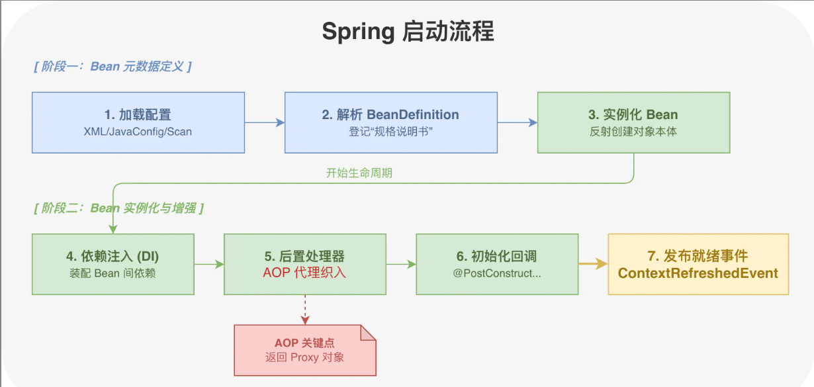

# MySQL的乐观锁和悲观锁是什么？

乐观锁和悲观锁是两种**并发控制思想**，本质区别在于**对冲突的预期态度不同**。

悲观锁假设冲突一定会发生，所以操作前必须对数据上锁。MySQL中用`SELECT ... FOR UPDATE`拿排他锁，拿`SELECT ... Lock IN SHARE MODE`拿共享锁。拿到锁之后别的事物读写都会被阻塞，直到当前事务提交或回滚才释放。

乐观锁假设冲突很少发生，干脆不加锁，等到更新时才检查数据有没有被别人改过。通常用一个`version`字段来实现，读的时候把`	version`一起读出来。在更新时在`where`条件里带上这个`version`，如果`version`变了说明被别人改过，更新影响0行，业务层自己决定是重试还是报错。


MySQL支持两种悲观锁

1）悲观锁X锁，用`SELECT ... FOR UPDATE`。拿到之后别的事务的当前读和写会被阻塞，独占数据。

2）共享锁S锁，用`SELECT ... LOCK IN SHARE MODE`。多个事务可以同时持有同一行的S锁，但只要有人拿了S锁，别的事物就拿不到X锁。

```sql
-- 悲观锁示例：扣减库存
BEGIN;
-- 先锁住这行，别人想改就得等
SELECT stock FROM products where id = 1 FOR UPDATE;
-- 业务判断库存够不够
-- 扣减库存
UPDATE products set stock = stock - 1 WHERE id = 1;
COMMIT;
```

这种情况在秒杀场景下很常见，先`SELECT FOR UPDATE`锁住库存行，再判断扣减，保证不会超卖。


## 乐观锁的实现方式

最常用的是`version`字段：

```sql
-- 读取数据和版本号
SELECT id,name,stock,version FROM products WHERE id = 1;
-- 假设读出来version=5
-- 更新时带上版本号
UPDATE products
SET stock = stock -1,version = version+1
WHERE id = 1 AND version = 5;
-- 检查影响行数
-- 让一个一返回0说明被别人改过， 需要重试或报错
```

另一种使用CAS比较原值：

```sql
-- 假设读出来stock = 100
UPDATE products 
SET stock = 99
WHERE id = 1 AND stock = 100;
```
这种方式不用加额外字段，但会出现ABA问题。如果值从100改回50又改回100，CAS就会认为没变过。version字段不存在这个问题，因为版本号只增不减。

怎么选择乐观锁还是悲观锁？

读多写少，冲突概率低的场景用乐观锁。比如用户修改自己的资料，同一时刻同一用户修改同一条数据的概率很低，用乐观锁省去加锁开销，吞吐量更高。

写多冲突多的场景用悲观锁。比如热门商品秒杀，几千人同时抢一个商品，乐观锁大概率一堆人都会失败然后重试，反而更慢。直接用悲观锁排队处理更稳。

还有一种思路是先乐观再悲观。平时用乐观锁，冲突概率上来了，自动切换成悲观锁。一些ORM框架(Object-Relational Mapping，对象关系映射，把数据库的表/行/字段，映射成程序里的类/对象/属性)比如Hibernate就支持这种策略。

## MySQL8.0的改进
MySQL 8.0引入了`SELECT ... FOR UPDATE NOWAIT`和`SELECT ... FOR UPDATE SKIP LOCKED`：
- NOWAIT表示拿不到锁立刻报错，不等待
- SKIP LOCKED表示跳过已被其他事务加锁的行，只处理拿得到锁的。
这两个特性在高并发抢占式场景下很有用。

## 面试官追问
提问：乐观锁更新失败率很高怎么办？

回答：先看业务是否需要这么高的并发写同一行数据，如果是秒杀的场景，可以考虑几个方案：
1. 分桶，把一个库存字段拆成10个桶，请求随机打到不同的桶上，冲突概率降10倍。
2. 合并请求，用队列收集一段时间内的请求，批量处理。
3. 直接改用悲观锁排队，吞吐量低但成功率有保障。

最差的方法是无限重试，会把数据库压垮。

提问：FOR UPDATE是锁行还是锁表？

回答：取决于有没有走索引。如果WHERE条件命中索引，则会锁满足条件的行。如果没走索引，InnoDB会锁全表的所有行。因此使用`FOR UPDATE`一定要确保走索引，不然并发直接变串行。另外在可重复读隔离级别下，还需要加间隙锁防止幻读，锁的范围比预期大一些。

提问：乐观锁的version字段用什么类型？

回答：通常使用INT(4字节)或BIGINT。INT最大值约21亿，假设每秒更新1000次，差不多能用60年。担心不够则用BIGINT,反正多4字节。有些人用timestamp做版本控制，精确到毫秒，但高并发情况下同一毫秒内可能有多次更新，会出问题。用UUID每次生成新的，但比较起来比数字慢。

提问：分布式系统怎么实现乐观锁？

回答：数据库层面的version字段能使用，但如果是跨服务的分布式事务，就需要使用分布式锁。比如用Redis的`WATCH+MULTI`实现。Redisson封装了RLock可以直接用。

# 什么是责任链模式？一般用在什么场景？
责任链模式是一种行为性设计模式，将多个对象连接成一条链，并且沿着这条链传递请求，让多个对象都有机会处理这个请求，请求会顺着链传递，直到某个对象处理它为止。

它主要避免了请求发送者和接收者之间的耦合，增强了系统的灵活性和可扩展性。

责任链模式的特点：
1. 解耦请求发送者和接收者：请求发送者无需知道由哪个处理器处理。
2. 动态组合处理器：可以灵活地动态改变链的结构。
3. 请求沿链传递： 请求可以由链中的一个或多个处理器处理。

## 一般用在什么场景
1. 请求需要多个处理器：例如日志记录的不同级别处理。
2. 动态指定处理流程： 请求的处理方式不固定，依赖于运行时的链条结构。
3. 消除条件分支：用责任链代替代码中的`if-else`或`switch-case`语句。
###典型场景
- 事件处理系统
- 审批流程（多级审批）
- 日志系统（不同级别的日志记录）

## 责任链模式的组成
1. 处理器接口(Handler):定义处理请求的通用方法和设置下一个处理器的方法。
2. 具体处理器(ConcreteHandler)：实现处理器接口，并处理具体请求。

```java
//处理器接口

abstract class Handler{
    protected Handler nextHandler;
    public void setNextHandler(Handler nextHandler){
        this.nextHandler = nextHandler;
    }
    public abstract void handleRequest(String request);
}

//具体处理器A
class ConcreteHandlerA extends Handler{
    @Override
    public void handleRequest(String request){
        if("A".equals(request)){
            System.out.println("ConcreteHandlerA handled request:"+request);
        }else if(nextHandler!=null){
            nextHandler.handleRequest(request);
        }else{
            System.out.println("No handler for request:"+request);
        }
    }
}
//具体处理器B
class ConcreteHandlerB extends Handler{
    @Override
    public void handleRequest(String request){
        if("B".equals(request)){
            System.out.println("ConcreteHandlerB handled request:"+request);
        }else if(nextHandler!=null){
            nextHandler.handleRequest(request);
        }else{
            System.out.println("No handler for request:"+request);
        }
    }
}

//客户端
public class Main{
    public static void main(String[] args){
        Handler handlerA = new ConcreteHandlerA();
        Handler handlerB = new ConcreteHandlerB();
        handlerA.setNextHandler(handlerB);
     
        handlerA.handleRequest("A");    //Output:ConcreteHandlerA handled request:A
        handlerA.handleRequest("B");    //Output:ConcreteHandlerA handled request:B
        handlerA.handleRequest("C");    //Output:No Handler for request:C
    }
}
```

# MySQL中如果发生死锁应该如何解决？
解决方法：
- 自动处理
- 手动干预

InnoDB自带死锁检测机制，由`innodb_deadlock_detect`参数控制。默认值为`ON`，开启死锁检测。一旦检测到死锁，会选择应该代价最小的事务回滚掉，释放其持有的锁让另一个事务继续执行。

另外还有一个兜底机制就是锁等待超时`innodb_lock_wait_timeout`。默认值为50秒。如果一个事务等待锁的时间超过了这个值就自动放弃并回滚。

手动干预主要用在自动机制不够快或者需要立刻恢复的场景。先用
`SHOW ENGINE INNODB STATUS`或者查锁相关表找到阻塞的线程ID，然后杀掉它。

## 常见避免死锁的手段
1. 拆分大事务。事务越大持锁时间越长，死锁概率越高。
2. 固定加锁顺序，如果业务上必须同时操作表A和B，所有地方先锁A再锁B，循环依赖不会形成。
3. 降低隔离级别。可重复读比读已提交多了间隙锁和临键锁，锁的范围更大。如果业务允许，使用读已提交能减少锁冲突。
4. 合理建索引，没命中索引的更新会锁全表，几位行数据一锁，和别的事务撞上的概率大增。
5. 调整锁等待超时。`innodb_lock_wait_timeout`默认值为50秒太长。高并发系统可以调小这个值，早点超市早点释放。

## 面试官追问：
提问：innodb_deadlock_detect关掉会怎么样？什么场景下会考虑关掉？

回答：关掉之后MySQL不会主动检测死锁，只能靠锁等待超时来解除。死锁检测本身有开销，高并发下大量事务同时检测会消耗CPU。比如秒杀系统几万个请求同时抢一行数据，死锁检测的开销可能比业务逻辑还大，这时候可以考虑关掉检测，把innodb_lock_wait_timeout调短到1-2s，靠快速超时来处理，应用层做重试。

提问：为什么MySQL选择回滚代价小的事务而不是代价大的？

回答：因为回滚代价小的事务意味着undo log少，已修改的数据少，回滚本身更快，对系统冲击更小。回滚大事务可能要花几秒甚至更久，这段时间锁还是拿着，其他事务还是被阻塞。

提问：间隙锁和临键锁跟死锁有什么关系？
间隙锁锁的是索引记录之间的空隙，临键锁是行锁加间隙锁的组合。他们主要是可重复读隔离下，用来防止幻读的，但锁的范围一大，容易出现两个事物锁住相邻间隙然后互相等待插入的情况。

# 什么是模板方法模式？一般用在什么场景？
模板方法模式是一种行为型设计模式，它定义了一个算法的骨架，将一些步骤延迟到子类中实现。这样可以在不改变算法结构的情况下，重新定义算法的某些步骤。将算法的不变部分放在抽象类中，可变部分放在子类中，达到代码复用和扩展的目的。
- 复用：所有子类可以直接复用父类提供的模板方法，即上面提到的不变的部分。
- 扩展：子类可以通过模板定义的一些拓展点进行不同的定制化实现。

## 模式的特点：
1. 算法骨架：在基类中定义一个算法的固定执行步骤，具体实现步骤交给子类完成。
2. 复用代码：子类复用基类中定义的通用逻辑，仅需实现具体步骤。
3. 遵循开闭原则：基类的骨架逻辑对拓展开放，对修改关闭。

## 一般用在什么场景？
1. 定义算法股价
2. 复用公共逻辑
3. 控制执行顺序

典型场景：
- 数据处理流程
- Web请求流程

## 模板方法模式的组成：
1. 抽象类
2. 具体类
3. 模板方法

```java
//抽象类
abstract class DataProcessor{
    //模板方法
    public final void process(){
        readData();
        processData();
        writeData();
    }

    protected abstract void readData();
    protected abstract void processData();
    protected void writeData(){
        System.out.println("Writing data to output.");
    }
}
//具体实现类A
class CSVDataProcessor extends DataProcessor{
    @Override
    protected void readData(){
        System.out.println("Reading data from CSV file.");
    }
    @Override
    protected void processData(){
        System.out.println("Processing CSV data.");
    }
}
//具体实现类B
class JSONDataProcessor extends DataProcessor{
    @Override
    protected void readData(){
        System.out.println("Reading data from JSON file.");
    }
    @Override
    protected void processData(){
        System.out.println("Processing JSON data.");
    }
}
//客户端
public class Main{
    public static void main(String[] args){
        DataProcessor csvProcessor = new CSVDataProcessor();
        csvProcessor.process();

        JSONDataProcessor jsonProcessor = new JSONDataProcessor();
        jsonProcessor.process();

```
# MySQL中count(*)、count(1)和count(字段)的区别
三者都是统计行数据的聚合函数，核心区别在于**对NULL值的处理方式不同**。
`count(*)`和`count(1)`会统计所有行，包括NULL值的行；
`count(字段)`会统计字段非NULL的行。

```sql
    SELECT count(*) FROM user;          --返回100
    SELECT count(1) FROM user;          --返回100
    SELECT count(name) FROM user;       --返回100
```
性能上,`count(*)`和`count(1)`的性能基本相同,因为MySQL内部实现时,`count(*)`和`count(1)`都被优化为相同的执行计划。

## MyISAM为什么count(*)特别快?
MyISAM引擎只支持表锁，对表的修改操作是串行的，所以它维护一个精确的行数计数器，执行不带where条件的count(*)时，直接返回这个计数器的值。
```sql
-- MyISAM 表，不带 WHERE 条件
SELECT count(*) FROM myisam_table;  -- 直接返回维护好的行数，极快
SELECT count(*) FROM myisam_table WHERE status = 1;  -- 带条件就要扫描了

```

## InnoDB的count优化策略
InnoDB支持行锁和MVCC，同一时刻不同事务看到的数据可能不同，因此无法维护一个全局计数器。不过，InnoDB也做了优化：
1. 优先选择最小的索引扫描。主键索引是聚簇索引，叶子节点存的是完整行数据，体积大。二级索引叶子节点只存主键值，体积小的多。执行`count(*)`时，优化器会选择占用空间最小的二级索引来扫描，减少IO开销。
2. MySQL8.0.17之后，对count(*)做了并行扫描优化。
```sql
-- 查看 MySQL 是否用了并行扫描
EXPLAIN SELECT count(*) FROM large_table;
-- Extra 列可能出现 Parallel scan
```
`count(字段)`会使用在特定场景且仅能使用：
```sql
-- 统计有多少用户填写了手机号
SELECT count(phone) FROM user;

-- 统计不同状态的订单数量
SELECT status, count(status) FROM orders GROUP BY status;

-- 配合 DISTINCT 统计去重后的数量
SELECT count(DISTINCT city) FROM user;  -- 用户分布在多少个城市
```

## 大表count的优化方案
线上一张千万级的表，直接`count(*)`会导致全表扫描，性能非常差。
1. 用缓存维持计数，每次增删数时同步更新Redis里的计数器，查缓存直接读缓存。缺点是要保证缓存和数据库的一致性。
2. 用单独的计数表，创建一张表单独存储，通过触发器或应用层维护。
3. 用近似值。`SHOW TABLE STATUS`返回的Rows字段是估算值，不精确但很快。
4. 分区表并行统计。

## 面试官追问
提问： 如果要统计一张 5000 万行的订单表有多少条记录，直接 `count(*)` 太慢，你怎么优化？

回答： 首先看业务对精确度的要求。如果允许一定误差，直接用 `SHOW TABLE STATUS` 拿估算值，毫秒级返回。如果要精确值又要快，就得用缓存方案，在 `Redis` 里维护一个计数器，每次订单增删时同步更新，读的时候直接查 `Redis`。要注意处理好缓存和数据库的一致性问题，比如用事务消息或者定期校对。

提问： `count(1)` 里面的 `1` 可以换成其他数字或字符串吗？比如 `count(2)` 或 `count('abc')`?
回答： 可以换，效果完全一样。`count(1)`、`count(2)`、`count('abc')` 都等价于 `count(*)`，因为这里的常量只是占位符，告诉 `MySQL` 对每一行都计数，实际不会真的去读这个常量值。优化器会把它们统一处理成一样的执行计划。

提问： `count(*)` 走的是主键索引还是二级索引？
回答： InnoDB 会选占用空间最小的索引。如果表上有二级索引，优化器通常会选二级索引而不是主键索引，因为二级索引的叶子节点只存主键值，数据量比聚簇索引小很多，扫描的数据页更少，I/O 开销更低。可以用 EXPLAIN 看 key 列用的是哪个索引。

# 什么是观察者模式？一般用在什么场景？
观察者模式是一种行为型设计模式，它定义了一种一对多的依赖关系，当一个对象的状态发生改变时，所有依赖它的对象都会得到通知并自动更新。

观察者模式的特点：
1. 松耦合：观察者和被观察者之间是松耦合的，便于扩展和维护。
2. 动态订阅：可以动态添加或一处观察者，灵活性很高。
3. 单向通信：被观察者通知观察者，观察者不能反向修改被观察者状态。

## 用在什么场景?
1. 事件驱动系统：在用户操作界面，通过监听事件(如按钮点击)触发响应。
2. 系统间通信：系统中某个模块发生变化时，需要通知多个依赖模块。
3. 分布式系统：数据更新时通知所有订阅者，例如推送通知，实时数据同步等。

典型场景：
- GUI事件处理系统（如按钮点击、窗口关闭事件）
- 数据模型与视图同步更新（如MVC架构中的数据绑定）
- 股票价格更新通知订阅者

## 观察者模式的组成
1. Subject(主题，被观察者)：状态发生变化时，通知所有注册的观察者。
2. Observer(观察者)：接收来自主题的更新通知，并进行响应的操作。
3. ConcreteSubject(具体主题)：实现具体的主题对象，保存需要被观察的状态。
4. ConcreteObserver(具体观察者)：实现具体的观察者对象，更新自己以与主题的状态同步。

```java
import java.util.ArrayList;
import java.util.List;

// 观察者接口
interface Observer{
    void update(String message);
}

// 被观察者接口
interface Subject{
    void addObserver(Observer observer);
    void removeObserver(Observer observer);
    void notifyObservers(String message);
}

// 具体被观察者
class ConcreteSubject implements Subject{
    private List<Observer> observers = new ArrayList<>();
    private String state;

    @Override
    public void addObserver(Observer observer){
        observers.add(observer);
    }

    @Override
    public void removeObserver(Observer observer){
        observers.remove(observer);
    }

    @Override
    public void notifyObservers(String message){
        for(Observer observer : observers){
            observer.update(message);
        }
    }
    public void setState(String state){
        this.state = state;
    }
}

// 具体观察者
class ConcreteObserver implements Observer{
    private String name;

    public ConcreteObserver(String name){
        this.name = name;
    }

    @Override
    public void update(String message){
        System.out.println(name + " received message: " + message);
    }
}

//客户端
public class Main{
    public static void main(String[] args){
        ConcreteSubject subject = new ConcreteSubject();
        ConcreteObserver observer1 = new ConcreteObserver("Observer1");
        ConcreteObserver observer2 = new ConcreteObserver("Observer2");

        subject.addObserver(observer1);
        subject.addObserver(observer2);

        subject.setState("New State");
        subject.notifyObservers("Hello Observers!");
    }
}
```

## MySQL中如何进行SQL调优？
SQL调优的核心思路是**减少磁盘I/O和避免无效计算**。实际操作分三步走：先定位慢SQL，再分析执行计划，最后根据执行计划进行优化。

定位慢SQL靠MySQL慢查询日志，分析计划用`EXPLAIN`，优化手段主要有这几类：
1. 索引层面优化
    - 合理设计联合索引，利用覆盖索引避免徽标查询。
    - 注意最左前缀匹配原则，避免索引失效。
    - 避免在索引列上使用函数操作，影响索引效率。
2. 查询语句优化
    - 避免使用`SELECT *`，只查询需要的列。
    - 避免在`%Like`前缀模糊查询，`Like %关键词`必然全表扫描。
    - 合理使用`JOIN`，避免字段隐式类型转换。
3. 架构层面优化
    - 热点数据上Redis缓存，访问频率高但变化少的数据没必要每次都查库。
    - 大表考虑分库分表，单表超过2000万行查询性能会明显下降。
    - 读写分离，把查询压力分摊到从库。

还可以通过业务优化，例如少展示一些字段，避免多表查询的情况。

## EXPLAIN关键指标解读

EXPLAIN 输出一堆字段，重点盯这几个：

type 表示访问类型，性能从好到差排序：
`system > const > eq_ref > ref > range > index > ALL`。
看到 `ALL` 基本就是全表扫描，得加索引了。`ref` 以上算比较健康的。

`rows` 是 `MySQL` 预估要扫描的行数，这个数字越小越好。如果一个查询 rows 显示 100 万，那肯定有问题。

Extra 里的信息很关键：
- `Using index` 表示用到了覆盖索引，不用回表
- `Using where` 表示在存储引擎返回数据后还要在 Server 层过滤
- `Using filesort` 说明排序没用上索引，需要额外排序操作
- `Using temporary` 说明用了临时表，一般出现在 GROUP BY 或 DISTINCT 场景

```sql
-- 一个典型的分析案例
EXPLAIN SELECT * FROM orders WHERE user_id = 10086 ORDER BY create_time;

-- 如果 Extra 显示 Using filesort，说明 create_time 排序没走索引
-- 优化方案：建联合索引 (user_id, create_time)
```

## 索引失效的情况
1. 对索引列做运算或函数调用
```sql
-- 索引失效
SELECT * FROM users WHERE YEAR(birthday) = 1990;
-- 优化后
SELECT * FROM users WHERE birthday >= '1990-01-01' AND birthday < '1991-01-01';
```
2. 隐式类型转换
```sql
-- phone 是 varchar 类型，传入数字会触发隐式转换
SELECT * FROM users WHERE phone = 13800138000;  -- 索引失效
SELECT * FROM users WHERE phone = '13800138000';  -- 正常走索引
```
3. OR条件中有非索引字段
```sql
-- 假设 name 有索引，age 没有
SELECT * FROM users WHERE name = '张三' OR age = 25;  -- 全表扫描
```
4. 联合索引不满足最左前缀匹配原则
```sql
-- 索引是 (a, b, c)
SELECT * FROM t WHERE b = 1;  -- 索引失效
SELECT * FROM t WHERE a = 1 AND c = 3;  -- 只能用到 a
```
5. like 左侧通配符
```sql
-- 索引失效
SELECT * FROM users WHERE name LIKE '%张三';
-- 优化后
SELECT * FROM users WHERE name LIKE '张三%';
```
6. 优化器的选择
```sql
-- 假设索引是 (a, b)
SELECT * FROM t WHERE a = 1 AND b = 2;  -- 可以用到 a, b
SELECT * FROM t WHERE b = 2 AND a = 1;  -- 索引失效，优化器会选择用 b 索引
```

## 慢查询日志配置
```sql
-- 开启慢查询日志
SET GLOBAL slow_query_log = ON;
-- 设置阈值，执行时间超过 1 秒的 SQL 会被记录
SET GLOBAL long_query_time = 1;
-- 记录没有使用索引的查询
SET GLOBAL log_queries_not_using_indexes = ON;

-- 查看配置
SHOW VARIABLES LIKE '%slow_query%';
SHOW VARIABLES LIKE 'long_query_time';
```

## 大表优化策略
当单表数据量上来之后，光靠索引已经不够用了。`MySQL` 单表数据太多的话，即便走索引，B+ 树层级也会变深，查询性能下降明显。

`分页优化` 是大表场景的高频问题。`LIMIT 1000000, 10` 这种深分页会扫描前 100 万条数据然后丢弃，非常浪费。优化方案用游标分页：
```sql
-- 深分页，性能差
SELECT * FROM orders ORDER BY id LIMIT 1000000, 10;

-- 游标分页，性能好
SELECT * FROM orders WHERE id > 1000000 ORDER BY id LIMIT 10;
```
冷热数据分离也很有效。把 3 个月前的订单挪到历史表，主表只保留热数据，查询压力小很多。

## 面试官追问
一个慢查询，EXPLAIN 看到走了索引但还是慢，可能是什么原因？

回答：几种可能。第一，回表次数太多，虽然走了二级索引，但查出来几十万行每行都要回表，随机 IO 吃不消，还是慢。第二，索引选择性差，比如 status 字段只有几个值，走索引过滤效果不好。第三，数据量太大，索引树本身就很大，内存装不下频繁读磁盘。第四，EXPLAIN 是估算，实际执行可能和估算不一样，可以用 EXPLAIN ANALYZE 看真实执行情况。第五，返回数据量大，网络传输耗时。重点看 EXPLAIN 的 rows 估算值和 Extra 列有没有 filesort、temporary。

提问：联合索引 (a, b, c)，查询条件是 WHERE a = 1 AND c = 3，能用到索引吗？

回答：能用到，但只能用到 a 这一列。因为联合索引是按 a、b、c 顺序排列的，跳过了 b 就没法利用 c 的有序性。MySQL 会用 a = 1 快速定位，然后在这个范围内逐行判断 c = 3。如果想让三列都生效，查询条件须包含 a 和 b。

提问：线上突然出现大量慢查询，排查思路是什么？

回答：先看是不是某个时间点突然出现的。如果是，查一下那个时间有没有发布、有没跑批任务。然后看慢查询日志，找出最频繁的几条 SQL。用 EXPLAIN 分析执行计划，检查索引有没有失效。同时看一下服务器指标，CPU、磁盘 I/O、连接数是不是打满了。如果是锁等待导致的，用 `SHOW PROCESSLIST` 和 `SHOW ENGINE INNODB STATUS` 排查。

提问：什么情况下 MySQL 优化器会放弃使用索引？

回答：优化器是基于成本估算的，它认为全表扫描更快就不走索引。典型场景是查询结果集占总数据量比例太高，比如表里 100 万条数据，查询条件能匹配 60 万条，走索引反而要多一次回表操作，不如直接全表。另外统计信息不准也会导致优化器误判，这时候可以用 ANALYZE TABLE 更新统计信息。

# 什么是代理模式？一般用在什么场景？
代理模式（Proxy Pattern） 是一种结构型设计模式，在不改变原始对象的前提下，通过引入一个代理对象来控制对原始对象的访问，实现额外的功能。例如控制权限、延迟加载、缓存等。

这个模式在我们业务中太常见了，比如动态代理就是代理模式，Spring AOP 就是动态代理，RPC 框架也是使用了动态代理才使得调用远程方法和本地方法一样。

所以，统一报错、监控、限流、鉴权等等，需要跟业务解耦的功能，我们基本上都是使用代理进行统一处理的。

## 代理模式的特点：
- 间接访问： 客户端通过代理访问实际对象，代理对象负责对实际对象的控制。
- 功能增强： 代理对象可以在访问实际对象之前或之后添加额外的功能。
- 解耦性： 客户端不直接与实际对象交互，通过代理对象可以透明地扩展实际对象的功能。

## 一般用在什么场景？
- 访问控制： 对实际对象的访问需要进行权限验证时。
- 性能优化： 通过代理实现缓存或延迟加载以提高系统性能。
- 远程访问（rpc 调用）： 客户端需要访问远程对象时，通过代理封装远程调用的细节。
- 日志记录： 在方法调用时添加日志记录功能。

## 典型场景：
- 远程代理： 为远程对象提供本地代表。
- 权限代理： 控制对对象的访问权限。
- 智能引用： 在访问对象时增加一些附加行为，如引用计数、日志记录等。

代理模式的分类
1. 静态代理：在编译时创建代理类，代理类与目标类实现相同的接口。
2. 动态代理：在运行时动态生成代理类，适用于无需事先定义代理类的场景。
```sql
// 接口
interface Subject {
    void request();
}

// 真实对象
class RealSubject implements Subject {
    @Override
    public void request() {
        System.out.println("RealSubject: Handling request.");
    }
}

// 代理对象
class ProxySubject implements Subject {
    private RealSubject realSubject;

    @Override
    public void request() {
        if (realSubject == null) {
            realSubject = new RealSubject(); // 延迟初始化
        }
        System.out.println("Proxy: Logging before delegating request.");
        realSubject.request();
        System.out.println("Proxy: Logging after delegating request.");
    }
}

// 客户端
public class Main {
    public static void main(String[] args) {
        Subject proxy = new ProxySubject();
        proxy.request();
    }
}
```

# 说说Spring启动过程？
Spring 启动的核心就是 **创建并初始化 IoC 容器**，整个过程可以拆成几个关键阶段：

1. 加载配置，实例化容器

Spring 先读取配置，可以是 XML 文件、Java Config 类或者 @ComponentScan 扫描的包路径。然后创建 ApplicationContext 实例，并加载容器中的 BeanDefinitions。这一步相当于把"图纸"准备好了。

2. 解析 BeanDefinition

Spring 容器会解析配置文件中的 BeanDefinitions，即把配置里声明的 Bean 元数据全部解析出来，包括每个 Bean 的类名、作用域、依赖关系、初始化方法等。注意这时候还没创建真正的对象，只是把"规格说明书"都登记好了。

3. 实例化 Bean

Spring 根据 BeanDefinition 开始真正 new 对象。单例 Bean 默认在容器启动时就全部实例化，懒加载的除外。

4. 依赖注入

Spring 进行依赖注入，将 Bean 之间的依赖关系进行注入，支持构造器注入、Setter 注入、字段注入三种方式。

5. 执行 BeanPostProcessor（Bean 后置处理器）

容器会遍历所有注册的 BeanPostProcessor，在 Bean 初始化前后分别调用 postProcessBeforeInitialization 和 postProcessAfterInitialization。AOP 代理就是在这个阶段织入的。

6. 执行初始化回调

先执行 @PostConstruct 标注的方法，再调用 InitializingBean.afterPropertiesSet()，最后执行自定义的 init-method。

> 注意，初始化回调处在两个 BeanPostProcessor 回调之间。
> 先执行 BeanPostProcessor.postProcessBeforeInitialization
> 然后执行初始化回调
> 先执行 @PostConstruct
> 再执行 InitializingBean.afterPropertiesSet
> 再执行自定义 init-method
> 初始化完成之后
> 再执行 BeanPostProcessor.postProcessAfterInitialization

7. 发布 ContextRefreshedEvent

所有 Bean 初始化完毕后，容器发布 ContextRefreshedEvent 事件，应用就可以正式对外服务了。


## Spring启动过程的详细分解
### 加载配置文件，初始化 Spring 容器
Spring 启动过程的第一步是初始化 Spring 容器。Spring 容器可以通过多种方式初始化，常见的包括：
- 使用 ClassPathXmlApplicationContext 读取 XML 配置文件。
- 使用 AnnotationConfigApplicationContext 加载基于注解的配置类。

示例：
```java
ApplicationContext context = new ClassPathXmlApplicationContext("applicationContext.xml");
// 或者使用注解配置
ApplicationContext context = new AnnotationConfigApplicationContext(AppConfig.class);
```

### 实例化容器加载 Bean 定义
在初始化容器时，Spring 会扫描所有的 Bean 定义。对于基于注解的配置，Spring 会扫描指定包下的所有带有 @Component、@Service、@Controller 等注解的类，并加载它们的定义到容器中。对于 XML 配置，Spring 会解析 `<bean>` 元素并加载定义，得到 BeanDefinitions。

示例：

```java
@Configuration
@ComponentScan(basePackages = "com.example.service")
public class AppConfig {
}
```

### 实例化 Bean
Spring 通过 ApplicationContext 或 BeanFactory 实例化每个 Bean。在此阶段，Spring 会创建 Bean 的实例，但不会立即注入依赖。这个过程类似于类的构造函数调用。

### 依赖注入
在实例化之后，Spring 会注入依赖项。依赖常见有以下三种方式：

- 构造函数注入：通过构造函数来注入依赖。
- Setter 注入：通过 Setter 方法注入依赖。
- 字段注入：通过 @Autowired 注解直接注入字段。

示例：
```java
@Service
public class UserService {

    @Autowired
    private UserRepository userRepository;

    // 或者通过构造函数注入
    @Autowired
    public UserService(UserRepository userRepository) {
        this.userRepository = userRepository;
    }
}
```

### 处理 BeanPostProcessors
在所有 Bean 初始化完成之前，Spring 容器会调用所有注册的 `BeanPostProcessor`。`BeanPostProcessor` 允许对每个 `Bean` 进行自定义的处理操作，比如修改 `Bean` 属性或者进行额外的初始化。
```java
@Component
public class CustomBeanPostProcessor implements BeanPostProcessor {

    @Override
    public Object postProcessBeforeInitialization(Object bean, String beanName) throws BeansException {
        // Bean 初始化前的处理
        return bean;
    }

    @Override
    public Object postProcessAfterInitialization(Object bean, String beanName) throws BeansException {
        // Bean 初始化后的处理
        return bean;
    }
}
```

### 处理 Bean 生命周期初始化方法
Spring 支持三种初始化回调机制：

- 实现 InitializingBean 接口，并在 afterPropertiesSet() 方法中执行初始化逻辑。
- 使用 @PostConstruct 注解的方法作为初始化回调。
- XML 配置里指定 init-method

```java
public class LifeCycleBean implements InitializingBean {

    public LifeCycleBean() {
        System.out.println("1. 构造方法");
    }

    @PostConstruct
    public void postConstruct() {
        System.out.println("2. @PostConstruct 方法");
    }

    @Override
    public void afterPropertiesSet() {
        System.out.println("3. InitializingBean.afterPropertiesSet");
    }

    public void initMethod() {
        System.out.println("4. 自定义 init-method");
    }
}
```

```xml
<bean id="lifeCycleBean"
      class="com.example.LifeCycleBean"
      init-method="initMethod"/>
```
### 发布事件
发布事件的时机可以是任何时候，取决于事件的类型，例如 Spring 会在容器启动完成时发布 ContextRefreshedEvent，以通知所有监听器容器已经准备就绪。

### 容器启动完成
当所有的 Bean 完成初始化后，Spring 容器正式启动完成。如果是 Web 应用，Spring 容器会开始监听 HTTP 请求并处理业务逻辑。

## refresh() 方法才是启动核心
不管用哪种 ApplicationContext 实现，最终都会走到 AbstractApplicationContext.refresh() 方法。这个方法有 12 个步骤，是 Spring 容器启动的总控流程：

```java
public void refresh() throws BeansException, IllegalStateException {
    prepareRefresh();                      // 准备刷新，记录启动时间，校验必需属性
    ConfigurableListableBeanFactory beanFactory = obtainFreshBeanFactory(); // 创建 BeanFactory
    prepareBeanFactory(beanFactory);       // 配置 BeanFactory，注册一些默认组件
    postProcessBeanFactory(beanFactory);   // 子类扩展点
    invokeBeanFactoryPostProcessors(beanFactory); // 执行 BeanFactoryPostProcessor
    registerBeanPostProcessors(beanFactory);      // 注册 BeanPostProcessor
    initMessageSource();                   // 初始化国际化组件
    initApplicationEventMulticaster();     // 初始化事件广播器
    onRefresh();                           // 子类扩展点，SpringBoot 在这里启动内嵌 Tomcat
    registerListeners();                   // 注册事件监听器
    finishBeanFactoryInitialization(beanFactory); // 实例化所有非懒加载的单例 Bean
    finishRefresh();                       // 发布 ContextRefreshedEvent
}
```


常见的 `BeanFactoryPostProcessor` 有 `PropertySourcesPlaceholderConfigurer` 用来解析 `${}` 占位符，`ConfigurationClassPostProcessor` 用来解析 `@Configuration` 类。

常见的 `BeanPostProcessor` 有 `AutowiredAnnotationBeanPostProcessor` 处理 `@Autowired` 注入，`AbstractAutoProxyCreator` 生成 AOP 代理。

## SpringBoot 启动有什么不同
SpringBoot 在 Spring 基础上做了大量简化：
1. 自动配置：@EnableAutoConfiguration 会加载 META-INF/spring.factories 或 META-INF/spring/org.springframework.boot.autoconfigure.AutoConfiguration.imports 里配置的自动配置类

2. 内嵌容器：在 onRefresh() 阶段启动内嵌的 Tomcat/Jetty/Undertow，不需要单独部署 WAR 包

3. 启动事件更丰富：除了 ContextRefreshedEvent，还有 ApplicationStartingEvent、ApplicationEnvironmentPreparedEvent、ApplicationPreparedEvent、ApplicationStartedEvent、ApplicationReadyEvent 等

SpringBoot 2.4 之后推荐使用 `AutoConfiguration.imports` 文件替代 `spring.factories`，加载速度更快。

Undertow支持在 Spring Framework 7.0 已被移除，因为 Undertow 项目目前不支持Servlet 6.1

## 面试官追问
提问：BeanFactory 和 ApplicationContext 有什么区别？为什么一般用后者？

回答：BeanFactory 是最基础的 IoC 容器接口，只提供 Bean 的获取和创建能力。ApplicationContext 是 BeanFactory 的子接口，在此基础上增加了事件发布、国际化、资源加载、AOP 集成等企业级特性。另外 BeanFactory 默认懒加载，Bean 在第一次 getBean 时才创建；ApplicationContext 默认预加载，启动时就把单例 Bean 全创建好了，能提前暴露配置问题。实际项目基本都用 ApplicationContext。

提问：容器启动时如果某个 Bean 创建失败会怎样？

回答：默认情况下整个容器启动失败，抛出 BeanCreationException，之前已经创建的 Bean 会被销毁。这是 fail-fast 策略，避免应用带着残缺的依赖运行。如果想让某个 Bean 创建失败也不影响启动，可以在 @Bean 方法上配合 try-catch 返回 null，或者用 @Lazy 延迟到真正使用时再创建。

提问：@PostConstruct 和 InitializingBean.afterPropertiesSet() 哪个先执行？

回答：@PostConstruct 先执行。执行顺序是：@PostConstruct → InitializingBean.afterPropertiesSet() → 自定义 init-method。原因是 @PostConstruct 由 CommonAnnotationBeanPostProcessor 在 postProcessBeforeInitialization 阶段处理，而 afterPropertiesSet 和 init-method 在 invokeInitMethods 阶段执行。

提问：如果想在所有 Bean 初始化完成后执行一段逻辑，有哪些方式？

回答：常用的有 4 种方式：
1）实现 ApplicationListener<ContextRefreshedEvent> 监听容器刷新事件
2）实现 CommandLineRunner 或 ApplicationRunner 接口，SpringBoot 启动完成后自动调用
3）使用 @EventListener(ContextRefreshedEvent.class) 注解方法
4）实现 SmartLifecycle 接口，在 start() 方法里写逻辑